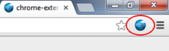
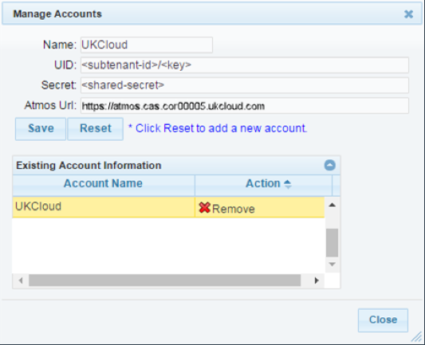
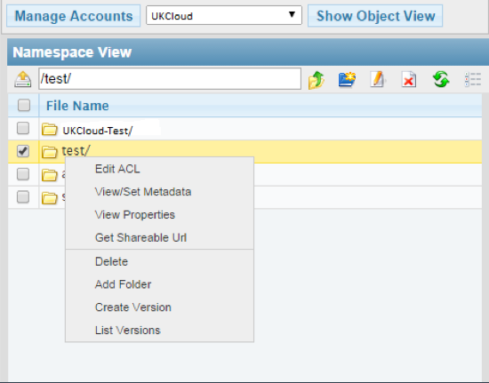
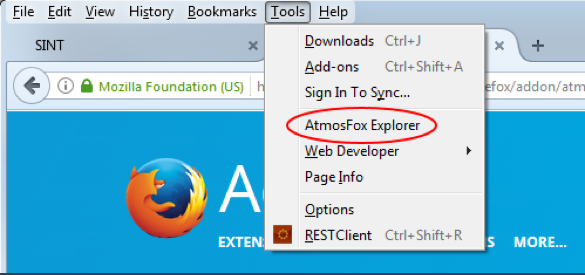
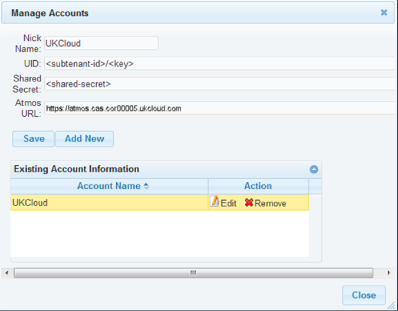
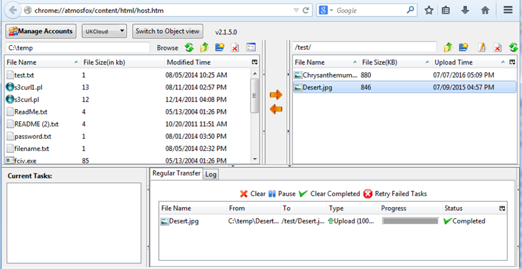

# How to use file browsers with Cloud Storage

## Overview

UKCloud's Cloud Storage service is an object storage solution based on Dell EMC Elastic Cloud Storage (ECS). Access is via a RESTful application programming interface (API).

Web applications can easily interact with the API, but the ability to browse the contents of the storage using a graphical client can be useful, as it provides a user friendly interface to the storage. This enables, for example:

- Verification by developers that their applications or scripts work as intended with the storage
- Bulk import or export of content by users
- Easy maintenance and housekeeping of the objects in the storage system

ECS provides two APIs that you can use to manage Cloud Storage: the S3 compatible API and the EMC ECS Atmos API.

> [!NOTE]
> If you write content to Cloud Storage using one of the APIs, you cannot subsequently access that content using the other API. Choose carefully which API you want to use before beginning a project, as it will be difficult to move between them.

In this article, we'll look at some of the many applications that enable you to browse an object storage system. We'll look at two categories:

- [Windows applications](#windows-applications)
- [Browser extensions for Chrome and Firefox](#browser-extensions)

The inclusion of applications in this article should not be taken as an endorsement or recommendation of them by UKCloud. However, we have tested them with our Cloud Storage service and verified that they work correctly.

## API endpoints

Cloud Storage provides different API endpoints to access your storage, depending on the UKCloud site and connectivity type you are using. Make sure you use the correct endpoint to ensure the best possible performance for your solution.

S3 API endpoints:

- **Corsham (Assured)**

  - Internet: `cas.cor00005.ukcloud.com`
  - PSN Assured: `cas.cor00005.psnassured.ukcloud.com`
  - N3: `cas.cor00005.ukcloud.thirdparty.nhs.uk/`
  
- **Farnborough (Assured)**

  - Internet: `cas.frn00006.ukcloud.com`
  - PSN Assured: `cas.frn00006.psnassured.ukcloud.com`
  - N3: `cas.frn00006.ukcloud.thirdparty.nhs.uk/`

If you're using the ENHANCED option (geo-resilient storage), you can use either the Corsham or Farnborough endpoints. In the event of a site failure, there will be an outage to objects created on the failed site. UKCloud will bring these objects online in the other site within about 15 minutes.

Contact UKCloud support if you are unsure which endpoint to use.

## Windows applications

This section takes you through installing and configuring two applications: Cyberduck and S3 Browser.

### Cyberduck

Cyberduck is an open source cross platform file browser for HTTP based object storage solutions. It utilises the S3 endpoints to establish connectivity with the ECS platform over HTTPS.

To install and configure Cyberduck:

1. Download [Cyberduck](https://cyberduck.io/).

2. Install Cyberduck using either the default settings or specifying your own configuration.

3. Download the [Cloud Storage Cyberduck profile](https://developer-content.emc.com/downloads/jive_attach_proxy.htm?ecnCommID=3939&ecnCommName=ECS%20-%20Elastic%20Cloud%20Storage&ecnAttachmentName=EMC%20ECS%20S3%20(HTTPS%20with%20AWS2).cyberduckprofile&ecnContainerURL=/docs/DOC-27683&reqURL=/servlet/JiveServlet/download/27683-11-131318/EMC%20ECS%20S3%20(HTTPS%20with%20AWS2).cyberduckprofile).

    > [!NOTE]
    > If you download this profile using a browser, ensure the file name is `.cyberduckprofile`.

4. Browse to the downloaded file and double click to open it.

    

5. Complete the fields in the new connection dialog box:

    - Ensure you enter the correct endpoint in the **Server** field, as shown in [API endpoints](#api-endpoints)
  
    - The **Access Key ID** is your User ID, which you can find in the *Storage* section of the UKCloud Portal

    - When you're done, click the **x** icon to close the dialog box

    

6. You can see the new connection in the Cyberduck UI.

    

7. Right-click the connection and select **Connect to server**.

    

8. In the *Login* dialog box, in the **Secret Access Key** field, enter your Cloud Storage secret key.

    If you've forgotten or don't know your secret key, you can reset it in the *Storage* section of the Portal.

    > [!NOTE]
    > Unless you want the password to be saved, deselect the **Save password** check box.

    

9. After you've authenticated yourself with your secret key, you can view, upload and download files as normal.

    

10. For additional information, see [*Connecting to ECS with Cyberduck*](https://community.emc.com/docs/DOC-27683).

### S3 Browser

S3 Browser is a Windows client for Amazon S3 that you can easily configure to work with the S3 compatible API on Cloud Storage. It’s free for personal use; a licence fee is payable for business use.

To install and configure S3 Browser:

1. Download [S3 Browser](ttp://s3browser.com/).

2. Execute the installer and follow the prompts in the wizard to complete the installation.

3. The first time you launch S3 Browser, you'll be prompted for your account credentials. Fill in the form with your Cloud Storage credentials:

    a. From the **Account Type** list, select **S3 Compatible Storage**.

    b. Ensure you enter the correct endpoint in the **REST Endpoint** field, as shown in [API endpoints](#api-endpoints).

    c. The **Access Key ID** is your User ID, which you can find in the *Storage* section of the Portal.

    d. The **Secret Access Key** is your secret key. If you've forgotten or don't know your secret key, you can reset it in the *Storage* section of the Portal.

    e. If you're using version 6.*x*.*x* of the browser, be sure to select **Use secure transfer (SSL/TLS)**. This option is not available or necessary for version 5.*x*.*x*.

    

4. When you're done, click **Save changes**. The application automatically connects to Cloud Storage and displays your buckets (if you have any).

5. For detailed usage instructions, see the documentation available on the S3 Browser web site.

    > [!NOTE]
    > Not all S3 features are implemented by the ECS S3 compatible API, so some functionality may not work. However, common file operations (create, read, write and delete) all work well.

## Browser extensions

This section takes you through installing and configuring browser extensions that enable you to browse the contents of Cloud Storage using your web browser.

Atmos extensions are available for both Chrome and Firefox. Although the extensions included in this article were natively built for the Atmos platform, they also work with ECS using Atmos endpoints and therefore work well with Cloud Storage.

S3 extensions are also available for both browsers, but none of them include the functionality to customise the server host name, which is a requirement for connecting to Cloud Storage. If we find S3 browser extensions that offer this functionality in the future, we'll update this article.

### Chrome — Atmos for Chrome

To install and configure Atmos for Chrome:

1. Download and install the [Atmos for Chrome extension](https://chrome.google.com/webstore/detail/atmos-for-chrome/befofpjhdclgccimklkaheifjajbcmnk).

2. After you complete the installation, you'll see a globe icon in your browser toolbar. Click this icon to launch the extension.

    

3. To connect the extension to Cloud Storage, click the **Manage Accounts** button.

4. Add an account for Cloud Storage using your credentials, which you can find in the *Storage* section of the UKCloud Portal.

    > [!NOTE]
    > The UID value is a combination of the subtenant ID (bucket name) and your user ID, joined by a forward slash (`/`): `<subtenant_id>/<user_id>`. Ensure you enter the correct endpoint in the **Atmos URL** field, as shown in [API endpoints](#api-endpoints).

    

5. When you're done, click **Save**, then **Close**.

6. You can now:

    - Browse the buckets and files stored in your account

    - Use the toolbar buttons to upload files and folders

    - Double-click items to download them

    - Access other operations for selected items through context menus

    

### Firefox — AtmosFox

To install and configure AtmosFox:

1. Download and install the [AtmosFox extension](https://addons.mozilla.org/en-US/firefox/addon/atmosfox/)

2. After you complete the installation, in Firefox, select **AtmosFox Explorer** from the **Tools** menu to launch the extension.

    > [!NOTE]
    > You may need to press the **Alt** key to reveal the **Tools** menu.

    

3. To connect to Cloud Storage, in the *Manage Account* dialog box, specify your Cloud Storage credentials, which you can find in the *Storage* section of the UKCloud Portal.

    > [!NOTE]
    > The UID value is a combination of the subtenant ID (bucket name) and your user ID, joined by a forward slash (`/`): `<subtenant_id>/<user_id>`. Ensure you enter the correct endpoint in the Atmos URL field, as shown in [API endpoints](#api-endpoints).

    

4. When you're done, click **Save**, then **Close**.

5. You can now browse the buckets and files stored in your account.

    You'll see two lists of files: your local machine on the left and your Cloud Storage on the right. Use the large red arrows in the centre to transfer files to and from Cloud Storage. Context menus work well on both sides, enabling you to access a variety of functions.

    

## Next steps

This guide has shown you how to create a new Cloud Storage user. For more information about how to use the service, see the following articles:

- [*How to view Cloud Storage information in the UKCloud Portal*](cs-how-view-info-portal.md)
- [*How to create a new Cloud Storage user in the UKCloud Portal*](cs-how-create-user.md)
- Cloud Storage Gateways
    - [CIFS-ECS Tool](cs-how-install-cifs-ecs.md)
    - [CloudArray](cs-how-setup-cloud-array.md)
- [Using file browsers with UKCloud Cloud Storage](cs-file-browsers.md)

## Feedback

If you have any comments on this document or any other aspect of your UKCloud experience, send them to <products@ukcloud.com>.
