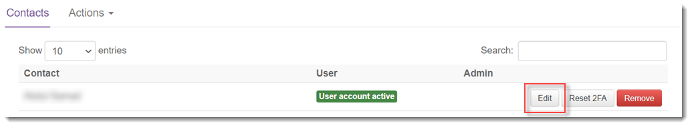
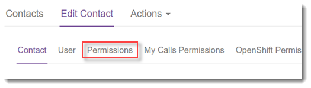
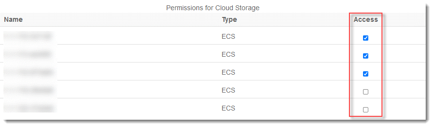
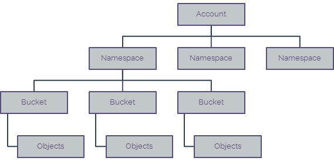
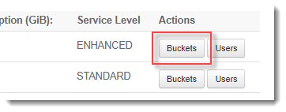
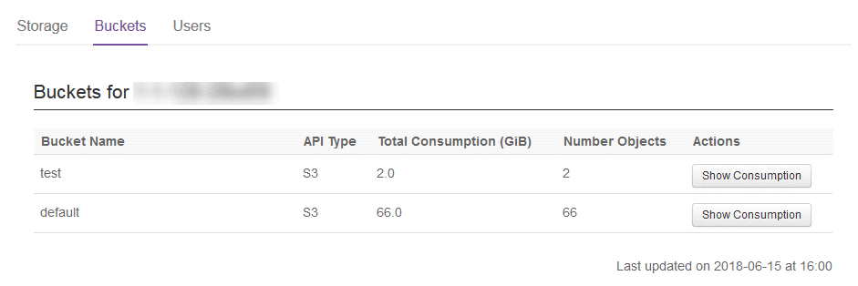
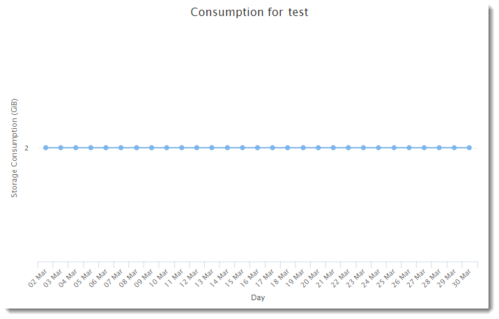

# How to view Cloud Storage information in the UKCloud Portal

## Overview

Cloud Storage is UKCloud's object storage solution based on Dell EMC Elastic Cloud Storage (ECS). Although you'll mostly interact with Cloud Storage through the API, the UKCloud Portal provides access to some information about your service.

Within the UKCloud Portal you can view:

- Information about the namespaces within your Cloud Storage environment
- A list of users with access to a namespace
- Information about the buckets within a namespace
- A graphical representation of the storage consumed over the last 30 days

You can also use the UKCloud Portal to create new Cloud Storage users. For more information, see [*How to create a new Cloud Storage user in the UKCloud Portal*](cs-how-create-user.md).

### Intended audience

To complete the steps in this guide you must have been granted access to the relevant namespace.

## Granting Portal permissions for Cloud Storage

To view Cloud Storage information in the Portal, users must be granted access to the relevant namespace. Once access is granted, the user will be able to see the namespace, list the buckets in the namespace and reset the secret key. They will also be able to see consumption data for namespaces and buckets, with a graphical representation of average consumption for buckets.

To grant Portal permissions for Cloud Storage:

1. Log in to the UKCloud Portal and select your account.

    For more detailed instructions, see the [*Getting Started Guide for the UKCloud Portal*](../portal/ptl-gs.md).

2. In the Portal navigation panel, expand the **Contacts** option and select **All Contacts**.

3. Find the contact for whom you want to grant permissions and click the **Edit** button.

    

4. Click the *Permissions* tab.

    

5. Scroll down to the *Permissions for Cloud Storage* section and select the **Access** check box for the relevant namespace.

    

## Viewing namespace and bucket information

In ECS, objects are stored in buckets. In the UKCloud Portal, you can drill down through your namespaces to see the allocated buckets available in your Cloud Storage service. You can also view storage consumption over the last 30 days.

> [!NOTE]
> It's not possible to view objects within the UKCloud Portal.

1. In the Portal navigation panel, expand the **Cloud Storage** option and select **ECS**.

2. The *Storage* tab lists the namespaces within the currently selected account. You can see:

    - The number of buckets in the namespace
    - The total amount of storage (in GiB) currently consumed by the objects in all the buckets in the namespace
    - The service level of the namespace:
        - STANDARD - data is stored in a single data centre
        - ENHANCED - data is stored in a primary named data centre and copied to a second geographically remote data centre

    

3. To list the buckets in a namespace, click the **Buckets** button for the namespace.

    

4. On the *Buckets* tab, you can see the following information for each bucket in the selected namespace:

    - The type of bucket: S3 or ATMOS
    - The total amount of storage (in GiB) currently consumed by the objects in the bucket
    - The number of objects in the bucket

    

5. To view a graph that shows the amount of storage (in GiB) consumed by the objects in the bucket over the last 30 days, click the **Show Consumption** button for the bucket.

    

## Next steps

This guide has shown you how you can view information about your Cloud Storage service in the UKCloud Portal. For information about how to use the service, see the following articles:

- [*How to view Cloud Storage information in the UKCloud Portal*](cs-how-view-info-portal.md)
- [*How to create a new Cloud Storage user in the UKCloud Portal*](cs-how-create-user.md)
- Cloud Storage Gateways
    - [CIFS-ECS Tool](cs-how-install-cifs-ecs.md)
    - [CloudArray](cs-how-setup-cloud-array.md)
- [Using file browsers with UKCloud Cloud Storage](cs-file-browsers.md)

## Feedback

If you have any comments on this document or any other aspect of your UKCloud experience, send them to <products@ukcloud.com>.
