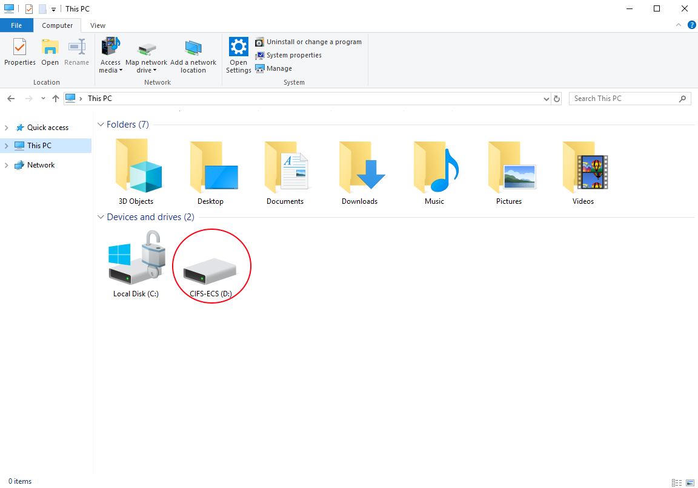

# Installation Guide for CIFS-ECS Tool

## What is CIFS-ECS?

CIFS-ECS is a free application that runs on Windows and Windows Server, exposing UKCloud Cloud Storage as file systems. It’s designed as an easy way use object storage by allowing Windows applications to interface with UKCloud’s Cloud Storage servers using the popular S3 REST API.

Customers that are happy to pay for the convenience of a fully integrated cloud gateway appliance with features like advanced deduplication and local caching, may want to consider [CloudArray] (cs-install-cloud-array.md).

## Use Cases

•	Exposing UKCloud Cloud Storage for native access on Windows through a centralised server With CIFS-ECS installed on a centralised Windows Server installation.

•	Using CIFS-ECS to present UKCloud Cloud Storage as storage for applications, without additional development.

•	CIFS-ECS allows UKCloud Cloud Storage to be used as a target for backups or long-term file retention.

## Prior to installation

CIFS-ECS offers a single caching option:

**Stub**: files are initially stored locally and replaced with a stub, or shortcut, after a period of time. When you access a file that has been stubbed, it will be retrieved from the cloud. This offers the best scalability, as you can use a virtually unlimited amount of cloud storage.

## Installation Guide

To download CIFS-ECS you will require your UKCloud Portal log in details.

1. Navigate to [this] (https://portal.skyscapecloud.com/support/knowledge_centre/85dc54ff-7d21-43ac-9cfa-88e87de7ba27) page to download the ZIP file containing the installer here from this page of the UKCloud Portal: [CIFS-ECS Tool] (https://portal.skyscapecloud.com/support/knowledge_centre/85dc54ff-7d21-43ac-9cfa-88e87de7ba27)

### To install CIFS-ECS:

1.	Extract and run the setup launcher from the ZIP file.

2.	Step through the wizard, adjusting values to suit your environment.

    > [!NOTE]
    > The Data Directory is used as a local cache for any content you place in the CIFS-ECS drive, so you may want to put this on a non-system volume.

3.	When the installation is complete, click the 'Add CIFS-ECS Drive' to open the Drive Parameters page.

1.  On the Drive Parameters page, select any available drive letter from the drop down menu to use as the CIFS-ECS drive then click Next.

    Optional: give your ECS drive a description.

    

5.	On the Settings page, click the Hosts button to configure the connection to the Cloud Storage service.

6.	On the General tab, click the Add button and configure the settings as shown in the following example:

    •	You can find the User ID in the Storage section of the UKCloud Portal.

    •	If you’ve forgotten or don’t know your Secret Access Key, you can reset it in the Storage section of the Portal

        > [!NOTE]
        > The 'Server Name' and 'Description' can be anything, but must not be blank. In the example it is shown as 'UKCloud' and 'UKCloud - ECS Drive'

7.  From the Use https or http list, select HTTPS.

    

8.  In the 'Host name / IP:' field add input one of the following:

    &nbsp;| S3 API endpoint |
    ------|-----------------|
    **Corsham (Assured)** |
    Internet | `cas.cor00005.ukcloud.com`
    PSN Assured | `cas.cor00005.psnassured.ukcloud.com`
    N3 | `cas.cor00005.ukcloud.thirdparty.nhs.uk/`
    **Farnborough (Assured)** |
    Internet | `cas.frn00006.ukcloud.com`
    PSN Assured | `cas.frn00006.psnassured.ukcloud.com`
    N3 | `cas.frn00006.ukcloud.thirdparty.nhs.uk/`

9. Uncheck **Port Override**.

9. Click OK to return to the Settings page.

10.	The rest of the fields on the Settings page, enable you to configure the root directory, encryption and compression settings.

    > [!TIP]
    > Configure these fields appropriately for your environment, or accept the defaults. We suggest you give the root directory a friendlier name, so that you can more easily identify it.

    

11.	Click the Advanced button to configure various thresholds, such as how long a local file will be retained before being replaced with a stub.

12. Click Next button to get to the 'Logging' page.

13. Configure Logging as to your preferred settings.

14.	Click finish to complete the wizard. CIFS-ECS connects to Cloud Storage and starts synchronising any content you put on the drive letter you assigned to it.

    

15.	You can share the CIFS-ECS drive, or a folder within it, so that other machines on the network can access it.

    > [!TIP]
    > See Microsoft's How-To guide on how to share a a drive on the network from Windows:
    https://support.microsoft.com/en-gb/help/4092694/windows-10-changes-to-file-sharing-over-a-network
    
    &nbsp;| |
    ------|-----------------|
     |

## Feedback

If you have any comments on this document or any other aspect of your UKCloud experience, send them to <products@ukcloud.com>.