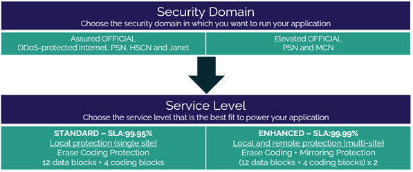

# Cloud Storage Service Definition

## What is Cloud Storage?

Cloud Storage is a secure and highly adaptable storage platform designed to address a wide variety of use cases. It's based on object storage technology, which is natively optimised for cloud storage in terms of scale, resilience and accessibility. Traditional storage solutions are typically characterised by large capital expenditure and an intensive management and support burden, and forever swing between under and over capacity. Cloud Storage benefits customers as there are no upfront costs and no minimum term commitments – customers merely pay for what they actually use, when they use it.

## What the service can help you achieve

- Release your existing Tier 1 storage capacity and avoid unnecessary storage costs by migrating valuable but seldom used data to a secure and cost-effective cloud storage repository

- Build modern, distributed architecture applications, leveraging the benefits of object storage

- Assure your data recovery – use it as a UK-based cloud backup target as an alternative to storing backups on unreliable tape media or expensive disk solutions

- Enhance the durability and availability of your personal data, replacing inflexible network drives with cloud storage that can be accessed by any device from any location

- Reduce the burden and complexity of managing the unpredictable capacity requirements of your organisation as we enter the era of big data

## Product options

Cloud Storage provides data resilience using the Reed Solomon 12 + 4 erasure coding scheme. This splits objects into 12 data fragments and 4 coding fragments. These fragments are spread across multiple nodes in the data centre making the object recoverable from any of the 12 data fragments.

This service is designed to be flexible and enables you to mix and match from a range of pre-defined options and change them when required.

## Pricing and packaging

UKCloud's Cloud Storage pricing can be as low as 1.46p per GiB per month. Full pricing with all options, including licensing and connectivity, is available in the [UKCloud Pricing Guide](https://ukcloud.com/pricing-guide).

## Accreditation and information assurance

The security of our platform is our number one priority. We've always been committed to adhering to exacting standards, frameworks and best practice. Everything we do is subject to regular independent validation by government accreditors, sector auditors and management system assessors. Details are available on the [UKCloud website](https://ukcloud.com/governance/).

## Connectivity options

UKCloud provides one of the best-connected cloud platforms for the UK public sector. We enable access to our secure platform by DDoS-protected internet, PSN, Janet, HSCN, MCN and your own leased lines via our HybridConnect or CrownConnect services. The full range of flexible connectivity options is detailed in the [UKCloud Pricing Guide](https://ukcloud.com/pricing-guide).

## An SLA you can trust

We understand that enterprise workloads need a dependable service that underpins the reliability of the application to users and other systems, which is why we offer one of the best SLAs on G-Cloud. For full details on the service SLA, including measurements and service credits, see the [*SLA definition*](../other/other-ref-sla-definition.md).

## The small print

For full terms and conditions, including onboarding and responsibilities, refer to the [*Terms and conditions documents*](../other/other-ref-terms-and-conditions.md).

For more information about this service, see the [*Service Scope*](cs-sco.md) and [*FAQs*](cs-faq.md).

## Why UKCloud?

UKCloud is dedicated to the digital transformation of our nation's public services through our flexible, secure and cost-effective multi-cloud platform and the expertise of our people and partners. We believe that diversity of technology drives value and innovation and so we bring together different cloud technologies, with different deployment models spanning on-premises (private cloud), on-campus (Government's Crown Campus) and off-campus global public cloud services. This enables you to choose the right cloud for creating new workloads or migrating or replacing existing applications to the cloud with specialist SaaS solutions.

We recognise the importance of public services to UK citizens and businesses, which is why we include the highest level of support to all our customers at no extra cost. This includes dedicated 24/7 UK support, a Network Operations Centre (NOC), utilising protective and proactive monitoring tools, and access to UKCloud's experts. UKCloud can also provide outcome-based professional services or managed services to help you with digital transformation.

## Feedback

If you find a problem with this article, click **Improve this Doc** to make the change yourself or raise an [issue](https://github.com/UKCloud/documentation/issues) in GitHub. If you have an idea for how we could improve any of our services, send an email to <feedback@ukcloud.com>.
