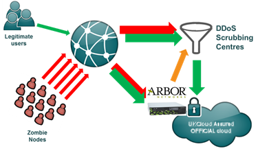

# Protection for Distributed Denial of Service (DDoS) attacks

## Overview

UKCloud services are designed to support and enable the government digital strategy and so we host citizen facing solutions for a number of government departments. Some of these high-profile solutions inevitably attract undesirable attention from malicious actors. Unfortunately, if these malicious actors launch a Distributed Denial of Service (DDoS)^ attack of sufficient size, it is possible to overwhelm the capacity of the UKCloud internet connections and affect the ability for users to access other internet facing systems (including those not specifically targeted by the attack).

UKCloud has enhanced the solutions used to protect the underlying internet-facing infrastructure used by all customers. To this end, UKCloud are focusing on mitigating broad, high-volume attacks, which are most likely to cause collateral damage and noisy neighbour characteristics. These enhancements do not provide adequate mitigation for low-level application-specific attacks or advanced persistent threats and these should be dealt with by customer-specific and customer-managed mitigation solutions. UKCloud customers can procure these customer-specific solutions via UKCloud's Digital Marketplace services (for more information, see the [*Application-tuned DDoS protection Service Scope*](conn-sco-app-ddos.md)).

^ Distributed Denial of Service (DDoS) is a specific type of attack designed to cause the target system to become unavailable. Specifically, this type of attack is highly distributed as the attack traffic comes from a diverse global network of attackers. This is similar to the analogy 'death by a thousand daggers'.

## Options considered

UKCloud evaluated the following three options to provide protection for DDoS attacks:

### Option 1 - Build our own DDoS mitigation solution

This option would entail UKCloud increasing the capacity of the platform by upgrading our ISP connections and it would require the procurement, implementation and on-going management of specialist DDoS mitigation products (for example, Arbor or Radware), which would incur significant up-front and on-going costs. Most importantly, as DDoS attacks are increasing in size and frequency, as well as attack vectors forever changing, it is clear that a sub-scale option like this would not provide effective mitigation in the long term.

### Option 2 - Procure DDoS detection and mitigation services from our upstream ISPs

UKCloud has confirmed that each of our upstream ISPs can provide a level of DDoS mitigation within their networks. These ISPs each have up to 100 Gb network capacity, which makes it less likely that they would be overwhelmed by a typical DDoS attack. However, their solutions are typically based on technologies from individual DDoS mitigation product vendors (typically Arbor) and so they can only provide generalised and automated DDoS protection services. Further, these solutions are only effective within the ISP network and each ISP works independently of each another, so UKCloud would have to procure the service from each ISP individually and co-ordinate them in the event of an attack.

### Option 3 - Leverage a specialist DDoS mitigation service

There are a number of specialist DDoS mitigation service providers such as Akamai (previously Prolexic), Black Lotus (now part of Level3), Neustar and Verisign. Each service provider has created a global network of scrubbing centres which operate at terabit (1000 Gb+) scale. The scrubbing centres use multiple DDoS mitigation techniques (both commercial and proprietary), which ensures they are even able to mitigate attacks that are designed to exploit weaknesses in individual DDoS mitigation products (such as Arbor). Their terabit scale also ensures that they can mitigate even the largest 100 Gb+ attacks, which could overwhelm ISP solutions. Therefore, it is not surprising that these services are used by most major retailers, financial institutions and service providers. On the other hand, these specialist services are typically more expensive to buy than any other option.

## Chosen implementation

Having carefully considered the options, UKCloud:

- Discounted option 1 because it is sub-scale and likely to be ineffectual against larger DDoS attacks and more complex DDoS attacks.

- Discounted option 2 because the effectiveness of the DDoS mitigation varies across ISPs which places a higher burden on UKCloud operational teams and a lower consistency of service to our customers.

- Focused on option 3 as these specialist services provide a more consistent and deterministic service (regardless of the route traffic takes into the platform), more effective DDoS mitigation and protection and superior incident reporting, enabling UKCloud to provide our customers with the details they need when reporting to GovCERT.

UKCloud has selected one of the leading global providers of DDoS mitigation services, which provides specialist DDoS mitigation capabilities to the largest online organisations worldwide. The service includes an array of DDoS mitigation technologies and specialist security analysts who operate a 24x7 security operations centre. This enables DDoS attacks to be detected and mitigated typically within five minutes.

UKCloud has performed extensive testing of the DDoS mitigation service, which has helped identify a number of customer-affecting issues that we had not anticipated. Based on the learning from this evaluation period, we've adjusted our design to incorporate a hybrid of option 1 (local DDoS mitigation appliances), which automatically signal and involve option 3 (cloud based DDoS mitigation) as appropriate.

This solution has now been implemented on the UKCloud platform. If your system is the target for a DDoS attack, UKCloud will notify you individually and work with you to provide the necessary information about the attack to submit into CERT-UK and GovCERT.

## How it works

UKCloud uses the internet standard BGP (border gateway protocol) to advertise preferred routes for our entire public IP address space to travel directly into our cloud platform via our multiple Tier 1 ISP connections. This ensures that all inbound traffic destined to workloads hosted on the UKCloud platform has a direct route into our platform and is not subjected to increased latency or additional network hops. Our Tier 1 ISPs pass traffic directly into specialist DDoS mitigation appliances (Arbor), which are hosted within each of UKCloud's data centres. Our local DDoS mitigation appliances are operated by our DDoS mitigation partner and so benefit from specialist 24x7 monitoring and management. All inbound traffic is inspected by the DDoS mitigation appliances, providing a first line of countermeasures and automatically signalling our DDoS mitigation partner. This configuration enables the DDoS mitigation partner to automatically and immediately detect when an attack is being mounted and implement appropriate countermeasures, including redirecting traffic through their terabit-scale scrubbing centres, as appropriate. These solutions typically begin mitigating DDoS attacks within five to ten minutes.

1. All inbound traffic is routed directly to UKCloud-hosted DDoS mitigation appliances via BGP.

2. The UKCloud DDoS mitigation appliances automatically alert our DDoS mitigation partner who have specialist engineers, processes and additional DDoS-mitigation technology to detect and mitigate DDoS attacks.

3. Under attack conditions, traffic is re-routed via terabit-scale DDoS scrubbing centres.

4. Workloads on the UKCloud platform are protected from DDoS traffic. They only receive clean traffic and so the impact of the DDoS attack is contained.

DDoS attacks can be extremely sophisticated in nature and there may be a dependency for the DDoS solution to be tuned based on the type and volume of the attack. This tuning process can be performed only during the attack and while the attack type is identified. In some cases, this may require customer co-operation and assistance.

## Risks and considerations

UKCloud would like to emphasise that the protection that has been implemented is designed to defend the community of our customers rather than any individual customer. We are able to mitigate volumetric network level DDoS attacks that not only affect the target solution, but many other internet-connected solutions too (this is sometimes referred to as noisy neighbour or collateral damage). Hence, during a sustained volumetric attack, the solution is designed to provide cleansing to ensure legitimate users can continue to access the application or service.

The solution is not designed to provide a comprehensive security solution for a specific application or service. This is important to understand because if your application or service needs to remain available regardless of the size of the DDoS attack then an additional, application-tuned DDoS service will be required. Further, it should be noted that volumetric DDoS attacks are often used as a smokescreen for more targeted low-and-slow attacks and advanced persistent threats (APT) that exploit application vulnerabilities higher up the stack (for example, Layer 7 exploits such as cross-site scripting). UKCloud recommends that customers consider mitigating these application specific threat vectors via appropriate solutions such as Web Application Firewalls, Content Delivery Networks, robust domain name services, on so on. UKCloud customers can procure an application-tuned DNS based DDoS mitigation solution via UKCloud's Digital Marketplace services (for more information, see the [*Application-tuned DDoS protection Service Scope*](conn-sco-app-ddos.md)).

## More information

For more information about DDoS protection, see the following articles:

- [*DDoS Mitigation Service FAQs*](conn-faq-ddos.md)

- [*Application-tuned DDoS protection Service Scope*](conn-sco-app-ddos.md)

- [*Application-tuned DDoS protection FAQs*](conn-faq-app-ddos.md)

## Feedback

If you find an issue with this article, click **Improve this Doc** to suggest a change. If you have an idea for how we could improve any of our services, visit [UKCloud Ideas](https://ideas.ukcloud.com). Alternatively, you can contact us at <products@ukcloud.com>.