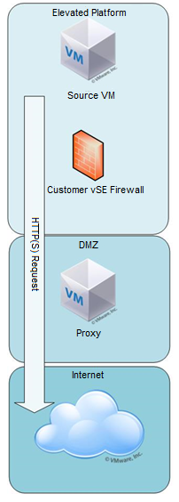

#### UKCloud Limited (“UKC”) and Virtual Infrastructure Group Limited (“VIG”) (together “the Companies”) – in Compulsory Liquidation

On 25 October 2022, the Companies were placed into Liquidation with the Official Receiver appointed as Liquidator and J Robinson and A M Hudson simultaneously appointed as Special Managers to manage the liquidation process on behalf of the Official Receiver.

Further information regarding the Liquidations can be found here: <https://www.gov.uk/government/news/virtual-infrastructure-group-limited-and-ukcloud-limited-information-for-creditors-and-interested-parties>

Contact details: 
For any general queries relating to the Liquidations please email <ukcloud@uk.ey.com> 
For customer related queries please email <ukcloudcustomers@uk.ey.com> 
For supplier related queries please email <ukcloudsuppliers@uk.ey.com>

# Internet access to the Elevated OFFICIAL security domain

## Overview

UKCloud's Elevated OFFICIAL security domain is natively connected to secure government networks; there is no direct internet connectivity. If you want access to the internet, we operate an internet gateway service that enables limited access to internet resources from our Elevated security domain.

The internet gateway isn't designed to support general web access, rich web applications or patch downloads. Instead, it's intended to facilitate access to basic web services such as postcode lookups, payment card authorisation, mapping data, and so on. Only web services identified via an allow-list may be accessed via the gateway.

## Gaining access to the gateway

To gain access to the gateway, raise a service request via the [My Calls](https://portal.skyscapecloud.com/support/ivanti) section of the UKCloud Portal containing the following information:

- Business justification of the requirement

- The NFT or IP address(es) from which the requests will originate

- Details of the target for the request (including the full URLs and HTTP methods)

HTTPS access is allowed, but the content must be decrypted so that it can be inspected. When a new client is provisioned, you'll be issued with the proxy RootCA certificate, which you need to install in your trusted root authority certificate store. The individual ProxyCA certificates can then be trusted by your application.

### Business justification review

If internet access via the gateway is part of a Cross Domain Security Zone (CDSZ) submission, sign-off authorisation for it is given through the UKCloud assurance wrap process.

For an individual request that isn't related to a CDSZ submission, we follow the steps below for sign off:

1. We review the service request to see whether it overlaps with any previously approved requests.

2. We carry out a review to see if the request types fall within the recommended criteria.

3. We make a recommendation to the UKCloud Compliance team detailing whether the request should be approved or rejected.

4. Compliance will approve as a checkpoint.

5. If the business justification is unclear, we may seek validation with the NCSC.

## Feedback

If you find a problem with this article, click **Improve this Doc** to make the change yourself or raise an [issue](https://github.com/UKCloud/documentation/issues) in GitHub. If you have an idea for how we could improve any of our services, send an email to <feedback@ukcloud.com>.
