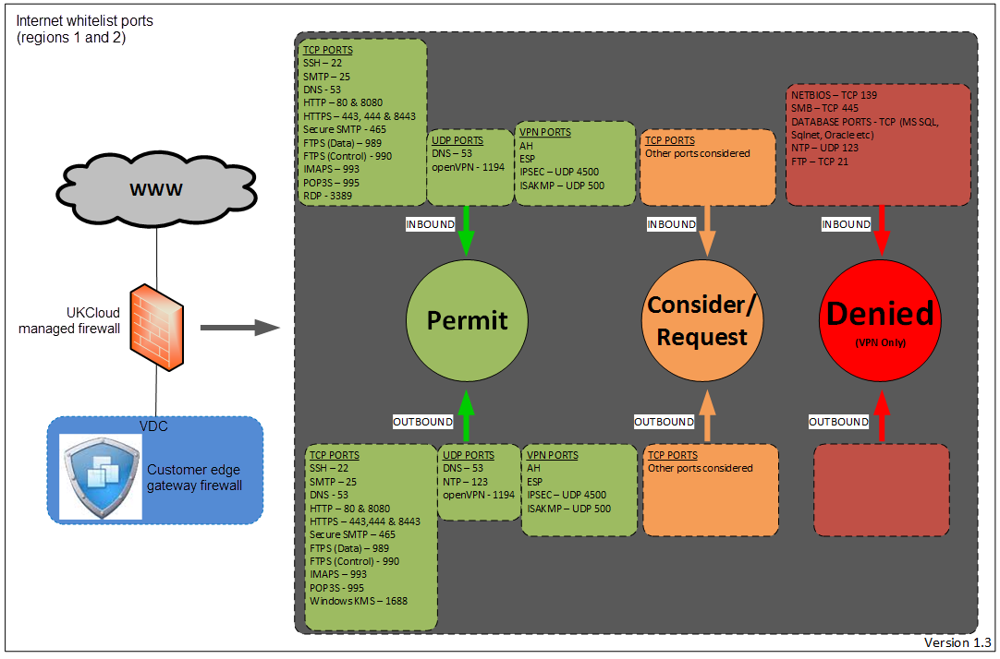

# Internet - permitted standard ports in regions 1 and 2

## Overview

For UKCloud regions 1 and 2, we consulted with NCSC and the Pan Government Accreditor and agreed a policy to maintain a whitelist of common ports that are open as standard on the platform, and allow interoperability between tenants in accordance with this whitelist.

You still need to enable access on your own edge gateway firewall to allow access, but this avoids having to request UKCloud to make similar changes.

> [!NOTE]
> In regions 5 and 6, there is no whitelist of common ports: all ports are open.

The security of your estate is your responsibility and we highly recommend that you review your edge gateway configuration, regardless of the region in which it is located, to verify that the access controls in place are in accordance with your own required security policy. We also recommend that you do not disable your firewall, even in test environments.

This whitelist policy applies to the Assured OFFICIAL security domain only, where connectivity is established using internet routable addresses and where access is to and from the internet or other customers on the UKCloud platform. Other whitelists are maintained for other connectivity types. The Elevated OFFICIAL security domain is completely locked down by default with no ports open by default.

If you require access outside of the standard whitelist, you can request this via the [My Calls](https://portal.skyscapecloud.com/support/ivanti) section of the UKCloud Portal.

The following diagram shows the status of standard internet ports. The permitted ports are also listed in the sections below.

## Inbound access from the internet to your edge gateway

### TCP ports

- SSH - 22 

- SMTP - 25

- DNS - 53

- HTTP - 80 & 8080

- HTTPS - 443,444 & 8443

- Secure SMTP - 465 & 587

- FTPS (Data) - 989

- FTPS (Control) - 990

- IMAPS - 993

- POP3S - 995

- RDP - 3389

### UDP ports
  

- DNS - 53

- OpenVPN - 1194

### VPN ports

- AH

- ESP

- IPSEC - UDP 4500 

- ISAKMP - UDP 500

## Outbound access to the internet from your edge gateway

### TCP ports

- SSH - 22

- SMTP - 25

- DNS - 53

- HTTP - 80 & 8080

- HTTPS - 443, 444 & 8443

- Secure SMTP - 465 & 587

- FTPS (Data) - 989

- FTPS (Control) - 990

- IMAPS - 993

- POP3S - 995

- Windows KMS - 1688

### UDP ports

- DNS - 53

- NTP - 123

- OpenVPN - 1194

### VPN ports

- AH

- ESP

- IPSEC - UDP 4500

- ISAKMP - UDP 500

## Feedback

If you find an issue with this article, click **Improve this Doc** to suggest a change. If you have an idea for how we could improve any of our services, visit the [Ideas](https://community.ukcloud.com/ideas) section of the [UKCloud Community](https://community.ukcloud.com).
