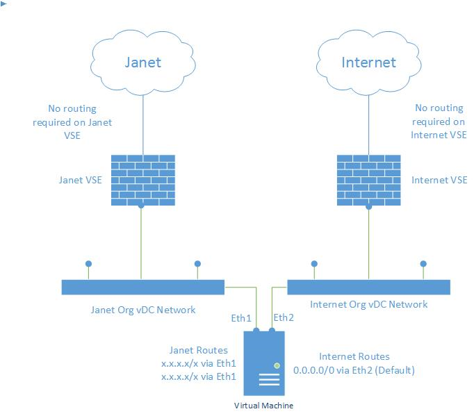
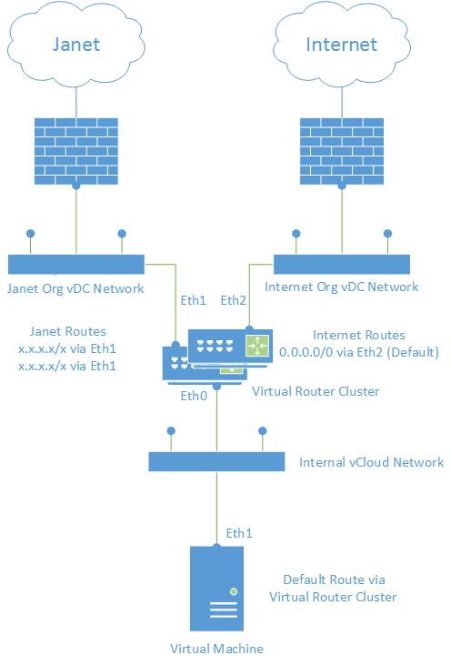

# Network configuration for Janet and internet access

## Overview

If you want to have connectivity to both the Janet network and the internet for one or more virtual machines (VMs), you'll need to configure custom routing. For smaller implementations you can do this on the VM itself, but for a more scalable solution, we recommend that you configure a virtual network device.

## Small or single instance implementation

If you are confident that your environment will not need to scale much past its original size, you can configure a simple implementation to gain a working connection to the Janet network.

To gain access to the Janet network and the internet, the VM must have at least two network interface cards (NICs): one to connect to the internet vCNS Edge and the other to the Janet vCNS Edge. The configuration will differ depending on your operating system (OS), so for details on how to configure this for your OS, refer to the vendor documentation.

Once completed, the topology should look something like that shown in the diagram below.

## Scalable implementation

If you need your environment to scale, or you plan to add additional services (such as PSN) in the future, we recommend that you deploy a centralised virtual networking device, such as pfSense, to connect to the multiple upstream vCNS Edge devices.

This solution enables the VMs within your environment to maintain a single NIC with routing configured as a single default gateway and no additional routes. You must configure the custom routing on the centralised virtual network devices. For details on how to do this, refer to the vendor documentation.

The diagram below shows the recommended topology for a scalable solution for Janet and internet connectivity.

## For more help

If you need more help, contact UKCloud Support via the [My Calls](https://portal.ukcloud.com/support/my_calls) area of the UKCloud Portal.

## Feedback

If you have any comments on this document or any other aspect of your UKCloud experience, send them to <products@ukcloud.com>.