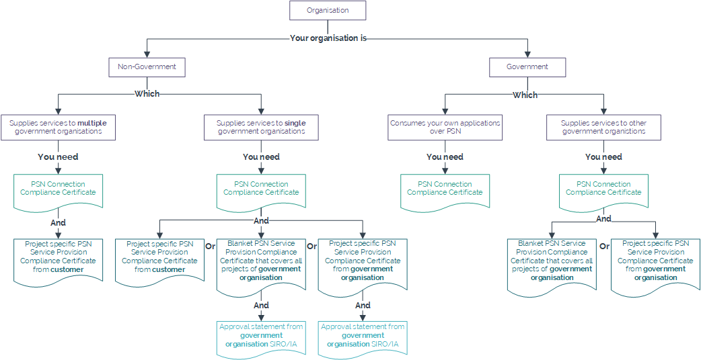

# PSN connection compliance

The following diagram shows the evidence you need to provide to obtain a connection to the PSN from your UKCloud environment.

## Feedback

If you find an issue with this article, click **Improve this Doc** to suggest a change. If you have an idea for how we could improve any of our services, visit the [Ideas](https://community.ukcloud.com/ideas) section of the [UKCloud Community](https://community.ukcloud.com).