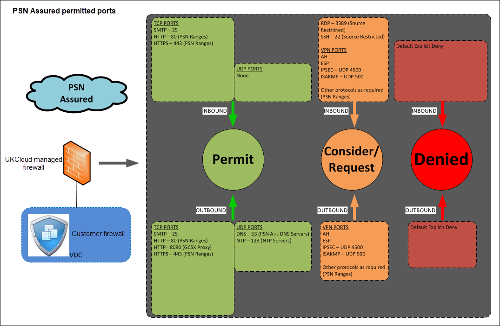

 **UKCloud Limited (“UKC”) and Virtual Infrastructure Group Limited (“VIG”) (together “the Companies”) – in Compulsory Liquidation**

On 25 October 2022, the Companies were placed into Liquidation with the Official Receiver appointed as Liquidator and J Robinson and A M Hudson simultaneously appointed as Special Managers to manage the liquidation process on behalf of the Official Receiver.

Further information regarding the Liquidations can be found here: <https://www.gov.uk/government/news/virtual-infrastructure-group-limited-and-ukcloud-limited-information-for-creditors-and-interested-parties>

Contact details: 
For any general queries relating to the Liquidations please email <ukcloud@uk.ey.com> 
For customer related queries please email <ukcloudcustomers@uk.ey.com> 
For supplier related queries please email <ukcloudsuppliers@uk.ey.com>

# PSN Assured - permitted standard ports

The following allow list of common ports will be open as standard on the platform and allow connectivity to/from the PSN network. This policy has been built in accordance with version 2.3(2) of the PSN Assured GCSX Take on Guide.

Customers still need to enable access on their own edge gateway firewalls to allow access but this change avoids having to request UKCloud to make similar changes.

Customers are encouraged to review their edge configurations to verify that the access controls that are in place are in accordance with their own required security policy.

This allow list policy applies to the Assured OFFICIAL platform only where connectivity is established over PSN using PSN routable addresses.

If you require access outside of the standard allow list this can be requested via the My Calls section of the UKCloud Portal.

## Inbound access from the internet to your edge gateway

### TCP PORTS

SMTP – 25 
HTTP – 80 (PSN Ranges)
HTTPS – 443 (PSN Ranges)

### UDP PORTS

None

### VPN PORTS

None

## Outbound access to the internet from your edge gateway

### TCP PORTS

SMTP – 25 
HTTP – 80 (PSN Ranges)
HTTP – 8080 (GCSX Proxy)
HTTPS – 443 (PSN Ranges)

### UDP PORTS

DNS – 53 (PSN Assured DNS Servers)
NTP – 123 (NTP Servers)

### VPN PORTS

None

## Feedback

If you find a problem with this article, click **Improve this Doc** to make the change yourself or raise an [issue](https://github.com/UKCloud/documentation/issues) in GitHub. If you have an idea for how we could improve any of our services, send an email to <feedback@ukcloud.com>.
