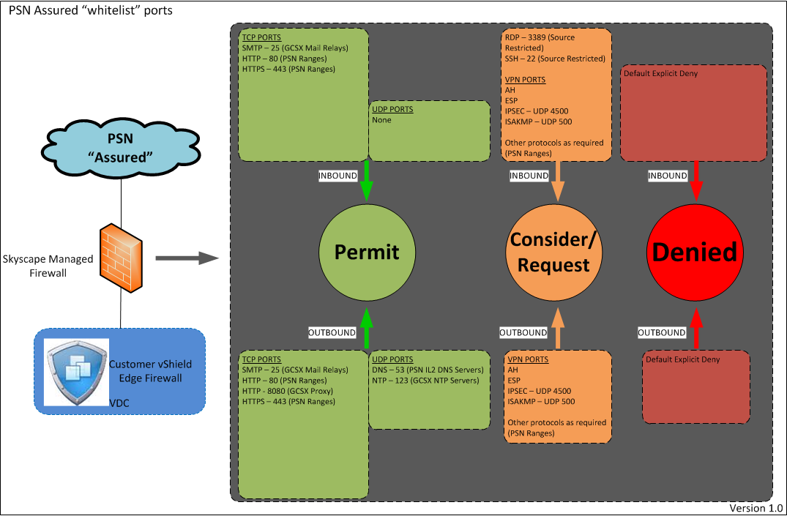

# PSN Assured - permitted standard ports

The following whitelist of common ports will be open as standard on the platform and allow connectivity to/from the PSN Assured network. This policy has been built in accordance with version 2.3(2) of the PSN IL2 GCSX Take on Guide.

Customers still need to enable access on their own vShield edge firewalls to allow access but this change avoids having to request UKCloud to make similar changes.

Customers are encouraged to review their vShield edge configurations to verify that the access controls that are in place are in accordance with their own required security policy.

This whitelist policy applies to the Assured OFFICIAL platform only where connectivity is established over PSN using PSN routable addresses.

If you require access outside of the standard whitelist this can be requested via the support section of the UKCloud Portal.

## Inbound access from the Internet to your vShield Edge Gateway

### TCP PORTS

SMTP – 25 (GCSX Mail Relays)
HTTP – 80 (PSN Ranges)
HTTPS – 443 (PSN Ranges)

### UDP PORTS

None

### VPN PORTS

None

## Outbound access to the Internet from your vShield Edge Gateway

### TCP PORTS

SMTP – 25 (GCSX Mail Relays)
HTTP – 80 (PSN Ranges)
HTTP – 8080 (GCSX Proxy)
HTTPS – 443 (PSN Ranges)

### UDP PORTS

DNS – 53 (PSN IL2 DNS Servers)
NTP – 123 (GCSX NTP Servers)

### VPN PORTS

None

## Feedback

If you find a problem with this article, click **Improve this Doc** to make the change yourself or raise an [issue](https://github.com/UKCloud/documentation/issues) in GitHub. If you have an idea for how we could improve any of our services, send an email to <feedback@ukcloud.com>.
