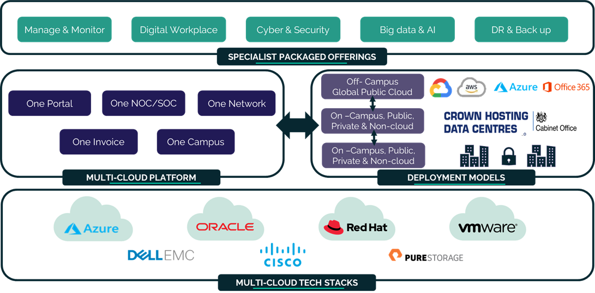

#### UKCloud Limited (“UKC”) and Virtual Infrastructure Group Limited (“VIG”) (together “the Companies”) – in Compulsory Liquidation

On 25 October 2022, the Companies were placed into Liquidation with the Official Receiver appointed as Liquidator and J Robinson and A M Hudson simultaneously appointed as Special Managers to manage the liquidation process on behalf of the Official Receiver.

Further information regarding the Liquidations can be found here: <https://www.gov.uk/government/news/virtual-infrastructure-group-limited-and-ukcloud-limited-information-for-creditors-and-interested-parties>

Contact details: 
For any general queries relating to the Liquidations please email <ukcloud@uk.ey.com> 
For customer related queries please email <ukcloudcustomers@uk.ey.com> 
For supplier related queries please email <ukcloudsuppliers@uk.ey.com>

# UKCloud Desktop as a Service

<!-- begin Tagline -->

  

    
<strong>Deliver safe, secure and compliant solutions to enable organisations to operate in dispersed working environments</strong>

  

<!-- end Tagline -->

<!-- begin Introduction -->

  
 
    <!-- brief introduction -->
    
Our remote desktop solution &nbsp; powered by VMware Horizon &nbsp; enables your workforce to access desktops and applications from their corporate and personal devices. Working in parallel with our unique connectivity and assurance options, your employees can access the information they need the most.

    <!-- link to propositions -->
    
The reasons for moving towards a new, <a href="https://ukcloud.com/solutions/digital-workplace/"><strong>digital workplace</strong></a> as part of your <a href="https://ukcloud.com/solutions/data-centre-modernisation/"><strong>data centre modernisation</strong></a> journey are long and growing, from increasing productivity and attracting the best talent, to more tangible results like downsizing your office space or reducing energy costs. With UKCloud's unique <a href="https://ukcloud.com/solutions/secure-cloud/"><strong>secure</strong></a> and <a href="https://ukcloud.com/solutions/sovereign-cloud/"><strong>sovereign cloud</strong></a>, the future might be closer than you think. We've partnered with various organisations so that you can adopt the latest <a href="https://ukcloud.com/solutions/public-sector-innovation/"><strong>innovative technologies</strong></a> to deliver new and existing services in the cloud.

  

  

    

      <iframe src="https://www.youtube.com/embed/Bli-XERyWLU" style="position:absolute;top:0;left:0;width:100%;height:100%;"title="YouTube video player" frameborder="0" allow="accelerometer; autoplay; clipboard-write; encrypted-media; gyroscope; picture-in-picture" allowfullscreen></iframe>
    

  

<!-- end Introduction -->

<!-- begin Videos -->

  

    <h2>See it in action</h2>
  

  

    

      <iframe src="https://www.youtube.com/embed/SJcWIxtjpJI" style="position:absolute;top:0;left:0;width:100%;height:100%;" frameborder="0" allow="accelerometer; autoplay; encrypted-media; gyroscope; picture-in-picture" allowfullscreen></iframe>
    

    
<a href="https://www.youtube.com/watch?v=SJcWIxtjpJI">UKCloud Desktop as a Service powered by VMware Horizon</a>

  

  

  

  

  

<!-- end Videos -->

<!-- begin How to Buy -->

  

    <h2>How to buy</h2>
  

  

    
The <a href="https://ukcloud.com/pricing-guide"><strong>UKCloud Pricing Guide</strong></a> lists all our product pricing. For examples of how pricing works for UKCloud Desktop as a Service, take a look at our <a href="daas-ref-pricing.md"><strong>Pricing information</strong></a> article.

    
If you're interested in buying UKCloud Desktop as a Service, or would like a quote:

  

  

    
<strong>If you're already a UKCloud customer</strong>

    
Raise a Service Request, contact your Service Delivery Manager or email <a href="mailto:servicedelivery@ukcloud.com"><strong>servicedelivery@ukcloud.com</strong></a>

  

  

    
<strong>If you're new to UKCloud</strong>

    
<a href="https://ukcloud.com/contact/"><strong>Contact us</strong></a> via our website or call us on 01252 303 300

  

<!-- end How to Buy -->

<!-- begin Additional Products -->

  

    <h2>Additional options</h2>
  

  

    
To get the most out of our platform, see below for some additional options and products you might want to consider using with UKCloud Desktop as a Service (additional charges apply).

  

  

    
<strong>Product options</strong>

  

  

    
<strong>Complementary products</strong>

  

  

      
<strong>Support services.</strong></a> Third-line support to VMware Horizon specialist engineers.

      
<strong>Fully managed support.</strong></a> A fully managed service to help manage your VDI environment.

  

  

      
<a href="https://ukcloud.com/app/uploads/2022/08/ukc-svc-251-managed-it-operations-service-definition-13.0.pdf"><strong>Managed IT Operations.</strong></a> Reduce the amount of time spent on managing your IT infrastructure.

      
<a href="https://ukcloud.com/app/uploads/2022/08/ukc-svc-239-security-operations-service-service-definition-13.0.pdf"><strong>Security Operations Service.</strong></a> People, processes and tooling to assist with cyber monitoring capabilities.

      
<a href="https://ukcloud.com/app/uploads/2022/08/ukc-svc-232-ukcloud-professional-services-service-definition-13.0-1.pdf"><strong>Professional Services.</strong></a> Help with solution design and digitisation projects.

      
<a href="https://ukcloud.com/app/uploads/2022/08/ukc-svc-244-ukcloud-for-vmware-service-definition-13.0.pdf"><strong>UKCloud for VMware.</strong></a> Migrate on-premises VMware-based VMs to UKCloud's VMware public cloud.

      
<a href="https://ukcloud.com/app/uploads/2022/08/ukc-svc-229-cloud-storage-service-definition-13.0-2.pdf"><strong>Cloud Storage.</strong></a> Cost effective unstructured object storage for data archive.

  

  

    
If you want to find out more about any of these options or products, contact your Service Delivery Manager or email <a href="mailto:servicedelivery@ukcloud.com"><strong>servicedelivery@ukcloud.com</strong></a>

  

<!-- end Additional Products -->

<!-- begin Why UKCloud -->

  

    <h2>Why UKCloud?</h2>
  

  

    
<strong><a href="https://ukcloud.com/our-platform/">The right cloud for every platform.</a></strong> Modernise legacy workloads across the board by rehosting traditional systems with UKCloud for VMware or exploring new and emerging technologies with OpenShift. We can help you build a cloud specific to your needs.

  

  

    
<strong><a href="https://ukcloud.com/ukcloud-support/customer-experience/">An award-winning customer experience.</a></strong> The customer sits at the heart of everything we do. Whether that's through our 24/7 support function – a service we provide at no extra charge – or by giving every single one of our customers a dedicated Service Delivery Manager.

  

  

    
<strong><a href="https://ukcloud.com/sectors/">Dedicated to the public sector.</a></strong> From our unique assurance and connectivity options to the people we employ &ndash; everything we do comes back to our mission to help public sector organisations deliver better digital services at a lower cost.

  

  

    
<strong><a href="https://ukcloud.com/governance/">Uncompromising security and integrity.</a></strong> Our UK-based data centres help protect your organisation from regulations such as GDPR, whilst our unique assurance and connectivity options enable you to move your most secure and sensitive systems to the cloud.

  

  

    
<strong><a href="https://ukcloud.com/solutions/public-sector-innovation/">Champions of innovation.</a></strong> We've partnered with over 300 specialist organisations who have built their pioneering digital services on top of our government-grade infrastructure. From AI to RPA, our partner ecosystem has you covered.

  

  

    
<strong><a href="https://ukcloud.com/why-ukcloud/social-value-overview/">Committed to doing the right thing.</a></strong> From paying our taxes to undergraduate and apprentice programmes. From Carbon Neutral solutions to charity work. Everything we do can be traced back to our commitment to doing the right thing.

  

  

    
  

<!-- end Why UKCloud -->

<!-- begin Feedback -->

  

    <h2>Get in touch</h2>
  

  

    
  

<!-- end Feedback -->
