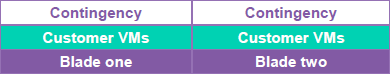
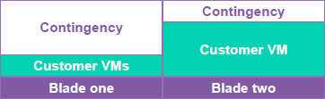

# Dedicated Compute v2 Service Scope

## About this document

This document is for customers considering purchasing our Dedicated Compute v2 service.

It describes the boundaries of the service, along with the division of responsibilities between UKCloud and the customer to facilitate the changes required.

## About Dedicated Compute v2

Dedicated Compute v2 enables you to run VMware compute workloads as a reserved, single-tenanted section of our cloud, where the physical CPU and RAM allocations are known.

This service is designed for customers who:

- Are looking to run abnormal sized VMs - such as those larger than our standard T-shirt sizes

- Looking to meet specific software licensing requirements

- Have an increased security requirement that can be met by Dedicated Compute infrastructure

## Default setup

We deliver Dedicated Compute v2 by providing you with dedicated physical hosts on which you control resource allocation.

The initial Dedicated Compute purchase is a starter pack consisting of two physical hosts. The standard host specification is dual 16 core and 512 GiB of RAM.

You can then scale your estate by purchasing additional upgrade packs (an upgrade pack consists of  1 x dual 16 core and 512 GiB of RAM compute host). After nine expansion packs, you must buy another starter pack.

You choose between Tier 1 or Tier 2 storage for your VMs, both of which can include a backup service. Full details of service options are given in the [*Service Definition*](dc-sd.md). For pricing, see the [*UKCloud Pricing Guide*](https://ukcloud.com/wp-content/uploads/2019/06/ukcloud-pricing-guide-11.0.pdf).

The storage pool isn’t a dedicated hardware resource; it's drawn from our UKCloud for VMware block storage solutions.

These resources are grouped in a private virtual data centre (pVDC) which is available only to the individual Dedicated Compute customer.

## Resilience and resource reservations

We operate at least N+1 for hardware resilience on our Dedicated Compute v2 service. However, we recommend sizing your resilience according to your workload profile.

We will reserve at least one physical hosts worth of resources from your allocation to ensure that, in the event of a hardware failure, the service can continue to run and support your workload.

During a failure scenario, VMs will be restarted on surviving hosts within the Dedicated Compute v2 cluster. UKCloud is not responsible for any performance degradation of VMs in the Dedicated Compute v2 cluster caused during a failure scenario due to over contention in the remaining hosts.

The table below shows the configuration, the resources available to a customer, the number of physical blades in the configuration, and the UKCloud resources reserved to run it.

&nbsp;                               | Customer available resources | Physical blades | Resource reservation
-------------------------------------|------------------------------|-----------------|---------------------
**Starter pack**                     | 32 cores, 512 GiB RAM        | 2               | 50% (32 core , 512 GiB RAM)
**Starter pack + 1 expansion pack**  | 64 cores, 1024 GiB RAM       | 3               | 33% (32 core , 512 GiB RAM)
**Starter pack + 2 expansion packs** | 96 cores, 1536 GiB RAM       | 4               | 25% (32 core , 512 GiB RAM)

## Resource utilisation

To improve performance, Dedicated Compute v2 uses all physical resources available in the installation and balances the load across them, without consuming the reserved capacity mentioned above.

This means that in general operation within the starter pack, there is a 50% utilisation of both physical hosts:

However, you can create VMs of any size and shape you require, up to the maximum size of the physical capacity of one host - 32 cores 512 GiB RAM.

A VM cannot span across physical hosts so, if you create a VM larger than 50% of the host capacity, the Dedicated Compute v2 installation may carry more of the contingency capacity of one physical host than of the others:

You can over-contend the resources on your Dedicated Compute v2 as you see fit.

## Deployment options

There are two deployment options for Dedicated Compute v2:

- **UKCloud-defined** - You select a workload type for your VDC based on UKCloud for VMware VM types (ESSENTIAL, POWER or PRIORITY). Any VMs will inherit the characteristics and reservation levels of that service when deployed.

- **Customer-defined** - You can set reservation levels on a per-VM basis.

## Platform management

Dedicated Compute v2 is managed in the same way as our other cloud services, using vCloud Director, the UKCloud Portal, and APIs associated with both.

The Dedicated Compute v2 service will be maintained to the same software patch revisions as our main platform.

It's not currently possible to see the level of provisioned/utilised resources against the Dedicated Compute v2 service on the UKCloud Portal. (This is a development item on the UKCloud Portal roadmap.) In the meantime, we can provide this information on request.

## Service provisioning

You can request Dedicated Compute v2 via your Technical Account Manager or using the My Calls section of the UKCloud Portal.

The minimum commitment period to the service is 30 days. The notice period is 30 days.

On receipt of all relevant information, we will deploy the service within 10 working days for standard configurations.

Dedicated Compute v2 is available only in UKCloud Regions 5 and 6.

## Customer responsibilities

You need to be aware of the following customer responsibilities relating to deployment of, configuration of and migration into the Dedicated Compute v2 service, which are in addition to the usual responsibilities placed on customers of our UKCloud for VMware service:

- Creating VMs in the new environment

- Migrating VMs from existing environments by cloning and copying turned-off VMs, or by moving turned-off vApps to the new environment

- Ensuring you have the right licensing in place for the applications in use in your Dedicated Compute v2 environment

- If you select the customer-defined deployment option, you must manage your own reservation levels

- It is your responsibility to purchase enough Dedicated Compute v2 modules to ensure that there is enough resource available to your VMs in the event that one or more hosts fail. If you need any help ensuring you have enough resource in your Dedicated Compute v2 cluster, contact your Cloud Architect.

## Feedback

If you find an issue with this article, click **Improve this Doc** to suggest a change. If you have an idea for how we could improve any of our services, visit [UKCloud Ideas](https://ideas.ukcloud.com). Alternatively, you can contact us at <products@ukcloud.com>.
