# Getting Started Guide for Email and Collaboration as a Service

## Overview

UKCloud offers an Email and Collaboration service, powered by Zimbra, to enable you to have a cloud hosted, secure email service, connected to government networks or the internet. You can connect this mail service
through your normal mail applications (for example, Microsoft Outlook), to send and receive mail as well as use lightweight collaborative features.

This Getting Started Guide walks you through the process of configuring your Email and Collaboration service.

### Intended audience

This guide is intended for users who want to set up their Email and Collaboration as a Service. To complete the steps in this guide you must have login credentials for an administrator account and access to the
Zimbra administration console.

## Introduction to Email and Collaboration as a Service

The Zimbra Collaboration Suite that underpins UKCloud's email offering provides a wide range of client connectivity options.

- An advanced webmail client allows the full feature set within the suite to be accessed from anywhere that internet connectivity is available and from virtually any platform via a wide-range of supported browsers

- A cross-platform desktop application is provided extending the functionality of the web client by enabling email to be read and composed while offline

- IMAP and POP3 clients are supported

- Calendar and contacts can be accessed via the CalDav and CardDav protocols

- Full Microsoft Outlook integration is supported using the Zimbra Collaboration Suite Connector for Outlook, which utilizes a full MAPI provider that leverages the Microsoft-standard MAPI interface for contacts, calendar, and other functionality not supported by IMAP or POP

The service provides enterprise-class functionality for end-users, on a per-mailbox, per- month pricing model. It offers several options for mailbox access, including POP3, IMAP4 and SMTP --- all with TLS (SSL)
encryption --- as well as HTTPS. Exchange ActiveSync is also supported.

Although the service was designed with end-users in mind, there's nothing to stop you using the supported protocols to allow an application to access a mailbox in order to send or receive email. This will generally be achieved via SMTP or POP3 over TLS.

It's worth noting that there's a minimum commitment of 25 mailboxes with this service --- but they don't all have to be used.

### Before you begin

To start using the Email and Collaboration service, you first need to decide on a domain name, which must be a real-world, registered domain name. You can use a new domain name, or simply delegate a sub-domain of
your organisation's existing domain name.

You'll need to configure your chosen domain's MX record as `mail.skyscapecs.net`.

Once you've decided on a domain name and submitted your service request, UKCloud will configure your domain name on our platform and create an administrator account. You'll receive a welcome email with details of your administrator account with delegated rights for your email domain. This account will usually be in the following format:

`admin@<yourdomain>`

For example:

`admin@example.com`

You'll receive the account details as part of the onboarding process; we recommend that you change the account's password immediately. This is the account you'll use to create mailboxes on the platform. You'll need to create a mailbox for each email address you want to be able to send or receive from.

### Supported browsers

Refer to the *Zimbra Collaboration Supported Systems* document for the most up to date list, at:

<https://wiki.zimbra.com/wiki/Zimbra_Releases/8.7.0/Supported_Systems>

- Firefox and Chrome on Windows, Mac, Linux

- Internet Explorer on Windows

- Safari on Mac and Windows

## Accessing the Zimbra administration console

The Zimbra administration console is a browser-based user interface for managing your mailbox server and mailbox accounts.

The way you access the administration console depends on which security domain you use:

- The Assured OFFICIAL console is accessible from the internet or via the PSN Assured network (depending on the service selected)

- The Elevated OFFICIAL console is accessible only via the PSN Protected network (and other interconnecting networks)

We'll provide you with the URL for the administration console along with your account details.

## Creating a user account

Creating a user account sets up the appropriate entries in the LDAP directory server. When the user logs in for the first time, or when the first email is delivered to the user's account, the mailbox is created on the mailbox server.

To create a user account:

1. In the administration console, select **Manage** and then **Accounts**.

2. Click the gear symbol in the top-right of the main panel and select **New**.

    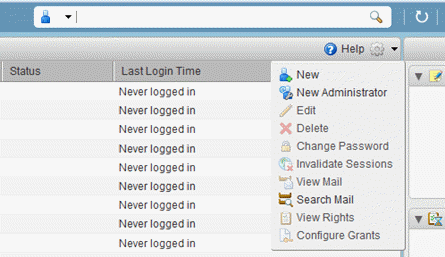

3. Enter an **Account name** and the user\'s **Last name** (the other fields are optional).

4. If the new account will be an administrator, select the **Administrator** checkbox in the *Account Setup* section.

    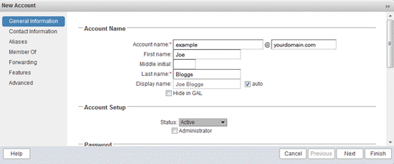

5. Scroll down to set the initial **Password** then click **Next**.

    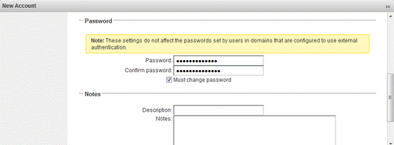

6. Enter the new user's contact information then click **Next**.

    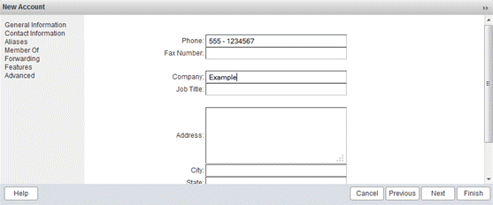

7. Enter any aliases required for the account then click **Next**.

    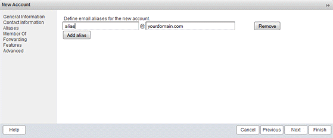

8. Add the account to any required distribution lists then click **Next**.

    If the account is an administrator account, you need to add it to the administration group at this point, to grant the necessary rights within the domain. To do this:

    - In the **Find** field under *Add distribution lists to the account*, enter `admingroup` and click **Search**.

    - Select the resulting `admingroup@<yourdomain>`, for example `admingroup@example.com`.

    - Click **Add** at the bottom of the dialog box to make the new account a member of the group.

    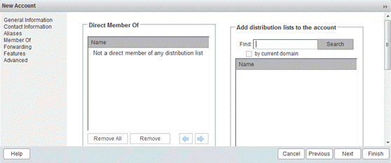

9. Specify any forwarding rules.

    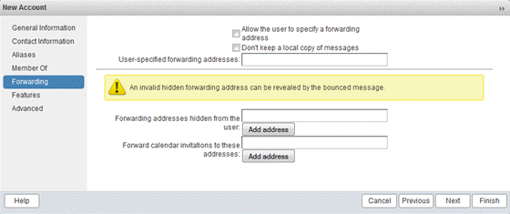

10. Click **Finish** to complete creation of the account.

The user can log in to and use the account immediately. It will take up to an hour to add the account to the Global Address List, during which time the account name won't be listed as an auto-complete option for users composing emails.

## Getting to know the Zimbra web client

Zimbra offers standard HTML, advanced JavaScript, and mobile web clients that you can log into. The web clients include mail, calendar, address book, and task functionality. You can select the client to use when you log in.

- The advanced web client includes Ajax capability and offers a full set of web collaboration features. This web client works best with newer browsers and fast internet connections.

- The standard web client is a good option when internet connections are slow or if you prefer HTML-based messaging for navigating within your mailbox.

- The mobile web client provides an experience optimized for smaller screen formats available on mobile devices.

Typically when you log in, you'll see the advanced Zimbra web client. You can switch to a different version if you prefer by using the **Version** list on the login screen. If the Zimbra web client detects that the screen resolution is 800x600, you're automatically redirected to the standard web client. You can still select the advanced web client but will see a warning message suggesting the use of the standard client for a better screen view. When connecting to Zimbra using a mobile web browser, Zimbra will automatically detect and default to the mobile web
client.

To access the Zimbra web client:

1. Go to the following location:

    <https://mail.skyscapecs.net/>

    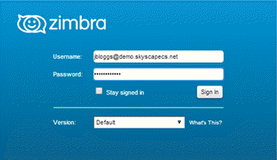

2. Log in using your account's email address and password.

    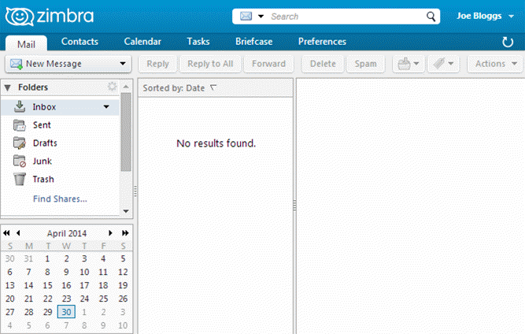

## Installing the Zimbra desktop client

The Zimbra desktop client delivers a consistent user experience offline, so email, social media, calendar, contacts, files and documents are synchronized and locally accessible when on the road. Zimbra Desktop aggregates information across accounts (Zimbra, Yahoo! Mail, Gmail,
Hotmail, etc.) and social networks (Facebook, Digg, Twitter, etc.) to help make communicating and sharing information easier than ever.

1. Download Zimbra Desktop from:

    <https://www.zimbra.com/downloads/zimbra-desktop/>

    > [!NOTE]
    > The desktop client is supported on Windows, Mac and Linux.

2. Once installed open the client and click the **Add New Account** button.

3. From the **Account Type** list, select **Zimbra** and complete the form as shown in the image below, substituting the **Email Address** and **Password** with your account details.

    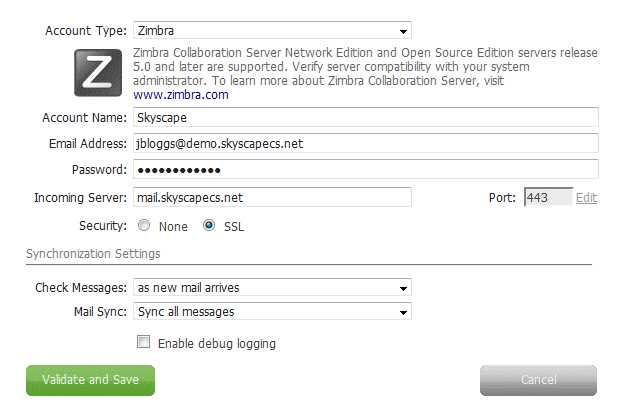

4. When you're done, click **Validate and Save**.

5. The new account will be listed.

    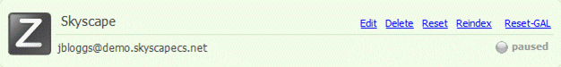

6. Click **Launch Desktop**.

    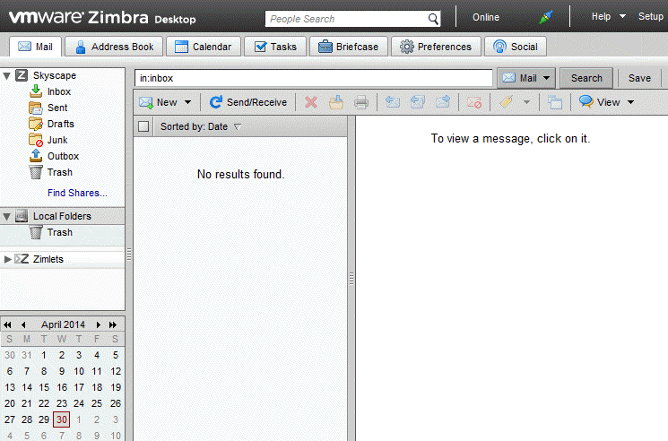

## Configuring IMAP and POP3 clients

A wide variety of IMAP and POP3 clients are available natively, or for download and use within Windows, Mac, Linux, Android, iOS and BlackBerry. There are far too many to cover in detail so examples of setting up the more common desktop applications will be detailed here.

The following settings should work with any application that adheres to the IMAP or POP3 protocol standards. IMAP is the preferred protocol and should be used if available.

**Incoming mail server (IMAP):** mail.skyscapecs.net\
**Encrypted connection type:** SSL\
**IMAP/S port:** 993

**Incoming mail server (POP3):** mail.skyscapecs.net\
**Encrypted connection type:** SSL\
**POP3/S port:** 995

**Outgoing mail server (SMTP):** mail.skyscapecs.net\
**Encrypted connection type:** SSL/TLS\
**SMTP/S port:** 465

### Configuring Microsoft Outlook

To configure Outlook:

1. In Outlook, select **File** then **Add Account**.

2. Select **Manually configure server settings or additional server types**.

3. Select **Internet E-mail**.

4. Enter **Your Name** and **E-mail Address**.

5. From the **Account Type** list, select **IMAP**.

6. Set both the **Incoming mail server** and **Outgoing mail server (SMTP)** to `mail.skyscapecs.net`.

7. In the **User Name** field, enter your full email address.

8. Enter your **Password**.

    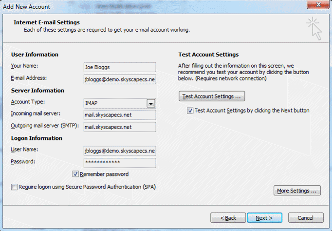

9. Click the **More Settings** button.

10. Select the *Outgoing Server* tab.

11. Select the **My outgoing server (SMTP) requires authentication** checkbox.

12. Make sure the **Use the same settings as my incoming mail server** checkbox is selected.

13. Select the *Advanced* tab.

14. Change the server port numbers as follows:

    - **Incoming server (IMAP):** 993\
        **Use the following type of encrypted connection:** SSL

    - **Outgoing server (SMTP):** 465\
        **Use the following type of encrypted connection:** SSL

15. Click **Next** to test the account settings and to add the account to Outlook.

### Configuring Mozilla Thunderbird

To configure Thunderbird:

1. In Thunderbird, select **Options** then **Account Settings**.

2. Select **Account Actions** and then **Add Mail Account**.

3. Enter your **Name**, **Email address** and **Password** then click **Continue**.

4. Click the **Manual Config** button.

5. Configure the connection as follows:

    - **Incoming:** IMAP 
        **Server hostname:** mail.skyscapecs.net 
        **Port:** 993 
        **SSL:** SSL/TLS 
        **Authentication:** Normal Password

    - **Outgoing:** SMTP 
        **Server hostname:** mail.skyscapecs.net 
        **Port:** 465 
        **SSL:** SSL/TLS 
        **Authentication:** Normal Password

6. In the **Username** field, enter your full email address.

7. **Re-test** the connection and click **Done** to complete the account setup.

    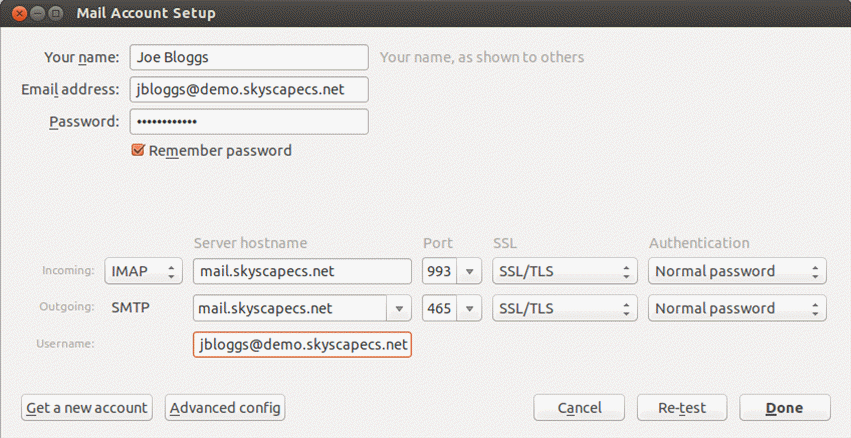

## Installing the Zimbra Collaboration Suite Connector for Microsoft Outlook

The Zimbra Connector for Microsoft Outlook (ZCO) provides real-time, two-way synchronization of mail, contacts, tasks, and calendar between Outlook and the Zimbra server.

Before you begin, check the *Zimbra Connector for Microsoft Outlook Administrator Guide* to verify that the target version of Microsoft Outlook is supported by the Zimbra connector:

<https://files.zimbra.com/website/docs/8.7/ZCS_Connector_For_Outlook_Admin_Guide_8.7.0.pdf>

To install the Zimbra Connector for Outlook:

1. Log in to the Zimbra administration console using an administrator account in your email domain.

2. In the left-hand menu, select **Tools and Migration**.

3. Under **Downloads for End Users**, select and download the appropriate version of the **Zimbra Connector for Outlook** for your environment (either 32-bit or 64-bit).

    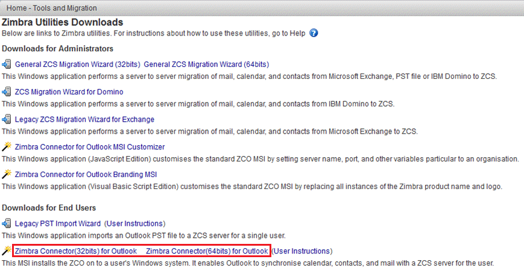

4. Install the MSI onto your machine.

5. Open Microsoft Outlook.

6. When prompted, enter the following details:

    - **Server Name** is mail.skyscapecs.net

    - Select the **Use Secure Connection** checkbox

    - Enter the **Email Address** and **Password** of your account

    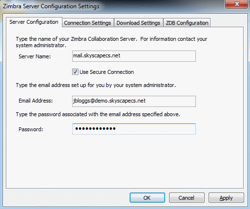

7. Click **OK** to complete the installation and Outlook will begin to synchronise email, contacts, tasks and calendar events with the UKCloud server.

    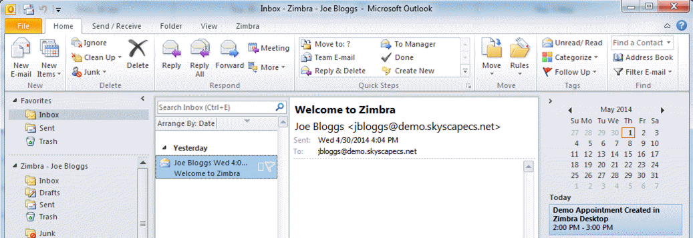

## Next steps

In this guide, you've learned how to:

- Access the Zimbra administration console and create new mailbox accounts

- Access your mailbox using the Zimbra web and desktop clients

- Configure IMAP and POP3 clients

- Install the Zimbra Connector for Outlook

For more information about using Email and Collaboration as a Service, see the following articles on the Knowledge Centre:

- [*How to use UKCloud's email service with your application*](email-how-use-with-app.md)

- [*How to set up Email and Collaboration on an iPhone or iPad*](email-how-setup-iphone.md)

- [*How to setup Email on Android, Windows or BlackBerry mobile devices*](email-how-setup-android.md)

## Glossary

This section provides a glossary of terms specific to Email and Collaboration as a Service.

**alias**&nbsp;&nbsp;An email alias is simply a forwarding email address.

**distribution list**&nbsp;&nbsp;A distribution list is a feature of email client programs that allows a user to maintain a list of email addresses and send messages to all of them at once. This can be referred to as an electronic mailshot.

**IMAP**&nbsp;&nbsp;The Internet Message Access Protocol (IMAP) is a mail protocol used for accessing email on a remote web server from a local client.

**LDAP**&nbsp;&nbsp;Lightweight Directory Access Protocol is an Internet protocol that email and other programs use to look up information from a server. LDAP is mostly used by medium-to-large organisations.

**POP**&nbsp;&nbsp;POP stands for Post Office Protocol. POP3 is version 3 of the protocol. When an e-mail is sent to your address, it is stored on the mail server until it is downloaded via your e-mail client (Outlook, your mobile, etc.) using POP3. After the e-mail has been downloaded to your client, it is removed from the server altogether.

**SMTP**&nbsp;&nbsp;Simple Mail Transfer Protocol. SMTP is used when email is delivered from an email client, such as Outlook Express, to an email server or when email is delivered from one email server to another. SMTP uses port 25.

**TLS**&nbsp;&nbsp;Transport Layer Security (TLS) and its predecessor, Secure Sockets Layer (SSL), both frequently referred to as "SSL", are cryptographic protocols that provide communications security over a computer network.

**Zimbra**&nbsp;&nbsp;An enterprise-class email, calendar and collaboration solution built for the cloud, both public and private.

**Zimbra Connector for Microsoft Outlook**&nbsp;&nbsp;Allows users to synchronise Mailbox, Calendar, Contacts and Tasks with Microsoft Outlook.

## Feedback

If you find an issue with this article, click **Improve this Doc** to suggest a change. If you have an idea for how we could improve any of our services, visit [UKCloud Ideas](https://ideas.ukcloud.com). Alternatively, you can contact us at <products@ukcloud.com>.
