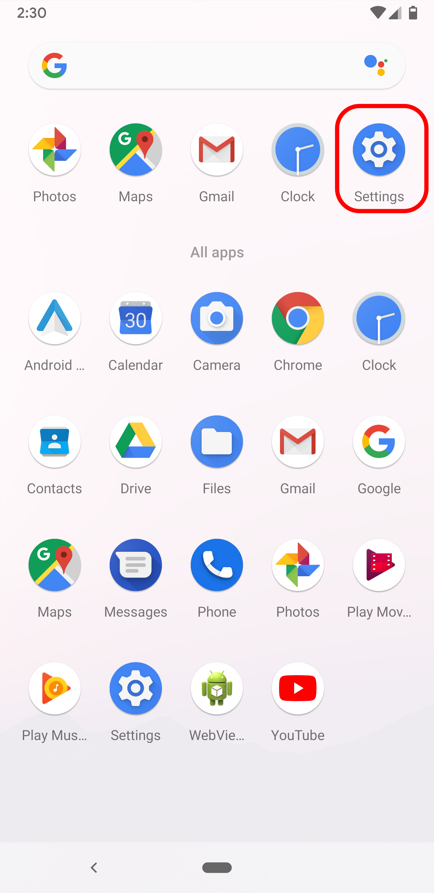
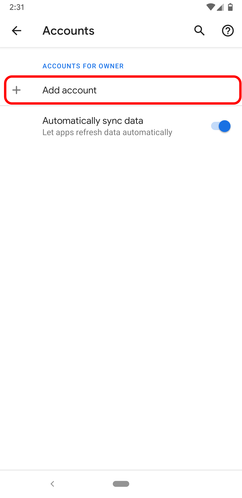
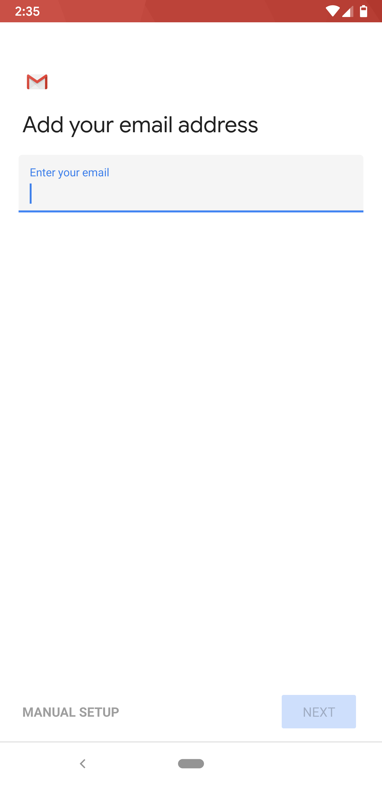
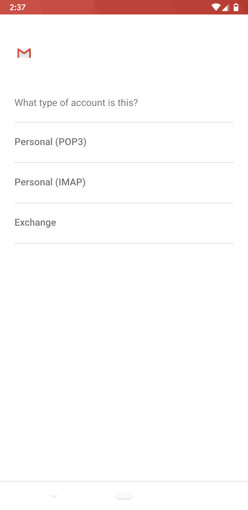
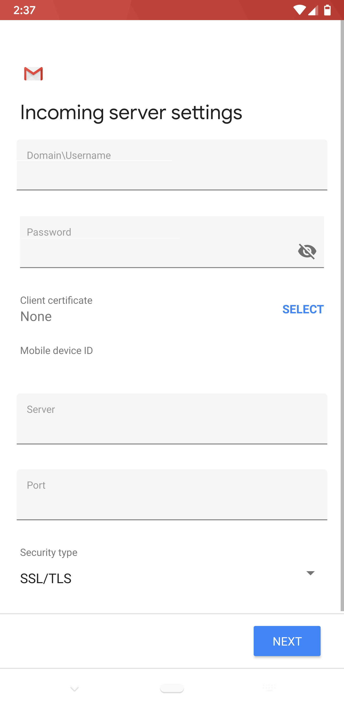
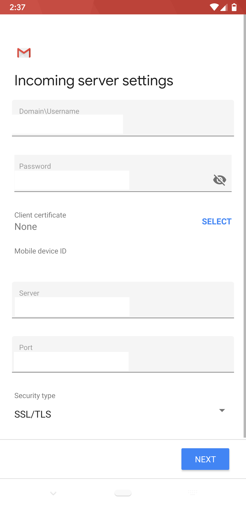
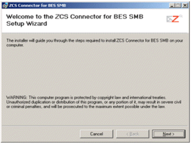

# How to set up Email and Collaboration on Android, Windows or Blackberry mobile devices

## Overview

UKCloud's Email and Collaboration as a Service includes the option of accessing emails, calendars and tasks via most smart phone devices. The underlying platform for this service is provided by Zimbra, and this guide contains an overview of mobility options for Zimbra Collaboration Suite (ZCS), as well as information on how to set up Zimbra Mobile for most smart phones on specific operating systems.

> [!NOTE]
> The information supplied is a general guide for the majority of Android, Windows and Blackberry mobile devices; some devices may require an alternative or modified set up process.

If you have an iPhone or iPad, see [*How to set up Email and Collaboration on an iPhone or iPad*](email-how-setup-iphone.md).

## Before you begin

Android-based smart phones can natively synchronise email, contacts and calendars to Zimbra accounts. The two prerequisites to configure this are:

- The Zimbra email system used by your organisation or service provider is a paid Network Edition license (ask your administrator if you're not sure)

- Your administrator has enabled mobility on your account

Assuming these two requirements are met, you can configure Zimbra just like you would a Microsoft Exchange account on the device (this is the name used for any ActiveSync‑based service).

To complete the set up you will need to know the following:

- **Email** - This is your company email address

- **Password** - This is your Zimbra password (the same one used for the Zimbra Web Client)

You may also need to know:

- **Server** - The Server FQDN or IP (best practice is to always use a valid FQDN, such as `mail.example.com`)

- **Security** - If you want to use SSL

- **Port** - If your server does not use the default port (443)

## Installation and setup

1. From your Android Home screen, tap the **Applications** button and go to the **Settings** icon.

    

2. Under *Accounts*, tap **Add account**.

    

3. Enter your **Email address** and **Password** to add an account, then tap **Next**

    

4. Select **Exchange** from the type of account

    

    > [!NOTE]
    > ZCS 7.x does not support auto-discovery. If you want to perform auto-discovery, you need to enter the server name on the Server Settings screen.

5. Complete the following fields in the Server Settings screen and then click **Next**

    - **Username** - Your full email address (For example, `jane@coolexample.com`)

    - **Password** - Your email password

    - **Server** - `mail.example.com` (same URL you use for Zimbra webmail)

    - **Security type** and **Port** - Ask your administrator

    

6. Configure your desired email account options and then tap **Next**

    

7. Your account set up is complete. You can optionally give this account a name. Click **Done**

## Configuring Zimbra Mobile for Smart Phones on Windows Mobile Devices

### Windows Mobile 6 and Windows Mobile 5

The following instructions are for configuring access to a ZCS account on a Windows Mobile 6 or Windows Mobile 5 device.

> [!NOTE]
> Some users may experience configuration difficulty if using SSL with Windows Mobile 5. Windows Mobile 5 includes a limited number of root certificates and it may be necessary to install your server's signing CA's certificate on the device in order to use SSL.  Zimbra Mobile must be enabled by a system administrator before a device can be configured.

1. Select **Start**.

2. Select **ActiveSync**.

3. Choose to **configure a new account**:

    - If no account is configured for ActiveSync, select the option to **Set up your device to sync with it** [the server].

    - If you're replacing a pre-existing account, select Menu and then select **Configure Server**

4. In the **Server address**, enter the publicly accessible hostname of the server (`zimbra.example.com`).

5. If the server requires SSL (that is, if the server's `zimbraMailMode` is `redirect`, `https` or `mixed`), select the **This server requires an encrypted (SSL) connection** check box.

    > [!NOTE]
    > Windows Mobile enforces strict verification of server certificates; if your Zimbra server has the default self-signed certificate, you will not be able to use Zimbra Mobile unless you import the root certificate from the server into the device. See the link to the `SSLChainSaver` utility below.

6. Select **Next**.

7. In the **User name** field, enter the username part of the email address (`bob` of `bob@example.com`).

8. In the **Password:** field, enter the password of the user.

9. In the **Domain:** field, enter the domain part of the email address (`example.com` of `bob\@example.com`).

10. Select the **Save password** check box.

11. Select **Next**.

12. Select the check boxes for any combination of **Contacts**, **Calendar**, and **E-mail**. As of ZCS 4.5.6, Tasks do not sync through Zimbra Mobile; selecting Tasks will cause the device to not sync properly with the server.

13. Select **Finish**.

The device is now configured. Select **Sync** to synchronize the selected items with the server.

### Windows Mobile 2003

The following instructions are for configuring access to a ZCS account on a Windows Mobile 2003 device.

1. Connect the device to your Windows PC.

2. Open **ActiveSync** if it is not already running.

3. Go to the **Tools > Configure Server Source**.

4. In the **server source** field, enter the FQDN of your Zimbra Server.

5. Select the **This server requires an encrypted (SSL) connection**" (if appropriate).

6. In the **username** field, enter the full email address of the user.

7. In the **password** field, enter the user's password.

8. In the **domain name** field, enter the user's mail domain.

9. Select the **save password** check box, if desired.

The device is now configured. You must now import a certificate from the Zimbra Server to your mobile device in order for it to sync, or you'll get an error regarding an invalid certificate.

#### Import the SSL certificate into the mobile device

1. Go to the `/opt/zimbra/ssl/zimbra/ca` directory and copy your `ca.pem` file to a safe location. (Make sure this is the new certificate that you have created).

2. Run the following command on the file you copied:

    $ openssl x509 -in ca.pem -inform PEM -out MyCertificatecrtcer -outform DER

3. Copy the new **MyCertificatecrt.cer file** to your Windows Mobile device.

4. Use your Windows Mobile device's File Manager to select the `MyCertificate.crt.cer` file.

    You should receive a message that the file was imported.

5. Enable **SSL** in ActiveSync on your device.

## Zimbra Mobile Connector for BlackBerry Enterprise Server

With the Zimbra Mobile Connector for BlackBerry Enterprise Server (ZCB), users can access the Zimbra Collaboration Suite (ZCS) server using their BlackBerry mobile devices. ZCB is a plug-in that enables synchronization of mail, address books (including GAL), calendars, and tasks between ZCS and a BlackBerry Enterprise Server (BES) for Microsoft Exchange, using MAPI.

To install and run ZCB, you must have the most recently updated versions of servers, software, and equipment.

### Preparing for ZCB Installation

Before installing ZCB, you must install MAPI/CDO, BES, and Outlook, along with the latest service packs. Following this, you must stop the BlackBerry Controller service.

#### Installing CDO, Outlook and BES

Use the appropriate software documentation to install the following:

1. Install Microsoft Windows Server 2003 and the latest service packs.

2. Install Microsoft Exchange Server MAPI/CDO 1.2.1 and the latest service packs.

3. Install BlackBerry Enterprise Server for Microsoft Exchange 4.1 or BlackBerry Professional Software for Microsoft Exchange 4.1

    > [!NOTE]
    > During the BES installation, after you enter your SRP information, you may be prompted to enter profile creation information in a Microsoft Exchange Server dialog. Press **OK** to skip this step. Ignore any subsequent BES profile errors, such as an **Invalid properties** error.  During the BES installation ignore warnings such as **Exchange Server is not detected** errors or **could not verify the Microsoft Exchange permissions** errors.

4. Install Outlook 2007 with Service Pack 2.

    Before continuing, make sure that you have completed setting up MAPI/CDO, BES, and Outlook.

5. Stop the BlackBerry Controller Service. The BlackBerry Controller service that controls the BlackBerryAgent process is a MAPI client. In order to install ZCB, all MAPI clients must be inactive. Stop the BlackBerry Controller service before continuing.

#### Install ZCB

The install program for ZCB is in the Windows Installer `.msi` format. To install the ZCB plug-in on BES.

1. Open the `.msi` file to start the Installation Wizard, accept the license agreement and click **Next**.

    

    The ZCB is being installed.

    

2. Click **Next** and then click **Close** to complete the installation.

    

### Provisioning accounts

Before you can provision accounts, the following must be set up:

- Create a Zimbra administrator account for BES. For ZCS 5.0.19 or earlier you create a Zimbra administrator. For 6.0.0 or later, you create a global administrator account. (This is the same administrator account, but in 6.0 the name was changed to global administrator).

- Recreate the BlackBerry Manager and BlackBerry Server mail profiles.

Following this, you can provision user accounts. After user accounts have been provisioned, restart your BlackBerry Controller service.

#### Creating a BES Zimbra administrator account on ZCS

Create a BES administrator account on the ZCS server in order to provision user accounts. Having a BES administrator account separate from the ZCS administrator account will allow you to specifically monitor BES use and statistics. Use the following steps to create this account:

1. Log in to the Zimbra administration console.

2. Go to **Accounts**.

3. From the **New** menu, select **Account**.

4. Complete the fields in the *New Account* dialog box.

    For 5.0.19 or earlier, select **Administrator**.

    For ZCS 6.0.0 or later, select **Global Administrator**.

    > [!NOTE]
    > The user name and password will be used to create the BES manager and server mail profiles.

5. Click **Finish**.

#### Creating new BlackBerryManager and BlackBerryServer profiles

Before you can provision BES accounts, you must delete and recreate the BES `BlackBerryManager` and `BlackBerryServer` mail profiles, using the account information from the BES Administrator account. Both of these profiles are configured identically. Use the following steps to create these two mail profiles.

> [!IMPORTANT]
> Before you can create the two mail profiles:  The BlackBerry Controller service must be stopped. Because the process of installing ZCB may have caused the BlackBerry Controller service to restart, verify that it is not running before continuing.  If your BES profiles will be opened with Outlook, when creating the mail profiles, select **prompt for a profile to be used**. Do not use the default.

#### To create the BlackBerryManager profile

1. Start the Mail Control Panel applet.

2. Go to **Control Panel > Mail > Show Profiles**.

3. Select the existing BlackBerryManager profile, and click **Remove**.

4. Click **Add** to create a new profile.

5. Enter `BlackBerryManager` in the New Profile dialog box, then click **OK**.

6. In the *Server Type* dialog box, select **Additional Server Types**, then Click **Next**.

7. In the *Additional Server Types* dialog box, from the **Additional Server Types** list, select **Zimbra Collaboration Server**.

8. In the *Zimbra Server Configuration Settings* dialog box, on the **Server Configuration** tab, enter the following information:

    - **Server Name** - This should be set to your Zimbra Server name and port number. This should be in the form of `example.domain.com:7071`

        > [!NOTE]
        > This must be the mailbox host name. It must be a direct access to the mailbox server, it cannot be the proxy server. ZCS proxy is not supported at this time.

    - Select **Secure Connection**

    - **Email Address** - This should be the name of the BES administrator account that you created on the ZCS server. This should be in the form of `adminname@example.com`

    - **Password** - This should be the password of the BES administrator account that you created on the ZCS server

9. Click **OK**.

#### Create the BlackBerryServer profile

1. Select the existing BlackBerryServer profile, and click **Remove**.

2. Click **Add** to create a new profile.

3. In the *New Profile* dialog box, enter **BlackBerryServer** then click **OK**.

4. In the *Server Type* dialog box, select **Additional Server Types** then click **Next**.

5. In the *Additional Server Types* dialog box, from the **Additional Server Types** list, select **Zimbra Collaboration Server**.

6. In the *Zimbra Server Configuration Settings* dialog box, on the **Server Configuration** tab, enter the following information:

    - **Server Name** - This should be set to your Zimbra Server name and port number. This should be in the form of `example.domain.com:7071`.

    - Select **Secure Connection**.

    - **Email Address** - This should be the name of the BES administrator account that you created on the ZCS server. This should be in the form of `adminname@example.com`.

    - **Password** - This should be the password of the BES administrator account that you created on the ZCS server.

7. Click **OK**.

8. Restart your BlackBerry Controller service. When your BlackBerry Controller service restarts, BES begins to synchronize the Global Address List (GAL).

#### Provisioning accounts with the BES Manager

Once the GAL has finished syncing, use BES Manager to provision user accounts and create the Activation Password.

> [!NOTE]
> It may take several minutes before BES is able to synchronize the GAL. Larger GALs may take longer to synchronize. You may be unable to provision users until the GAL has been fully synchronized.  ZCB SMB only supports over the air (OTA) activation, so you must set an activation password. For more information on provisioning accounts using the BES Manager, refer to your BES documentation.

#### Multi-agent configuration

When a single instance of BES used with the Zimbra Collaboration Suite Connector is expected to support more than 100 users, the Zimbra multi-agent configuration (MAC) for BES must be used. In the multi-agent
configuration, processing of users provisioned on BES is distributed among multiple static agents.

### Activating devices

When user accounts are provisioned in BES, ZCB syncs with the ZCS server to build a local cache of each user's data. Once this synchronization is complete, users can activate their devices over the air (OTA).

OTA activation is performed through the Enterprise Activation application on users' devices. To activate a device, users use the email address that was provisioned for them in BES and the enterprise activation password.

> [!IMPORTANT]
> If users reprovision their BlackBerry mobile device, they must first wipe the device before activating their accounts.

## Feedback

If you find an issue with this article, click **Improve this Doc** to suggest a change. If you have an idea for how we could improve any of our services, visit [UKCloud Ideas](https://ideas.ukcloud.com). Alternatively, you can contact us at <products@ukcloud.com>.
