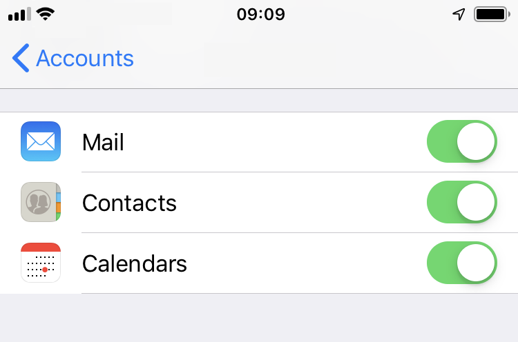
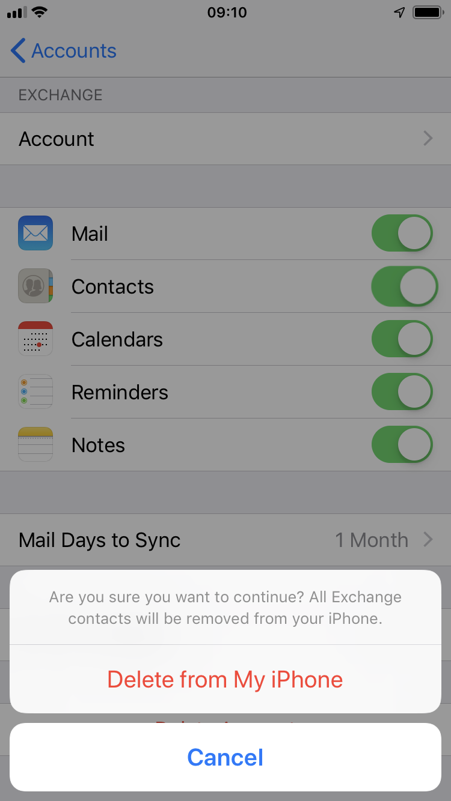

# How to set up Email and Collaboration on an iPhone or iPad

## Overview

Zimbra Collaboration Server Network Edition with Zimbra Mobile enabled integrates natively over the air with the Mail, Contact and Calendar applications on any Apple iPhone, iPod Touch or iPad. By using the ActiveSync protocol no additional download is required, only that WiFi or a wireless data plan is enabled. After a simple configuration step you can work virtually anywhere with your Zimbra account on the go.

You can use the Apple iPhone to access your Zimbra account three primary ways:

- Enter Zimbra Mobile settings for email, contact and calendar sync

- View Zimbra in the Safari mobile web browser

- Enter IMAP/POP3 email settings

For more information about ActiveSync, go to <https://en.wikipedia.org/wiki/ActiveSync>.

> [!IMPORTANT]
> Performing the following steps may delete all of the existing contacts on your iPhone. This is a common problem for iPhone users when creating a new ActiveSync account. You should ensure that you have backed up all of your contacts before proceeding.

## Installation and setup for iPhone

1. On your iPhone Home screen, tap the **Settings** icon.

    

2. Scroll down and select **Passwords & Accounts**.

    

3. Select **Add Account**.

    

4. Choose **Exchange**.

    

5. Enter your account information.

    

    - **Email:** This is your company email address (for example, `user@example.net`)

    - **Password:** This is your Zimbra password (the same one used for the Zimbra Web Client)

    - **Description:** This is a description for yourself; use your preferred name for this account

    - **Domain:** If iOS asks for a domain, leave the field blank
  
6. Click **Next**.

7. Enter your server details as supplied by your UKCloud Customer Success Manager.

8. Synchronise **Mail**, **Contacts**, and/or **Calendars** as you prefer by setting the appropriate sliders to on.

    

9. If you already have contacts, a screen displays asking if you want to keep your current contacts on your iPhone. If you select **Keep on My iPhone**, you may see duplicate entries of your contacts.

    

10. Click **Save**. Your Zimbra Mobile account is now set up and will synchronize to your iPhone.

You can now edit your global or account-specific settings as described in the next section.

## Changing Your Account Settings

When you have successfully set up your account, you should begin to see mail folders, contacts, and your calendar(s) appear on your device. When the synchronization completes, you can edit your global or account-specific settings.

In **Passwords & Accounts** you can set global or account-specific usability controls for your email account(s), including setting the number of messages to show, how many lines of an email to preview, font size, how often to sync, and more.

> [!NOTE]
> When you make a global setting, all your email accounts are affected. When you make an account-specific setting, only the selected email account is affected.

## Calendar Sync Filter

Select your Zimbra Account and then select **Account Info** to adjust whether you want any of the syncing options changed, how many days of email and which folders you want synced.

> [!IMPORTANT]
> If you have a large calendar, you may have some issues if you are syncing more than 200 appointments.

## Email Sync Filter

Select your Zimbra Account and then select **Account Info** to adjust whether you want any of the syncing options changed, how many days of email and which folders you want synced.

> [!IMPORTANT]
> If you select **No Limit** and you have a large amount of email, you may have some issues syncing.

## Accessing ZCS using Zimbra Mobile Web Client

All devices with an HTML‑compatible browser can access Zimbra email, contacts, calendar, and briefcase using the Zimbra Mobile Web Client.

To use the Zimbra Mobile Web Client, open the HTML-compatible browser on your phone (the Safari icon on your iPhone) and type in the URL of your Zimbra Server with /m/ at the end of the URL. For example, `https://domain.servername.com/zimbra/m/`.

If you have Zimbra Collaboration 8.x or above, you can use the new Touch Client. You must have a License 1.2 for your server. n your mobile type the URL of your Zimbra Server. For example, `https://domain.servername.com/'.

You can see Emails, Contacts and Calendars for now, and it uses an HTML5 interface, so you can see it in your iPad too.

## Getting Zimbra email using IMAP/POP3

You can read your email on your iPhone just like you would with a desktop email client by setting it up for IMAP or POP3 access. This option is available to both free Open Source users and paying Network Edition users.

> [!NOTE]
> This method only syncs email messages. To access your Zimbra contacts and calendars, use either Zimbra Mobile Web client in the Safari browser or upgrade to Zimbra Network Edition.

1. Under Mail settings, select **Add Account**.

2. Select **Other**.

3. Select **IMAP**, **POP3** or **Exchange** as appropriate.

4. Fill in the **Name**, **Address** and **Description** fields.

5. In the Incoming Mail Server section, provide the **Host Name**, **User Name** and **Password**.

    Your iPhone automatically detects IMAP over SSL if your server requires it.

    If your server requires a non-default TCP port specification, use the hostname:port format in the **Host Name** field.

    You can adjust SSL settings laster under the Advanced section in the main account settings.

6. In the Outgoing Mail Server (SMTP) section, provide the **Host Name**, **User Name** and **Password**.

    As with the incoming mail server, the **Host Name** setting accepts the hostname:port format if the outgoing mail server uses a non-default TCP port.

7. Save the configuration.

> [!NOTE]
> To enable the browsing of child folders of your inbox, but not peer folders such as Sent, Drafts, Trash and Junk, in the Advanced section of your account settings, set the **IMAP Path Prefix** to **INBOX**.

## Accessing Zimbra with Tethered Sync Options

It is possible to sync iPhone contacts and calendars using Connector for iSync (Apple) or Connector for Outlook (Windows) or on Linux via iTunes. These options are unsupported by Zimbra and we recommend using Zimbra Mobile instead.

## SSL Certificates, the iPhone, and Zimbra Mobile

The iPhone prefers non self-signed SSL connections. If you have a self-signed certificate, you should install the iPhone Configuration Utility to deploy a self-signed certificate on the iPhone. For more information, see: <http://www.apple.com/support/iphone/enterprise/>.

An iPhone client must address the Exchange ActiveSync server using the primary name of the server's SSL certificate. This is important when the Zimbra server is being run in a split‑horizon DNS environment, because the name by which you address the EAS server must resolve to the same (public) IP address, no matter where you are. If the Zimbra server does not use the primary server name, if you want to use SSL, you must rebuild the certificate using the primary name.

## Creating New Mail Notification via SMS

You may wnat the Zimbra server to send you a text message when you receive a new email.

1. Click **Options**.

2. Choose **Mail**.

3. Select **Enable address for new mail notifications**.

4. Enter your SMS address in email format. For example `number@txt.att.net`.

5. Click **Save**.

Now the server will send you a text message when you receive a new email. Text messaging rates may apply.

## Feedback

If you find an issue with this article, click **Improve this Doc** to suggest a change. If you have an idea for how we could improve any of our services, visit the [Ideas](https://community.ukcloud.com/ideas) section of the [UKCloud Community](https://community.ukcloud.com).
