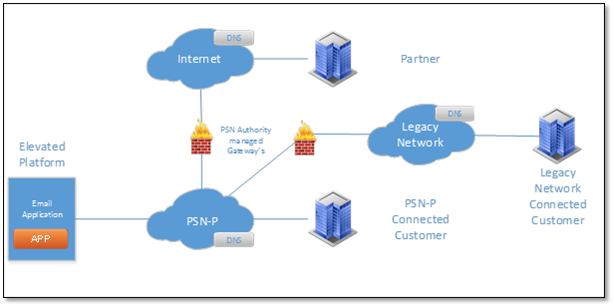
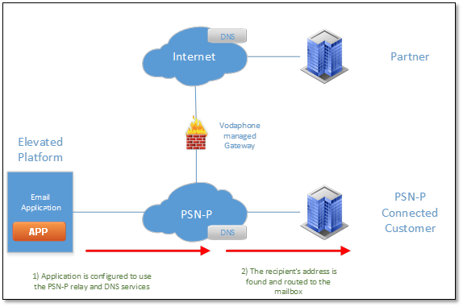
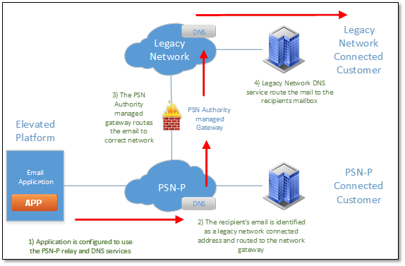

# Sending email from the Elevated environment

## Overview

The UKCloud Elevated OFFICIAL platform is connected to the PSN Protected network. This means that we can provide cloud services on that network to our whole range of partners and direct public sector customers.

PSN Protected is a closed, controlled, encrypted and heavily regulated network that connects many public sector bodies together. With this in mind, it presents the UK government with security and control of their data, but also presents solution providers and partners with extra planning and consideration when deploying solutions or applications for public sector customers.

Email is used extensively throughout most solutions. Use cases range from monitoring and alerting for back end systems to releasing information and data such as invoices and records. Whatever the use case is for email, it's a tool that solution providers have come to rely upon.

## Email and Collaboration as a Service

It's common for public sector customers to require email as-a-service, and as such, we have a solution available. Email and Collaboration-as-a-Service is a Zimbra based email solution that is available on both the Assured OFFICIAL and Elevated OFFICIAL platforms and is available on PSN Assured and PSN Protected. The advantages of our email solution is that it can be provisioned quickly, is hosted on our cloud platform and can be scaled as your requirements change. For more information on this solution, please see the service definition on the Digital Marketplace.

## What the Elevated topology looks like

We provision a platform for use on PSN Protected, and you can utilise our Email and Collaboration-as-a-Service, to deploy an email solution of your own. Our Email and Collaboration-as-a-Service is an email domain that you control and configure, and enables you to create mailboxes for a wide range of uses depending on your required solution.

The PSN Authority uses change management forms to control access and rules on PSN Protected. If you need to make any changes or requests, you must complete a GCF Request for Change Form in the necessary format (check for the latest version [here](https://www.gov.uk/government/publications/public-services-network-psn-gcf-customer-change-form)). The GCF form provides guidance there are third party contract incumbents who have support services on hand to provide further guidance.

Depending on where you need to exchange emails depends upon what happens on PSN Protected (routing and gateway forwarding) and what rule sets you need to follow for antivirus, content inspection, recipient addresses and other settings. Note that there may be additional services you need to consider or procure, or there may be PSN Protected rule sets in place that mean you are unable to move data in the format you originally planned (for example, encrypted ZIP files).

## Email Domain naming

Email uses DNS to route emails to their intended destination. All DNS record requests have to go through the Cabinet Office in the form of GDS (Government Digital Services). They maintain all records and rules for who and what is eligible for a name (for example, `.gov.uk` and `.nhs.uk` addresses).

All information regarding this process is available from [GOV.UK](https://www.gov.uk/government/publications/public-services-network-psn-gcf-customer-change-form). The latest authorisation and request forms are available there to download.

UKCloud cannot help in the procurement or authorisation of any DNS address as this is solely a GDS service.

## Email to PSN Protected

When you have a DNS namespace allocated, you can create your mail domain (UKCloud's Email and Collaboration-as-a-Service or self-built). Once built or provisioned, you must use the PSN Authority managed email relays and DNS servers, and point your email domain application at these services. For information about configuring Email and Collaboration as-a-Service to do this, see [*How to use UKCloud's email service with your application*](email-how-use-with-app.md). If you are connected to PSN Protected, you can request DNS and IP address information from us over secure communication channels via [My Calls](https://portal.ukcloud.com/support/my_calls).

When you are connected and configured, you can establish email to PSN Protected connected customers as shown below:

The PSN Protected DNS service routes all email to its known destination. You do not need to deploy a virus scanning facility for your email release as the PSN Authority does this for all traffic.

## Email to legacy connected networks

Not all public sector bodies have migrated over to the PSN Protected currently and networks such as GSI, GSE, PNN and CJX still have an active user base who have requirements to exchange emails with PSN Protected services. All routing to these networks are reliant upon the PSN Authority and the partners to provide gateway services to these areas.

All configuration from the application and solution sides are the same as the changes happen on PSN Protected itself.

Instead of releasing the email to an address on PSN Protected, the PSN Protected mail relay uses DNS to route the email through a gateway to another DNS service local to that network. When the record is found, it is routed to its intended addressee.

The legacy network you are connecting to determines the rule set for email release, AV control, and content inspection used by the gateway. For the latest rule set, use GOV.UK and contact GDS for advice.

You can procure these extra services, if needed, from the current third party contract incumbent.

## Email to the internet

The most common and restricted use case for email is to and from the internet. Configuration of any email application or service remains the same; the routing changes as does the behaviour and delivery of email. In  addition, email release to the internet means that you will need to procure extra services from the third party contract incumbent.

DNS forwards emails addressed for the internet to the internet email gateway. All content is rule checked, whitelisted, and scanned for viruses against PSN Authority schemes. For a current list and guidance of what is and is not allowed, we recommend that you consult with GDS or the PSN Authority directly.

If you are designing a solution that requires email usage, consult UKCloud for advice on how to get information and from which resource. As email routing and release to a controlled network is outside our jurisdiction, you must ensure that you have the most current information from the [GOV.UK](https://www.gov.uk/government/publications/public-services-network-psn-gcf-customer-change-form) website or directly from [GDS](https://gds.blog.gov.uk/) or the Cabinet Office.

## Feedback

If you have any comments on this document or any other aspect of your UKCloud experience, send them to <products@ukcloud.com>.