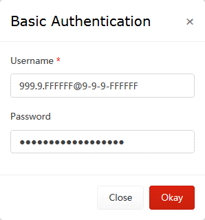
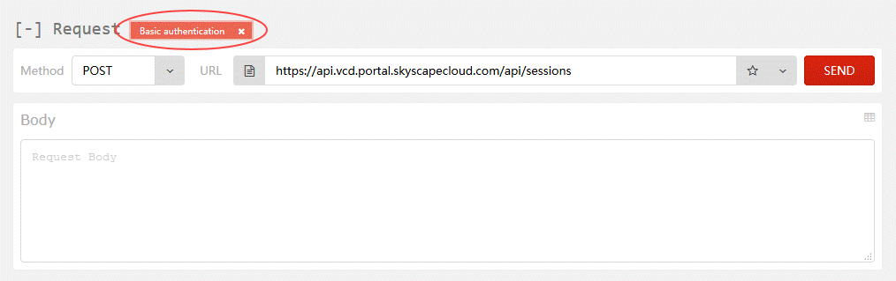
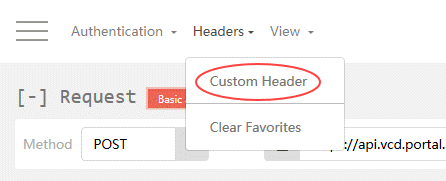
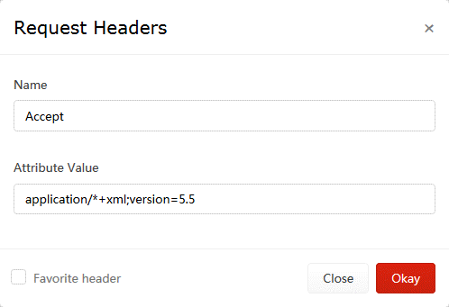
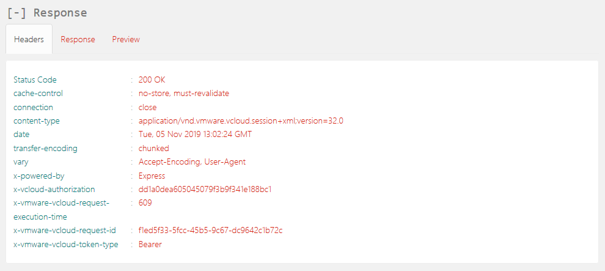
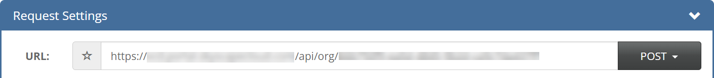

# How to migrate edge configuration data to another edge

When moving VMware workloads between regions on the UKCloud platform, if you want to apply same edge configuration data to an edge in the new region, you can use the vCloud API to export edge configuration data to an XML file and then migrate that data to the new edge.

As part of the migration, some aspects of the environment may change, therefore you can edit the exported XML file to easily make those changes before applying the configuration to the new edge.

## Before you begin

Before using the vCloud API to migrate edge configuration data, we recommend that you install a REST client that enables you to access the vCloud API. The steps in this article use a Firefox plugin called RESTClient. For information about how to install this plugin, see [*How to install a REST client to access the vCloud API*](../vmware/vmw-how-install-vcloud-api-rest-client.md).

You also need to find your API credentials. For more information, see [*How to access vCloud Director through the vCloud API*](../vmware/vmw-how-access-vcloud-api.md).

## Obtaining an authorisation token

To start interacting with the vCloud API, you first need to obtain an `x-vcloud-authorization` token; to do this you need to adjust some settings in RESTClient.

1. In your browser, click the **RESTClient** icon.

    

2. From the **Method** menu, select **POST**.

    

3. In the **API** field, enter the API URL you recorded earlier and append the following to the end of the URL:

    `/api/sessions`

    

4. Next add a Basic Authentication header. To do this, from the **Authentication** menu at the top of the REST Client, select **Basic Authentication**.

    

5. In the *Basic Authentication* dialog box, in the **Username** field, enter your API username recorded earlier from the API page.

6. In the **Password** field enter your UKCloud Portal password and then click **Okay**.

    

7. The *Request* section now includes an Authorization header.

    

8. Next add an Accept header. To do this, from the **Headers** menu, select **Custom Header**.

    

9. In the *Request Header* dialog box, in the **Name** field, enter `Accept`

10. In the **Value** field enter `application/*+xml;version=32.0` and then click **Okay**.

    

11. The *Headers* section should now be displayed, containing the Accept header.

    

12. The RESTClient has now got all the required settings in place to make a request to the vCloud API to obtain a `x-vcloud-authorization` token, so click the **Send** button.

13. When a response is received, the **Headers** tab in the *Response* section will be populated, including an `x-vcloud-authorization` token.

    

14. The `x-vcloud-authorization` token will replace the Basic Authentication header added earlier. To do this highlight and copy the string of characters displayed after the word `x-vcloud-authorization`.

    > [!NOTE]
    > If at any point while following the instructions in this guide, the output displayed in the REST Client does not look similar to that shown in the images, you can use the value of the **Status Code** field to determine what went wrong and needs investigation. In this case above, the **Status Code** received was `HTTP 200 OK`, which means that the request succeeded. For a list of HTTP response codes, see [HTTP Response Codes](https://developer.mozilla.org/en-US/docs/Web/HTTP/Status).

15. To add an `x-vcloud-authorization` header, from the **Headers** menu, select **Custom Header**.

16. In the *Request Header* dialog box, in the **Name** field enter `x-vcloud-authorization`.

17. In the **Value** field, paste the string of characters copied in the previous step, then click **Okay**.

    

18. Now that you've obtained an `x-vcloud-authorization` token, you can remove the Basic Authentication Header. Click the **x** in the upper right-hand corner of the header.

    

## Retrieving organisation details via the API

Now that you've obtained an `x-vcloud-authorization` token, you can call the vCloud API to retrieve the information that you need about your organisation to extract your edge configuration data.

1. Set the **Method** to **GET**.

    

2. In the *Response* section, select the **Preview** tab.

    This view lists the links that you can use to drill down into the various objects exposed via the vCloud API. Of interest in the output below is a link that will, when queried, return details about the organisation and the objects contained within it.

    

    The link should look something like:

    `https://<api_url>/api/org/<org_id>`

3. Copy the URL and paste it into the Request **URL** field.

    

4. Click **Send**.

    After a short amount of time the contents of the Response **Preview** tab will be updated to reflect the response from the vCloud API to your latest request, including links to each VDC in the organisation.

## Retrieving virtual data centre details via the API

When locating the VDC and exporting the edge configuration data, perform this for both the existing environment and the new environment that you'll be migrating to.

To retrieve details about the VDCs in an organisation:

1. Copy the link for the VDC that contains the edge gateway.

    The link should look something like:

    `https>//<api_url>/api/vdc/<vdc_id>`

2. Click **Send**.

    The contents of the Response **Preview** tab will be updated again.

## Retrieving edge gateway configuration via the API

To retrieve details of the edge gateway configuration:

1. The response this time will probably be quite long. To easily locate a specific section in the response, use your browser's search utility. You can invoke this in Firefox by pressing **CTRL+F**. In the search dialog window at the bottom of the screen enter `edgeGateways`, and then click the down arrow button to locate a section that looks similar to the one shown below:

    `<Link rel="edgeGateways" href="https://api.vcd.portal.skyscapecloud.com/api/admin/vdc/<vdc_id>/edgeGateways" type="application/vnd.vmware.vcloud.query.records+xml" />`

2. Copy the link ending in `/edgeGateways` and paste it into the URL field at the top of the RESTClient. Ensure that the **Method** drop down is set to **GET** and click **Send**.

    If this request is successful, the response will contain a link to the edge gateway which, when queried, will return the configuration of the edge gateway. Once you've received a response, use your browser's search utility to locate the `EdgeGatewayRecord` section within the response.

    `<EdgeGatewayRecord gatewayStatus="READY" haStatus="UP" isBusy="false" name="<edge_name>" numberOfExtNetworks="1" numberOfOrgNetworks="8" vdc="https://api.vcd.portal.skyscapecloud.com/api/vdc/<vdc_id>" href="https://api.vcd.portal.skyscapecloud.com/api/admin/edgeGateway/<edge_id>"     task="https://api.vcd.portal.skyscapecloud.com/api/task/<task_id>" isSyslogServerSettingInSync="true" taskOperation="networkConfigureEdgeGatewayServices" taskStatus="success" taskDetails=" " />`

3. Within the `EdgeGatewayRecord` section of the above from the response, locate the link to the edge gateway that starts with the following:

    `https://<api_url>/api/admin/edgeGateway/`

4. Appended to the end of the URL will be a unique identifier for the edge gateway within the VDC. Copy this link, paste it into the URL field and then click **Send**.

    After a short amount of time the current configuration of the edge gateway will be displayed in a block of XML.

## Reviewing and updating the edge gateway configuration

The edge configuration information is contained between an opening `<Configuration>` and closing `</Configuration>` tag.

This block of XML is split into sections that detail the configuration settings applied to a specific item, function or service available on the edge gateway.

The example below shows a high‑level overview of the structure of the XML block returned:

```xml
<EdgeGateway>
   <Configuration>
      <GatewayBackingConfig>
      </GatewayBackingConfig>
      <GatewayInterfaces>
      </GatewayInterfaces>
      <EdgeGatewayServiceConfiguration>
         <FirewallService>
         </FirewallService>
         <NatService>
         </NatService>
         <GatewayIpsecVpnService>
         </GatewayIpsecVpnService>
         <StaticRoutingService>
         </StaticRoutingService>
         <LoadBalancerService>
         </LoadBalancerService>
      </EdgeGatewayServiceConfiguration>
      <HaEnabled>
      </HaEnabled>
      <UseDefaultRouteForDnsRelay>
      </UseDefaultRouteForDnsRelay>
   </Configuration>
</EdgeGateway\>
```

This is the configuration that you'll need to amend prior to posting it back to your new edge. Depending on your specific configuration and requirements, different sections of the configuration may or may not require editing. Copy and paste all of this configuration into a text editor, for example Notepad++, for editing.

### Configuration that must be changed

You'll need to change the following configuration data prior to posting the configuration back to the new edge.

#### Firewall rules

When you migrate to a different region or zone, your external IP address will more than likely need to be changed. While this should not affect your egress firewall rules, you'll need to change your ingress rules to reflect the change in external IP address.

The easiest way to change these would be to map a specific new address to one of your old addresses. This way, you can find and replace each IP with a new address.

#### NAT rules

##### External IP addresses

As above, if your external IP addresses are being changed, your NAT rules will also need to be amended. We recommend using the find and replace method as above to amend your NAT rules IP addresses.

##### Edge interfaces

You'll also need to change the interface that the NAT rules are applied on.

As the configuration will be posted back to a new edge, the interface and its reference will have changed. By exporting the configuration of the new edge as an XML file, you can identify the `href` of the interface that the rules will need o be applied on. Again, you should be able to find and replace the existing interface `href` with the new one.

The interface name will also likely have changed, so you will need to update this as well.

```xml
<NatService>
     <IsEnabled>true</IsEnabled>
         <NatRule>
             <Description></Description>
                 <RuleType></RuleType>
                 <IsEnabled></IsEnabled>
                 <Id></Id>
                 <GatewayNatRule>
                     <Interface href=https://api.vcd.portal.skyscapecloud.com/api/admin/network/<interface-id> name="nft00xxxxx" type="application/vnd.vmware.admin.network+xml" />
                     <OriginalIp>x.x.x.x</OriginalIp>
                     <TranslatedIp>x.x.x.x</TranslatedIp>
                 </GatewayNatRule>
             </NatRule>
</NatService>
```

##### VPNs and load balancers

If you have any VPNs or load balancers configured on your existing edge, you'll need to update the external IP addresses with your newly assigned addresses. Again, a find and replace of your existing address allocation should sort this.

Remember that with your VPN configuration, you'll also need to update the remote end of the VPN with its new peer endpoint (your newly assigned IP address).

## Applying the new configuration

When you've updated the relevant sections of the configuration, you can apply it to the **new** edge gateway.

To easily detect any potential configuration issues or catch any errors, it may be easier to apply the configuration in stages or smaller blocks. You can separate each configuration item and apply them separately, for example, firewall rules, NAT rules and so on.

1. Enclose the new configuration in a pair of `<EdgeGatewayServiceConfiguration>` tags, for example:

    ```xml
    <?xml version=”1.0” encoding=”UTF-8”?>
    <EdgeGatewayServiceConfiguration xmlns=”http://www.vmware.com/vcloud/v1.5”>

    <NatService>
        <IsEnabled>true</IsEnabled>
            <NatRule>
                <Description></Description>
                    <RuleType></RuleType>
                    <IsEnabled></IsEnabled>
                    <Id></Id>
                    <GatewayNatRule>
                        <Interface href=https://api.vcd.portal.skyscapecloud.com/api/admin/network/<interface-id> name="nft00xxxxx" type="application/vnd.vmware.admin.network+xml" />
                        <OriginalIp>x.x.x.x</OriginalIp>
                        <TranslatedIp>x.x.x.x</TranslatedIp>
                    </GatewayNatRule>
            </NatRule>
    </NatService>

    </EdgeGatewayServiceConfiguration>
    ```

2. Copy and paste this configuration into the Request *Body* section of the RESTClient.

3. From the **Method** list, select **POST**.

4. Append the following to the URL of the **new** edge gateway in the **URL** field:

    `/action/configureServices`

    For example, if the original contents of the URL were:

    `https://<api_url>/api/admin/edgeGateway/<id>`

    The updated URL would be:

    `https://<api_url>/api/admin/edgeGateway/<id>/action/configureServices`

5. You must also add one more Header to the RESTClient prior to submitting the new configuration.

    From the **Headers** menu at the top of the RESTClient select **Custom Header**.

6. In the **Name** field, enter **Content-Type**.

7. In the **Attribute Value** field enter the following:

    `application/vnd.vmware.admin.edgeGatewayServiceConfiguration+xml`

8. Click **Okay**.

9. To submit the new configuration, click **Send**.

10. The status of the edge gateway as viewed from vCloud Director will briefly show as **Updating Configuration**. Once this process has completed, click the edge gateway and select **Configure Services**.

11. In the *Configure Services* window, verify that the configuration has been applied successfully.

## Next steps

If you need any further assistance, or if you want to discuss any aspect of this service or settings specific to your domain, log a support ticket via the [My Calls](https://portal.skyscapecloud.com/support/ivanti) section of the UKCloud Portal.

## Feedback

If you find an issue with this article, click **Improve this Doc** to suggest a change. If you have an idea for how we could improve any of our services, visit the [Ideas](https://community.ukcloud.com/ideas) section of the [UKCloud Community](https://community.ukcloud.com).
