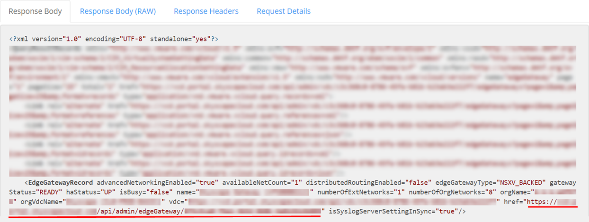

# How to migrate edge configuration data to another edge

## Overview

When moving VMware workloads between regions on the UKCloud platform, if you want to apply same edge configuration data to an edge in the new region, you need to export edge configuration data to an XML file and then migrate that data to the new edge. As part of the migration, some aspects of the environment may change, therefore you'll need to edit the exported XML file to make those changes before applying the configuration to the new edge.

While the migration of edge configuration is not a common process, there are certain activities that may require this to make the transition from one edge to another much simpler and quicker. The main reason this would likely be needed is when migrating workloads between regions, where, for the most part, the edge configuration needs to remain the same, but some amendments, such as a change in IP address, are required.

This article explains how to use the Cloud Director API to export configuration from an NSX edge, make the necessary amendments and then apply this configuration to a different edge.

## Before you begin

Before using the Cloud Director API to migrate edge configuration data, we recommend that you install a REST client that enables you to access the API using a more intuitive interface. The steps in this article use a plugin called YARC; if you use a different client, some of the steps will be different.

## Obtaining an authorisation token

To start interacting with the Cloud Director API, you first need to find your API credentials and use those to obtain an `x-vmware-vcloud-access-token` token.

For detailed steps for how to do this, see [*How to access VMware Cloud Director through the Cloud Director API*](../vmware/vmw-how-access-vcloud-api.md).

## Retrieving organisation details via the API

Now that you've obtained an `x-vmware-vcloud-access-token` token, you can call the Cloud Director API to retrieve the information that you need about your organisation to extract your edge configuration data.

To retrieve organisation information using the YARC client:

1. In the *Response* section returned by the request when you obtained your authorisation token, select the **Response Body** tab.

   This view lists the links that you can use to drill down into the various objects exposed via the Cloud Director API. Of interest in the output below is a link that will, when queried, return details about the organisation and the objects contained within it.

   

   The link should look something like:

   `https://<api_url>/api/org/<org_id>`

2. Copy the URL and paste it into the Request **URL** field.

3. You must be in admin mode to retrieve the list of VDCs in the organisation, so change the URL to:

   `https://<api_url>/api/admin/org/<org_id>`

   

4. From the list of methods, select **GET**.

   

5. Click **Send Request**.

   After a short amount of time the contents of the **Response Body** tab will be updated to reflect the response from the Cloud Director API to your latest request.

## Retrieving virtual data centre details via the API

When locating the VDC and exporting the edge configuration, perform this for both the existing environment and the new environment that you'll be migrating to.

To retrieve details about the VDCs in an organisation using the YARC client:

1. The response this time will probably be quite long. To easily locate a specific section in the response, use your browser's search utility (typically accessed by pressing **CTRL+F**). In the search field, enter `Vdcs` to locate a section that looks similar to the one shown below:

   ```xml
   <Vdcs>
        <Vdc href="https://<api-url>/api/vdc/<vdc1-id>" id="urn:vcloud:vdc:<vdc1-id>" name="<vdc-name>" type="application/vnd.vmware.vcloud.vdc+xml"/>
        <Vdc href="https://<api-url>/api/vdc/<vdc2-id>" id="urn:vcloud:vdc:<vdc2-id>" name="<vdc-name>" type="application/vnd.vmware.vcloud.vdc+xml"/>
        <Vdc href="https://<api-url>/api/vdc/<vdc3-id>" id="urn:vcloud:vdc:<vdc3-id>" name="<vdc-name>" type="application/vnd.vmware.vcloud.vdc+xml"/>
    </Vdcs>
    ```

2. Copy the link for the VDC that contains the edge gateway.

3. Paste the VDC link into the **URL** field at the top of the page (the method should still be set to **GET**) and click **Send Request**.

   The contents of the **Response Body** tab will be updated again.

## Retrieving edge gateway configuration via the API

To retrieve details of the edge gateway configuration using the YARC client:

1. Use your browser's search utility to locate the `edgeGateways` link, which will look similar to:

   `<Link rel="edgeGateways" href="https://<api_url>/api/admin/vdc/<vdc_id>/edgeGateways" type="application/vnd.vmware.vcloud.query.records+xml" />`

2. Copy the link ending in `/edgeGateways` and paste it into the **URL** field at the top of the REST client. Ensure that the method is still set to **GET** and click **Send Request**.

   Once you've received a response, locate the `EdgeGatewayRecord` section for the edge gateway.

   

3. Within the `EdgeGatewayRecord` section of the above from the response, locate the link to the edge gateway that starts with the following:

   `https://<api_url>/api/admin/edgeGateway/`

4. At the end of the URL you'll find a unique identifier for the edge gateway within the VDC. Copy the whole link, paste it into the **URL** field (the method should still be set to **GET**) and then click **Send Request**.

   After a short amount of time the current configuration of the edge gateway will be displayed in a block of XML.

## Reviewing and updating the edge gateway configuration

The edge configuration information is contained between `<Configuration>` and `</Configuration>` tags.

This block of XML is split into sections that detail the configuration settings applied to a specific item, function or service available on the edge gateway.

The example below shows a high‑level overview of the structure of the XML block returned:

```xml
<EdgeGateway>
   <Configuration>
      <GatewayBackingConfig> </GatewayBackingConfig>
      <GatewayInterfaces> </GatewayInterfaces>
      <EdgeGatewayServiceConfiguration>
         <GatewayDhcpService> </GatewayDhcpService>
         <FirewallService> </FirewallService>
         <NatService> </NatService>
         <GatewayIpsecVpnService> </GatewayIpsecVpnService>
         <StaticRoutingService> </StaticRoutingService>
         <LoadBalancerService> </LoadBalancerService>
      </EdgeGatewayServiceConfiguration>
   </Configuration>
</EdgeGateway\>
```

This is the configuration that you'll need to amend prior to posting it back to your new edge. Depending on your specific configuration and requirements, different sections of the configuration may or may not require editing. Copy and paste all of this configuration into a text editor for editing.

### Configuration that must be changed

As you can see above, the edge XML configuration is split into each configurable item. When amending and applying the configuration, you may want to apply this section by section, rather than as a single XML block.

#### Firewall and NAT rules

When migrating configuration between edges, particularly when moving between regions, your external IP allocation will change. This means that any references to your externally assigned IP addresses within your edge configuration will need to be amended.

You'll be assigned the same amount of external addresses as before, so we'd recommend pairing a new IP with each of your old IP addresses and then performing a find and replace to ensure all IPs are updated correctly.

When you create NAT rules, they're applied to a single interface on the edge. Each interface is referenced within the configuration file as an `href` with its own interface ID. When applying the configuration to the new edge, these interface IDs will be different and will therefore need to be replaced. The interface name will also likely change. By exporting the configuration of the new edge as an XML file, you can identify the interface name and its `href` that the rules will need to be applied on.

Providing you keep your private address ranges the same as your original environment, you should not need to make any changes to these within the new configuration.

```xml
<NatService>
     <IsEnabled>true</IsEnabled>
         <NatRule>
             <Description> </Description>
                 <RuleType> </RuleType>
                 <IsEnabled> </IsEnabled>
                 <Id> </Id>
                 <GatewayNatRule>
                     <Interface href=https://<api_url>/api/admin/network/<interface-id> name="nft00xxxxx" type="application/vnd.vmware.admin.network+xml" />
                     <OriginalIp>x.x.x.x</OriginalIp>
                     <TranslatedIp>y.y.y.y</TranslatedIp>
                 </GatewayNatRule>
             </NatRule>
</NatService>
```

#### VPNs and load balancers

With your external IP allocation likely to change, this will also affect any configured VPNs and load balancers that you may have previously had on your original edge.

For VPN configuration, you'll need to replace the interface references and names for your **local** networks. For the load balancer configuration, you'll need to replace the **external** network interface reference and name. As above, each of these interfaces have their own ID and `href` that you'll need to add to the new configuration. Exporting the XML configuration of the new edge will provide you with the required information for these new interfaces.

Remember that when amending VPN configuration, and particularly the local endpoint IP address, you'll also need to make configuration changes on the peer side to mirror those amendments.

If you're using a Pre-Shared Key (PSK) for IPsec VPN authentication, the key will not be exported as part of this configuration. You can retrieve the key either through the VMware Cloud Director GUI or by querying an additional API endpoint (see [*How to obtain full IPsec VPN configuration via the vCloud API*](enbl-how-obtain-vpn-config.md)).

## Applying the new configuration

When you've amended the configuration with the necessary elements of the new edge gateway, you can apply it to the edge gateway.

To easily identify and resolve any possible issues when applying the configuration, posting the configuration to the edge in the individual configurable items may be easier. For example, apply the amended firewall rules, then apply the NAT rules and so on.

The steps below outline how to apply the amended configuration to your new edge gateway using the YARC client.

1. Enclose the new configuration in a pair of `<EdgeGatewayServiceConfiguration>` tags, for example:

   ```xml
   <?xml version="1.0" encoding="UTF-8" standalone="yes"?>
   <EdgeGatewayServiceConfiguration xmlns="http://www.vmware.com/vcloud/v1.5">

   <NatService>
       <IsEnabled>true</IsEnabled>
           <NatRule>
               <Description></Description>
                   <RuleType></RuleType>
                   <IsEnabled></IsEnabled>
                   <Id></Id>
                   <GatewayNatRule>
                       <Interface href=https://<api_url>/api/admin/network/<interface-id> name="nft00xxxxx" type="application/vnd.vmware.admin.network+xml" />
                       <OriginalIp>x.x.x.x</OriginalIp>
                       <TranslatedIp>y.y.y.y</TranslatedIp>
                   </GatewayNatRule>
           </NatRule>
   </NatService>

   </EdgeGatewayServiceConfiguration>
   ```

2. Copy and paste this configuration into the **Payload** field of the *Request Settings* section.

3. Select the **POST** method.

4. Append the following to the URL of the **new** edge gateway in the **URL** field:

   `/action/configureServices`

   For example, if the original contents of the URL were:

   `https://<api_url>/api/admin/edgeGateway/<id>`

   The updated URL would be:

   `https://<api_url>/api/admin/edgeGateway/<id>/action/configureServices`

   

5. You must also add another header prior to submitting the new configuration.

   In the *Custom Headers* section, select **Add New Header**.

6. In the **Name** field, enter **Content-Type**.

7. In the **Value** field enter the following:

   `application/vnd.vmware.admin.edgeGatewayServiceConfiguration+xml`

   

8. Click **Save**.

9. To submit the new configuration, click **Send Request**.

10. The status of the edge gateway as viewed from VMware Cloud Director will briefly show as **Updating Configuration**. Once this process has completed, select the edge gateway and click **Services**.

11. On the appropriate tab of the *Edge Gateway* page, verify that the configuration has been applied successfully.

## Next steps

If you need any further assistance, or if you want to discuss any aspect of this service or settings specific to your domain, log a support ticket via the [My Calls](https://portal.skyscapecloud.com/support/ivanti) section of the UKCloud Portal.

## Feedback

If you find a problem with this article, click **Improve this Doc** to make the change yourself or raise an [issue](https://github.com/UKCloud/documentation/issues) in GitHub. If you have an idea for how we could improve any of our services, send an email to <feedback@ukcloud.com>.
