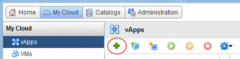

# How to use the Data Transfer Facility

## Overview

There are many ways to transfer data directly to your environment using UKCloud's Data Transfer Facility. This guide explains how to set up the two most commonly used methods:

- Transferring virtual machines (VMs)
- Transferring data

## Transferring virtual machines

To transfer VM templates to the UKCloud platform you can:

- Use the vCloud Director UI
- Use the OVF Tool

### Use the vCloud Director UI

1. Log in to the UKCloud Portal using the Firefox browser on the UKCloud-provided computer.

    For more detailed instructions, see the [*Getting Started Guide for the UKCloud Portal*](../portal/ptl-gs.md).

2. In the navigation panel, expand **VMware Cloud** and then select the compute service to which you want to transfer the VMs.

3. On the **vCloud Director** tab, enter your password and then click **Confirm**.

4. Click **Add vApp from OVF**.

    

5. Select the **Local file** radio button.

6. Click **Browse** and locate the local path that contains the OVF file you want to upload, select the file and click **Open**.

    

7. Click **Next** and then **Finish**.

8. You can monitor the progress of the upload via the task window.

    

### Use the OVF Tool

The OVF Tool is useful if you want to script or schedule an import.

1. To run a simple transfer, first you'll need your API username, which you can find on the UKCloud Portal.

    For more information, see [*How to access vCloud Director through the vCloud API*](../vmware/vmw-how-access-vcloud-api.md).

2. Open a PowerShell command prompt and format the OVF Tool command as follows, substituting the parameters as appropriate:

    ``` powershell
    & "c:\\Program Files\VMware\VMware OVF Tool\ovftool.exe" <path_to_ovf> 'vcloud://<api_username>:<password>@vcd.portal.ukcloud.com/?org=<org_name>&vapp=<new_vapp_name>
    ```

## Transferring data

If you already have VMs running in the UKCloud environment and want to ingest existing data, the two most common ways to achieve this are:

- Use SCP/SFTP
- Use FTPS

### Use SCP/SFTP

The data you transfer is encrypted between the Data Transfer Facility PC and the VM running on the UKCloud compute platform.

#### Set up your VM

You need to use a Linux machine to set up the transfer of data over SCP/SFTP. If you don't already have a server running SSH, you can use a UKCloud Linux template.

#### Set up your network

You need to create the following firewall and NAT rules.

##### Firewall rules

Name | Source | Protocol | Source port | Destination | Translated port
-----|--------|----------|-------------|-------------|----------------
SCP | 37.26.88.73 | TCP | Any | Public IP | 22

##### NAT rules

Applied on | External IP | Protocol | Source port | Internal IP | Translated port
-----------|-------------|----------|-------------|-------------|----------------
nft... | Public IP | TCP | 22 | FTPS server private IP | 22

### Use FTPS

FTPS provides secure transfer using FTP and SSL. The data you transfer is encrypted between the Data Transfer Facility PC and the VM running on the UKCloud compute platform.

#### Using FTPS in the Flex-based UI in vCloud Director 8.20

1. Log in to the UKCloud Portal.

    For more detailed instructions, see the [*Getting Started Guide for the UKCloud Portal*](../portal/ptl-gs.md)

2. In the navigation panel, expand **VMware Cloud** and then select the compute service to which you want to transfer the VMs.

3. On the **vCloud Director** tab, enter your password and then click **Confirm**.

4. Select the the **My Cloud** tab.

    

5. Click the green **+** sign to add a new virtual application (vApp) from a template.

    

6. From the **Look in** list, select **Public Catalogs**, then select the **All Templates** option.

7. In the search field, enter **ftps** and run the search.

8. Select the **Skyscape_CentOS_6_FTPS_v1.0.0** template and click **Next**.

    

9. Enter a **Name** for the vApp, choose the **Virtual Datacenter** you want to deploy to and then click **Next**.

10. On the *Configure Resources* page, click **Next** to accept the default settings.

11. On the *Configure Networking* page, from the list of **Networks**, select the network you want to deploy to and click **Next**.

    > [!NOTE]
    > The network you select must be connected to the internet.

12. On the *Customize Hardware* page, click **Next** to accept the default settings.

13. On the *Ready to Complete* page, select the **Power on vApp after this wizard is finished** check box at the bottom of the page, then click **Finish**.

14. When the deployment is complete, open the vApp and take note of the private IP address.

    

15. Next you need to:

    - [Determine your cloud IP addresses](#determine-your-cloud-ip-addresses)
    - [Add NAT rules](#add-nat-rules)
    - [Add firewall rules](#add-firewall-rules)
    - [Configure FTPS](#configure-ftps)
    - [Connect with FileZilla](#connect-with-filezilla)

#### Using FTPS in the HTML5 tenant portal in vCloud Director 9.1

1. Log in to the UKCloud Portal.

    For more detailed instructions, see the [*Getting Started Guide for the UKCloud Portal*](../portal/ptl-gs.md)

2. In the navigation panel, expand **VMware Cloud** and then select the compute service to which you want to transfer the VMs.

3. On the **vCloud Director** tab, enter your password and then click **Confirm**.

4. Go to the VDC and select **vApps**.

    

5. Click **Build New vApp** to add a new virtual application (vApp) from a template.

    

6. Enter a name for the vApp and select the VDC to deploy it in.

7. Click **Add Virtual Machine**.

8. In the *Create VM* dialog box, enter a VM **Name** and **Computer Name** (or host name).

9. From the **Type** list, select **From Template**.

10. In the *Templates* section, find and select the FTPS template.

    

11. Click **OK**.

12. Verify the details for your vApp are correct and then click **Build** to deploy the vApp and VM.

    > [!TIP]
    > Close the dialog box to see the status.

13. When the deployment is complete, in the *Virtual Machines* section, click **Edit** to edit the hardware settings.

14. Setup the network and IP allocation and save the changes.

15. Make a note of the private IP address assigned to the VM; you'll need this later to set up the NAT rules.

16. Next you need to:

    - [Determine your cloud IP addresses](#determine-your-cloud-ip-addresses)
    - [Add NAT rules](#add-nat-rules)
    - [Add firewall rules](#add-firewall-rules)
    - [Configure FTPS](#configure-ftps)
    - [Connect with FileZilla](#connect-with-filezilla)

#### Determine your cloud IP addresses

1. Click the **Administration** tab.

    

2. Double-click your VDC.

3. Click the **Edge Gateways** tab.

    

4. Right-click your edge gateway and select **Properties**.

5. Click the **Sub-Allocate IP Pools** tab and make a note of the IP addresses in the **Sub-Allocated IP Pool** list.

    

6. Click **OK**.

#### Add NAT rules

The steps for adding NAT rules depend on whether your edge gateway is a standard edge or an advanced gateway:

- [*Add NAT rules in an advanced gateway*](#add-nat-rules-in-an-advanced-gateway)
- [*Add NAT rules in a standard edge*](#add-nat-rules-in-a-standard-edge)

##### Add NAT rules in an advanced gateway

1. On the **Edge Gateways** tab, right-click your edge and select **Edge Gateway Services**.

2. Select the **NAT** tab.

3. Click **+ DNAT Rule**.

    

4. From the **Applied On** list, select the network that you deployed your VM to.

5. In the **Original IP/Range** field, enter the external IP addresses you noted in the previous section.

6. Set the **Original Port** and **Translated Port** as listed in the table below.

7. In the **Translated IP/Range** field, enter the private IP address you recorded during the VM deployment.

8. Make sure **Enabled** is selected and click **OK**.

    

9. Create a DNAT rule for each port listed in the table below:

    Original IP/Range | Protocol | Original Port | Translated IP/Range | Translated Port
    ------------------------|----------|---------------|--------------------------|----------------
    Public IP | TCP | 989 | FTPS server private IP | 989
    Public IP | TCP | 990 | FTPS server private IP | 990
    Public IP | TCP | 8080 | FTPS server prviate IP | 8080

10. Click **Save changes**.

##### Add NAT rules in a standard edge

1. On the **Edge Gateways** tab, right-click your edge gateway and select **Edge Gateway Services**.

2. Select the **NAT** tab.

3. Click **Add DNAT**.

    

4. From the **Applied on** list, select the network that you deployed your VM to.

5. In the **Original (External) IP/range** field, enter the external IP addresses you noted in the previous section.

6. Set the **Original port** and **Translated port** as listed in the table below.

7. In the **Translated (Internal) IP/range**, enter the private IP address you recorded during the VM deployment.

8. Make sure **Enabled** is selected and click **OK**.

    

9. Create a DNAT rule for each port listed in the table below:

    Applied on | Original (External) IP | Protocol | Original port | Translated (Internal) IP | Translated port
    -----------|------------------------|----------|---------------|--------------------------|----------------
    nft... | Public IP | TCP | 989 | FTPS server private IP | 989
    nft... | Public IP | TCP | 990 | FTPS server private IP | 990
    nft... | Public IP | TCP | 8080 | FTPS server private IP | 8080

#### Add firewall rules

The steps for adding firewall rules depend on whether your edge gateway is a standard edge or an advanced gateway:

- [*Add firewall rules in an advanced gateway*](#add-firewall-rules-in-an-advanced-gateway)
- [*Add firewall rules in a standard edge*](#add-firewall-rules-in-a-standard-edge)

##### Add firewall rules in an advanced gateway

1. In the *Configure Services* dialog box for your edge, select the **Firewall** tab.

2. Make sure the **Enabled** toggle is selected.

3. Click the **+** button.

    

4. Enter the following details:

    Field | Value
    ------|------
    Name | FTPS
    Source | Click **IP** and enter `37.26.88.70`
    Destination | Click **IP** and enter the first address from the sub-allocated IP pool list
    Service | Click **+** and enter details from the table below
    Action | Allow

5. Repeat this for each rule in the table below:

    Protocol | Source Port | Destination Port
    ----------|------------|----------------
    TCP | Any | 989
    TCP | Any | 990
    TCP | Any | 8080

6. Click **Save changes**.

##### Add firewall rules in a standard edge

1. In the *Configure Services* dialog box for your edge gateway, select the **Firewall** tab.

2. Click **Add**.

    

3. Enter the following details:

    Field | Value
    -----|------
    Enabled | Select this checkbox
    Name | FTPS
    Source | 37.26.88.70
    Source port | any
    Destination | The first address from the sub-allocated IP pool list
    Destination port | from the list below
    Protocol | TCP
    Action | Allow
    Log network traffic | Select this checkbox

4. Click **OK**.

    

5. Repeat this for each rule in the table below:

  Name   Source        Protocol   Source port   Destination   Translated port
  ------ ------------- ---------- ------------- ------------- -----------------
  FTPS   37.26.88.70   TCP        Any           Public IP     989
  FTPS   37.26.88.70   TCP        Any           Public IP     990
  FTPS   37.26.88.70   TCP        Any           Public IP     8080

#### Configure FTPS

Login to the FTPS server and run the following command:

    /usr/local/bin/setupFTPS.sh <public_ip_address>

For example:

    /usr/local/bin/setupFTPS.sh 83.56.212.12

#### Connect with FileZilla

Finally, configure FileZilla using the following settings:

1. Open FileZilla.

2. From the menu, select **File**, then **Site manager**.

3. Click **New Site**.

4. Enter the following details:

    Field | Value
    ------|------
    Host | Public IP address
    FTP protocol | FTP...
    Encryption | Require implicit FTP over SSL
    Logon Type | Interactive
    User | ftpuser

5. Click the **Transfer Settings** tab.

6. For **Transfer Mode**, select **Passive**.

7. Click **Connect**.

## Feedback

If you have any comments on this document or any other aspect of your UKCloud experience, send them to <products@ukcloud.com>.