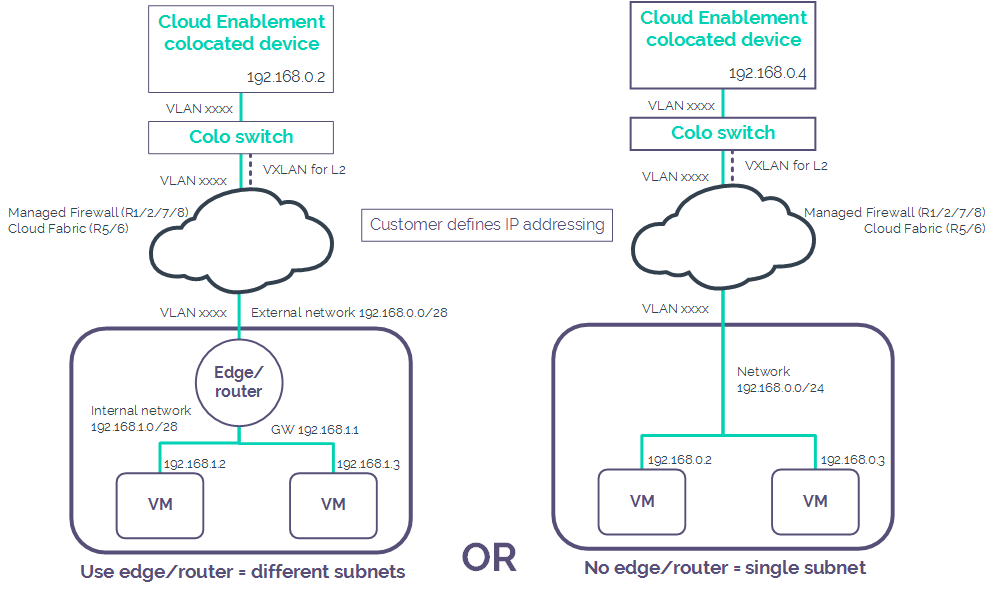

# Cloud Enablement services

UKCloud provides several Cloud Enablement services to help you install your own hardware in our cloud platform:

- CAPS/CPA-approved VPN - Provides basic facilities for your own CAPS and CPA-approved (or equivalent standard) hardware installed in our data centre for the purpose of utilising our cloud. For more information, see the [*Cloud Enablement - CAPS/CPA-approved VPN Service Scope*](enbl-sco-capscpa.md).

- VPN solutions - Provides basic facilities for your own VPN hardware installed in our data centre for the purpose of utilising our cloud. For more information, see the [*Cloud Enablement - VPN solutions Service Scope*](enbl-sco-vpn.md).

- Server/Storage Hosting - Provides basic facilities for your own hosting servers and storage hardware installed in our data centre for the purpose of utilising our cloud. For more information, see the [*Cloud Enablement - Server/Storage Hosting Service Scope*](enbl-sco-hosting.md).

The following diagram shows the different configurations available to you for these Cloud Enablement services:

Other enablement services that we provide to help you work with our cloud platform include:

- Data Transfer Facility - Enables you to use the secure network connections at our Farnborough office to manage systems or transfer data into or out of your environments. For more information, see the [*Data Transfer Facility Service Scope*](enbl-sco-dtf.md).

- Mass Data Transfer - Enables you to move virtualised environments, in the form of VMs, into or out of your UKCloud environment using your own NAS, HDD, or USB devices. For more information, see the [*Mass Transfer Facility Service Scope*](enbl-sco-mtf-nas.md).

- Smart Hands - This service can be used for a number of different requirements such as a physical 'push-button' task, replacing hardware and checking equipment statuses. For more information, see the [*Smart Hands Service Scope*](enbl-sco-smart-hands.md).

## Feedback

If you find an issue with this article, click **Improve this Doc** to suggest a change. If you have an idea for how we could improve any of our services, visit the [Ideas](https://community.ukcloud.com/ideas) section of the [UKCloud Community](https://community.ukcloud.com).
