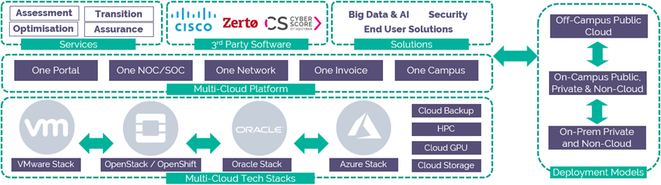

# High Performance Compute Service Definition

## Why UKCloud?

UKCloud is dedicated to helping the UK Public Sector and UK citizens by delivering more choice and flexibility through safe and trusted cloud technology. We own and operate a UK-sovereign, industry-leading, multi-cloud platform, located within the Government’s Crown Campus, offering multiple cloud technologies, including VMware, Azure, OpenStack, OpenShift and Oracle. This enables customers to choose the right technology for creating new workloads or migrating existing applications to the cloud.

We recognise the importance of government services in making the country run smoothly, which is why we include the highest level of support to all our customers at no extra cost. This includes a dedicated 24/7 UK telephone and ticket support, and Network Operations Centre (NOC) utilising protective and proactive monitoring tools, and access to UKCloud’s technical experts.

## What is High Performance Compute?

High Performance Compute (HPC) is designed to give you the compute power to help you solve large scale problems, whether you need rapid real time data processing to provide direction to teams making life or death decisions, need to process complex large data sets in search of patterns to unlock new knowledge, or simulating hypotheses to support fast innovation in healthcare or science. HPC can help by providing an easy to deploy and easy to use compute infrastructure that can power Grid engine or parallel processing workloads that typically underpin these services.

For full information regarding this product, we have Service Scopes, FAQs] and other relevant documents on our [Knowledge Centre](https://docs.ukcloud.com).

## What the service can help you achieve

- **Provides agility.** Prove and validate hypotheses in days, not years with the ability to adjust, and then run again quickly and efficiently

- **Reduces risk.** Avoid hardware lock-in providing flexibility if the hypothesis changes

- **Facilitates collaboration.** Encourage community collaboration on solving problems by enabling your platform to talk across multiple community networks

- **A singular focus.** Work with all levels of data classification – without having to build appropriate security and compliance regimes yourself. This ensures more time is spent asking questions and solving problems

- **A platform to support you.** Flexible and reconfigurable deployment patterns to evolve the platform as you understand more about the problem you are solving

## Product options

The service is designed to be flexible and allows you to mix and match from a range of pre-defined options for each workload and change them when required.

### Cluster size and virtual CPU mode

Choose the most appropriate virtual CPU mode for your workloads

- Hyper-threaded cores

- Native cores

### Cluster configuration

Choose the core to memory ratio that best suits your application

- 1 core:12GiB RAM ratio

- 1 core:16GiB RAM ratio

### Security domain

Choose the security domain for your workload to use

- Assured OFFICIAL

- Elevated OFFICIAL

### Storage

Define the storage required to deliver your application

- Tier 0 block

- Tier 1 block

- Tier 2 block

## Pricing and packaging

High Performance Compute starts at 5p per hour, and full pricing with all options including licensing and connectivity is available in the [*UKCloud Pricing Guide*](https://ukcloud.com/wp-content/uploads/2019/06/ukcloud-pricing-guide-11.0.pdf).

## Accreditation and information assurance

The security of our platform is our number one priority. We’ve always been committed to adhering to exacting standards, frameworks and best practice. Everything we do is subject to regular independent validation by government accreditors, sector auditors, and management system assessors. Details are available on the [UKCloud website](https://ukcloud.com/governance/).

## Connectivity options

UKCloud provides one of the best-connected cloud platforms for the UK Public Sector. We offer a range of flexible connectivity options detailed in the [*UKCloud Pricing Guide*](https://ukcloud.com/wp-content/uploads/2019/06/ukcloud-pricing-guide-11.0.pdf) which enable access to our secure platform by DDoS-protected internet, native PSN, Janet, HSCN and RLI and your own lease lines via our HybridConnect service.

## An SLA you can trust

We understand that enterprise workloads need a dependable service that underpins the reliability of the application to users and other systems, which is why we offer one of the best SLAs on G-Cloud. For full details on the service SLA including measurements and service credits, please view the [*SLA defintion article*](../other/other-ref-sla-definition.md) on the UKCloud Knowledge Centre.

&nbsp;                       | High Performance Compute
-----------------------------|-------------------------
**Service level agreement**  | 99.90%
**Portal level agreement**   | 99.90%
**Availability calculation** | Availability is calculated based on processor core hours. This is calculated by dividing the actual number of processor core hours that were available by the potential number of processor core hours that could have been available. This is based on the number of hours in the billing month excluding any planned and emergency maintenance.
**Measurement of SLA**       | Unavailability applies to processor cores that become unresponsive due to a fault recognised at the IaaS layer or below, that is, the fault is within UKCloud-controlled components, such as the physical host availability, storage, power and internal networking such as physical firewalls and routers.
**Key exclusions**           | The following are examples of what is not covered by the SLA:<ul><li>Faults within your control, such as client application issues and dependency on individual VMs<li>Routine failures of individual hosts<li>Faults within external connectivity providers (for example DDoS-protected internet, PSN, Janet or HSCN) and components co-located at UKCloud<li>Specific VMs and data using ephemeral storage<li>Planned maintenance</ul> |

## The small print

For full terms and conditions including onboarding and responsibilities, please refer to the [*Terms and conditions documents*](../other/other-ref-terms-and-conditions.md).

## Feedback

If you find an issue with this article, click **Improve this Doc** to suggest a change. If you have an idea for how we could improve any of our services, visit the [Ideas](https://community.ukcloud.com/ideas) section of the [UKCloud Community](https://community.ukcloud.com).
