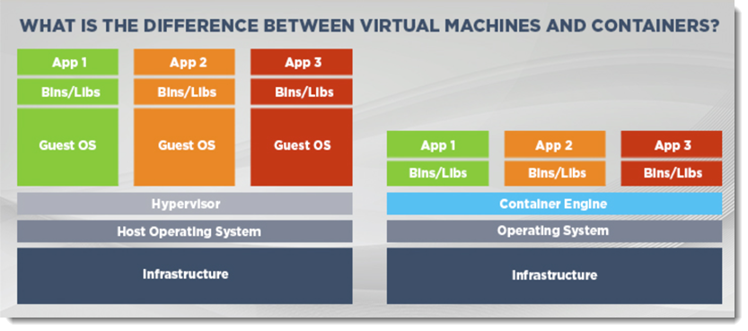

# UKCloud for Kubernetes powered by VMware Tanzu

## Introduction

  
 
    <!-- brief introduction -->
    
The way that customers consume applications has dramatically changed over the last decade. The pervasiveness of "born in the cloud" online services, such as Netflix, iPlayer and even Gov.UK, means that customers now expect new features and enhancements to be constantly delivered with no interruption to availability or performance.

    
This shift to modern, cloud-native applications means that traditional virtualisation technologies are starting to show their age and crack under the strain. As such, organisations now look to more modern hosting solutions that offer instantaneous scaling, deployment flexibility and the assurance of the highest level of availability, all without operator intervention.

    
<strong>The solution they look for is containers.</strong>

  

  

    

      <iframe src="https://www.youtube.com/embed/rYO4WrPKWI8" style="position:absolute;top:0;left:0;width:100%;height:100%;"title="YouTube video player" frameborder="0" allow="accelerometer; autoplay; clipboard-write; encrypted-media; gyroscope; picture-in-picture" allowfullscreen></iframe>
    

  

## What are containers?

Containers are a solution to the problem of how to get software to run reliably when moved from one computing environment to another, with the least amount of interaction or refactoring.

A container is an entire runtime environment: an application, plus all its dependencies, libraries and other binaries, and configuration files needed to run it, bundled into one package. Containers are run in isolated user environments, from a developer's local laptop through to traditional servers or in the cloud, all with minimal user intervention.

## What is containerisation?

Containerisation is the packaging together of software code, including its dependencies so that it is isolated in its own "container", allowing the uniform and consistent running of the package on any infrastructure and any environment.

### What are container orchestration tools?

A single container is often used for local development, however most modern cloud-native applications will often consist of 100s of inter-related containers. To effectively manage containers at this scale, you need container orchestration: the automation of the operational effort required to run containerised workloads and services. This includes a wide range of elements that teams need to manage a container's lifecycle, including provisioning, deployment, scaling (up and down), health, networking, load balancing and more.

## What are the benefits of containerisation?

Benefit | Explanation
--------|------------
Higher speed and efficiency for developing apps and scripts | Containers are smaller than virtual machines (VMs) and require less start up time and no additional resources or expertise for the creation of VMs.
Uses less resources than VMs | Containerisation is more efficient in terms of compute and data resources, but also in terms of the time taken to create the environments and move completed packages of work.
Continuous integration/continuous delivery friendly | As containers are lightweight and have limitless scalability, this works perfectly with CI/CD.
Multi-cloud compatibility/portability | Containers operate smoothly on the cloud and on multiple cloud platforms or desktop.
Cost efficiency | Although there is initial investment for memory and storage, it's possible to run many containers on the same infrastructure and integrate with third-party solutions &ndash; saving time and money. This is enhanced further by utilising a containerisation solution with a cloud service provider, such as UKCloud, that owns, manages and operates the underlying infrastructure and software layer.
Easier management | Install, upgrade and rollback processes are built into the container platform (Kubernetes).
Isolation of faults | Failures and faults on one container don't affect the others or the host, which means that issues can be recognised and dealt with &ndash; quickly, efficiently and automatically.
Increased security | The isolation of containers also prevents invasion from affecting other containers. However, there are requirements to protect containers from attacks at the host operating system level.

## Why containers and not virtual machines?

Differences between VMs and containers &ndash; the two different methods to achieving virtualisation.

&nbsp; | VMs | Containers
-------|-----|-----------
Efficiency | Larger and require more start up time, including the creation of the VM, installation of the OS, patching and any development tools required. This may be done by a separate team and may cause unnecessary delays. | Considered "lightweight", with smaller capacity than VMs, therefore:<ul><li>
Require less start up, which means more containers can run on the same compute capacity as individual VMs
</li><li>
Higher efficiencies and reduced costs
</li><li>
Almost instant availability and no dependency on external teams or interaction
</li></ul>
Structure | The base is hardware, followed by the hypervisor, which is responsible for creating the virtualised instances of each of the components that make up the VM (for example, processors, RAM, storage, network cards are virtualised by the hypervisor). | The base is hardware, but following this is the kernel, which helps the software and hardware communicate. On top of that is the operating system, which hosts all of the containers. On top of that is every container that is running.
Type of isolation achieved | Achieving isolation of machines: A VM is an isolated environment with access to a subset of physical resources of the computer system. Each VM appears to be running on the bare hardware, giving the appearance of multiple instances of the same computer, though all are supported by a single physical system. | Achieving isolation of the process: A container isn't a strong security boundary. Containers provide some restrictions on access to shared resources on a host, but they don't necessarily prevent a malicious attacker from circumventing these restrictions.
How these resources are accessed | The hypervisor is creating different machines out of the server and that's mainly where the interaction is happening with what we think is hardware, but that's being managed by the hypervisor to what the actual hardware is. | Namespaces allow for the illusion of customisation, which a container perceives as its own operating system. Portability &ndash; taking the one file that the container is stored in and are able to run anywhere. There aren't any hardware limitations.

### What's the difference between virtual machines and containers?

Source: <https://www.netapp.com/blog/containers-vs-vms/>

### Why choose containers over virtual machines?

- Containers are more lightweight and require less start up time than VMs

- Containers require less IT resources to deploy, run and manager

- Containers spin up in milliseconds, facilitating true elastic cloud applications

- A single system can host many more containers compared to VMs

## What containerisation technology options are available?

Containerisation technology is commonly split into two parts:

- **Container runtime.** This is what runs the applications and associated dependencies within the container.

- **Container orchestration.** This is the automation of the operation effort required to run containerised workloads and services

### Container runtime

Generally, container runtime technologies fall into two main categories:

- Open Container Initiative (OCI) runtimes

- Container Runtime Interface (CRI)

#### Open Container Initiative (OCI) runtimes

- Native runtimes

  - runC

  - Railcar

  - Crun

  - rkt

- Sandboxed and virtualised runtimes

  - gviso

  - nabla-containers

  - runV

  - clearcontainers

  - kata-containers

#### Container Runtime Interface (CRI)

- containerd

- cri-o

### Container orchestration

The following lists five of the most common container orchestration tools:

- **Kubernetes (K8s)**

  Kubernetes is an open-source, out-of-the-box container orchestration tool. It comes with an excellent scheduler and resource manager for deploying highly available containers more efficiently.

  The Kubernetes project is maintained by the cloud-native foundation with contributors worldwide. Contributors include big organisations to individual open-source developers, and has become the de facto container orchestration tool for many organisations.

- **Tanzu**

  Tanzu is VMware's commercial version of Kubernetes. Tanzu provides a full stack of capabilities for modernising your applications and infrastructure to continuously deliver better software to production. The VMware Tanzu portfolio simplifies multi-cloud operations and enables developers to easily access the resources they need to build modern applications.

  VMware Tanzu enables you to containerise your workloads to run in the cloud, while increasing security and manageability. You can refactor existing software to be delivered continuously and resiliently. You run and manage your applications consistently everywhere, on a secure and scalable infrastructure with a conformant Kubernetes runtime.

- **OpenShift**

  OpenShift is Red Hat's container orchestration platform, built on top of Kubernetes. There is a community as well as an enterprise version of OpenShift.

  Red Hat maintains the OpenShift project, with both and open-source (OKD) and enterprise version (OpenShift Container Platform).

  Along with core Kubernetes features, OpenShift offers container management and orchestration as well as a wealth of developer features to help drive efficient cloud native application development and deployment.

- **Docker swarm**

  The Docker ecosystem consists of tools from development to production deployment frameworks. A mix of tooling, including docker-compose, swarm, overlay network, and a service discovery tool, such as etcd or consul, can be used for managing a cluster of Docker containers.

  Docker swarm is still maturing in terms of functionality compared to other open-source container cluster management tools. Considering the vast docker contributors, it won't be long for Docker swarm to have all the best functionality other tools possess. Docker has documented a good production plan for using Docker swarm in production.

- **Mesos**

  Mesos is another cluster management tool that can manage container orchestration very efficiently. It was created by Twitter for its own infrastructure and then became open source. It's used by companies like eBay and Airbnb.
  
  Mesos is not a dedicated tool for containers. Instead, you can use it for VM or physical machine clustering for running workloads (for example, for big data) other than containers. It has an efficient Marathon framework for deploying and managing containers on a Mesos cluster. You can also run a Kubernetes cluster on a Mesos cluster.

## More information

For information about our plans for the future of our VMware public cloud, including UKCloud for Kubernetes powered by VMware Tanzu, see the **[VMware Innovation](https://ukcloud.com/vmware-innovation/)** page on the UKCloud website.

## Feedback

If you find a problem with this article, click **Improve this Doc** to make the change yourself or raise an [issue](https://github.com/UKCloud/documentation/issues) in GitHub. If you have an idea for how we could improve any of our services, send an email to <feedback@ukcloud.com>.
