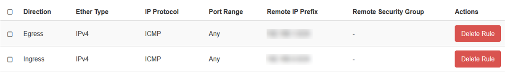
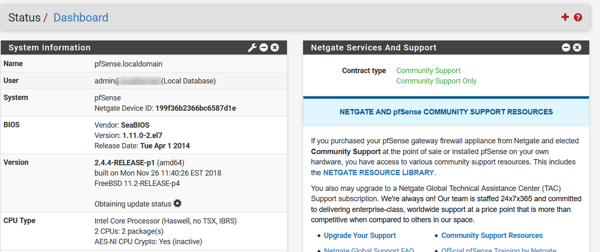
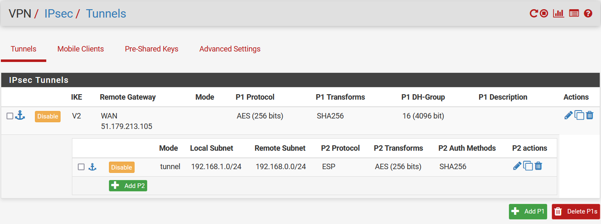

#### UKCloud Limited (“UKC”) and Virtual Infrastructure Group Limited (“VIG”) (together “the Companies”) – in Compulsory Liquidation

On 25 October 2022, the Companies were placed into Liquidation with the Official Receiver appointed as Liquidator and J Robinson and A M Hudson simultaneously appointed as Special Managers to manage the liquidation process on behalf of the Official Receiver.

Further information regarding the Liquidations can be found here: <https://www.gov.uk/government/news/virtual-infrastructure-group-limited-and-ukcloud-limited-information-for-creditors-and-interested-parties>

Contact details: 
For any general queries relating to the Liquidations please email <ukcloud@uk.ey.com> 
For customer related queries please email <ukcloudcustomers@uk.ey.com> 
For supplier related queries please email <ukcloudsuppliers@uk.ey.com>

# How to configure a VPN to enable Monitoring of OpenStack instances with Managed Monitoring as a Service

## Overview

To enable monitoring of your OpenStack instances using Managed Monitoring as a Service, you must stand up an OpenStack instance containing either a VPN appliance or an operating system with a VPN application installed. We recommend using pfSense as it has been tried and tested on the UKCloud platform.

This article shows how to set up pfSense as a VPN to use for monitoring OpenStack instances.

## Installing and configuring pfSense

The steps for installing and configuring pfSense are:

1. [Create a pfSense image](#creating-a-pfsense-image).

2. [Set up the network](#setting-up-the-network).

3. [Attach the network to the router](#attaching-the-network-to-the-router).

4. [Apply security groups](#applying-security-groups).

5. [Deploy the VPN instance](#deploying-the-vpn-instance).

6. [Configure networking for the VPN endpoint](#configuring-networking-for-the-vpn-endpoint).

7. [Configure the VPN endpoint](#configuring-the-vpn-endpoint).

### Creating a pfSense image

To obtain the latest pfSense image, raise a service request via the My Calls section of the UKCloud Portal.

1. In the OpenStack Horizon dashboard, expand **Compute** then select **Images**.

2. Click the **Create Image** button.

3. In the *Create Image* dialog box, in the **Image Name** field, enter an appropriate name for the image, for example, `pfSense2.4.4_http`.

4. In the **File** field, click **Browse** and locate the pfSense image.

5. From the **Format** list, select **QCOW2 - QEMU Emulator**.

6. In the **Minimum Disk** field, enter `60`.

7. Click **Create Image**.

### Setting up the network

We recommend creating a new network for the VPN to reside on.

1. Expand **Network** then select **Networks**.

2. Click the **Create Network** button.

3. In the *Create Network* dialog box, provide the following information:

   - **Networks** tab:

     - **Network Name:** Enter `VPN Bridge` or something similar.

     - Don't change any of the remaining options.

   - **Subnet** tab:

     - **Subnet Name:** Leave blank.

     - **Network Address:** The network subnet in a CIDR format. The subnet should not already be in use and the subnet mask should be `x.x.x.0/28`.

     - **IP Version:** Select `IPv4`.

     - **Gateway IP:** The IP dedicated to the gateway of the network. For ease of use, use the network address but ensure that the last octet is a `.1`, for example, `192.168.0.1`.

   - **Subnet Details** tab:

     - **DNS Name Servers:** Enter `8.8.8.8` or your preferred DNS server.

4. Click **Create**.

### Attaching the network to the router

The next step is to attach the network to the router.

1. Expand **Network** then select **Network Topology**.

2. Hover over the internet router and click **Add Interface**.

3. In the *Add Interface** dialog box, provide the following information:

   - **Subnet:** Select the network the VPN will sit on.

   - **IP Address:** Leave this blank so the gateway address you picked in the previous step will be chosen.

4. Click **Submit**.

### Applying security groups

You'll need to apply security groups to the VPN server to be able to talk to the other side.

1. Expand **Network** then select **Security Groups**.

2. Click the **Create Security Group** button.

3. In the *Create Security Group* dialog box, in the **Name** field, enter `UKCloud IT Operations VPN` then click **Create**.

4. Apply the following security group rules, where the **Remote IP Prefix** is your peer endpoint, as provided by UKCloud.

   

5. Create a second security group with the name `SSH & Web Access` with the following rules, where the **Remote IP Prefix** is **your** public IP address and the **Port Range** is 443 and 22 (HTTPS and SSH). This enables you to access the pfSense console and web GUI.

   

6. Create a third security group with the name `Managed Monitoring Ports`.

   - The rules for this security group allow the UKCloud IT Operations subnet to communicate with the ports that are required to be monitored as specified in the MITO Data Capture Form. You must also allow ICMP to and from the local and peer subnets.

   - The Ingress entry IP address must be the UKCloud IT Operations subnet, which will be provided by UKCloud.

   - The Egress entry IP address must be the required monitored subnet(s), which are specified in the MITO Data Capture form.

   

7. If you have opted for UKCloud Patching as a Service you must also create an additional security group with the name `Managed Patching Ports`.

   The rules for this security group allow the UKCloud IT Operations subnet to communicate through the VPN to patch the machines on the patching ports. Raise a service request to obtain the ports that require opening.

### Deploying the VPN instance

You're now ready to deploy the instance.

1. Expand **Compute** then select **Instances**.

2. Click the **Launch Instances** button.

3. In the *Launch Instance* dialog box, provide the following information:

   - **Details** tab:

     - **Instance Name:** Enter `MMaaS-VPN-Endpoint` or similar.

     - **Description:** Leave blank.

     - **Availability Zone:** Select **Any Availability Zone**.

     - **Count:** Enter `1`.

   - **Source** tab:

     - **Select Boot Source:** Select **Image**.

     - **Create New Volume:** Select **No**.

     - Select your pfSense image from the list of images.

   - **Flavor** tab:

     - Select **t1.large**.

   - **Networks** tab:

     - Select the network that you created earlier.

   - **Security Groups** tab:

     - Select the security groups that you created earlier: UKCloud IT Operations VPN, SSH & Web Access, Managed Monitoring Ports, Managed Patching Ports (if applicable).

4. Click **Launch Instance**.

### Configuring networking for the VPN endpoint

Next, you'll need to configure networking for the VPN endpoint.

1. On the *Instances* page, in the dropdown for your new instance, select **Associate Floating IP**.

2. In the *Manage Floating IP Associations* dialog box, from the **IP Address** list, select a public IP address.

3. From the **Port to be associated** list, select the local IP address of the VPN instance.

4. You'll need to add two **Allowed Address Pairs** entries for the instance's port.

   - In the Horizon dashboard, expand **Networks** then select **Network**.

   - Click your VPN network's name.

   - Select the **Ports** tab.

   - Click the port that corresponds to the instance's internal IP address.

   - Click **Allowed Address Pairs** then **+**.

   - Create an address pair for the local subnet and click **Submit**.

   - Create a second address pair for the peer subnet and click **Submit**.

5. You need to add a static route to the OpenStack router to ensure that UKCloud Monitoring infrastructure is routed via the VPN.

   - In the Horizon dashboard, expand **Network** then click **Routers**.

   - Select your internet router.

   - On the **Static Routes** tab, click the **Add Static Route** button.

   - In the *Add Static Route* dialog box, provide the following information:

     - **Destination CIDR:** The UKCloud IT Operations subnet.

     - **Next Hop:** The private IP for the VPN instance.

### Configuring the VPN endpoint

The final step is to configure the VPN endpoint using the pfSense dashboard.

1. Providing the security groups are set up correctly, whilst on you local machine and using the IP address specified in the SSH & Web Access security group, browse to `http://<floating-ip>` (using the floating IP you set in the previous section).

2. You can find pfSense administrator credentials in [Default Username and Password](https://docs.netgate.com/pfsense/en/latest/usermanager/defaults.html) or you can contact UKCloud Support.

3. Once you're logged in, you should see the following dashboard:

   

4. In the top navigation bar, go to **VPN** > **IPsec** > under **tunnels** > **Add P1**. Provide the following information (this must match the IPsec):

   - **General Information**

     - **Key Exchange version:** IKEv2

     - **Internet Protocol:** IPv4

     - **Interface:** WAN

     - **Remote Gateway:** This will be provided by UKCloud

   - **Phase 1 Proposal (Authentication)**

     - **My Identifier - IP address:** <floating-ip>

     - **Peer Identifier - IP address:** This will be provided by UKCloud

     - **Pre-Shared Key:** This will be provided by UKCloud

   - **Phase 1 Proposal (Encyption Algorithm)**

     - **Algorithm:** AES

     - **Key length:** 256 bits

     - **Hash:** SHA256

     - **DH Group:** 16 (4096 bit)

   - **Advanced Options**

     - Leave all as default

5. Click **Save**.

6. Go to **VPN** > **IPsec** > expand **Show Phase 2 Entries** > **Add P2**. Provide the following information:

   - **General Information**

     - **Disabled:** Leave unselected

     - AES | 256 bits

     - **Hash Algorithms:** SHA256

     - **PFS key group:** 16 (4096 bit)

     - **Lifetime:** 3600

   - **Advanced Configuration**

     - Leave the rest blank

7. Click **Save**.

   Your IPsec configuration should look similar to the following:

   

8. You'll need to apply firewall rules on the pfSense WAN interface to let traffic in and out.

   - Go to **Firewall** > **Rules** > **WAN** > **Add**.

   - Leave everything as default, but under **Protocol**, change **TCP** to **Any**.

9. You'll need to apply firewall rules on the pfSense IPsec interface to let traffic in and out.

   - Go to **Firewall** > **Rules** > **IPsec** > **Add**.

   - Leave everything as default, but under **Protocol**, change **TCP** to **Any**.

10. Contact UKCloud Support to confirm that the VPN tunnel is up between the UKCloud IT Operations subnet and your monitored subnet.

## Feedback

If you find a problem with this article, click **Improve this Doc** to make the change yourself or raise an [issue](https://github.com/UKCloud/documentation/issues) in GitHub. If you have an idea for how we could improve any of our services, send an email to <feedback@ukcloud.com>.
