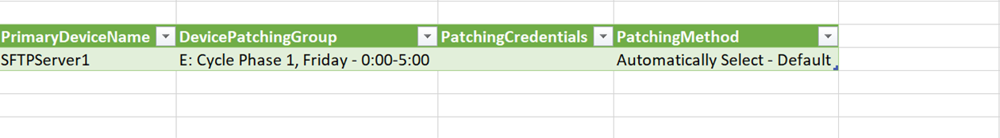

# How to define patching windows for Patching as a Service

## Overview

With Patching as a Service, an option of our Managed IT Operations service, our Cloud Operations team provides routine OS patch management for compute instances, removing the burden of basic OS hygiene so that you can focus your attention above the operating system.

This article provides information about how to specify patching windows for your devices and also other changes that you may want to make to your Patching as a Service.

> [!IMPORTANT]
> You must subscribe to Managed Monitoring as a Service to be able to also subscribe to Patching as a Service.

To make changes, you'll need to fill in the appropriate details in the Managed IT Operations - Add or Remove Device spreadsheet (UKC-FRM-303) spreadsheet, which enables us to automate your requested changes. This is the same spreadsheet as the one you used to originally set up your service. The Service Request template includes a link to download the spreadsheet. When filling out the spreadsheet, ensure that you follow the instructions provided.

If you want to download the spreadsheet ahead of raising the request, click [here](https://cas.frn00006.ukcloud.com/Docs/UKCloud_Man_IT_Ops/UKC-FRM-303%20-%20Managed%20IT%20Operations%20-%20Add%20or%20Remove%20Devices.xlsx?AWSAccessKeyId=438-1048-5-aefff7-1&Expires=1690632276&Signature=WPn9yI6cxrq8EPPOQovxPlEAViE%3D).

> [!NOTE]
> If you're not sure how to complete the spreadsheet or need help with any of the details, contact UKCloud Support.

## Specifying a patching window for a device

A patching window determines when the patching will take place on a monitored device. You define a patching window for a device by adding it to a patching group. The patching groups are divided into two phases within a two week cycle that begins every other Tuesday in line with software vendor patching schedules. The first phase centres on the first weekend, and the second phase around the second weekend. An example where this may be useful is to select the first phase to patch staging devices and the second phase to patch production devices, thereby providing several days between the patching cycles.

1. In My Calls, raise a ticket using the **Managed IT Operations - Make changes to my managed devices** template.

2. Download the spreadsheet linked in the template.

   

3. On the **Credentials** tab of the spreadsheet, add the set of credentials to be used for patching purposes if these are different from the administrative credentials used for the device.

4. On the **Device Information** tab, enter the details of the device(s) for which you want to specify the patching window, making sure to select **Yes** in the **Patching** column.

   > [!TIP]
   > You can find the details of your devices on previous spreadsheets if you have them. If you don't, and can't remember your device details, contact UKCloud Support, who will be able to provide you with the necessary information.

5. On the **Patching** tab, in the row for the appropriate device, from the list in the **DevicePatchingGroup** column, select the patching group you want to add the device to.

   > [!TIP]
   > Device names from the **Device Information** tab are auto-populated into the **Patching** tab. If the information doesn't auto-populate, in the **Data** ribbon, select **Refresh All**.
   >
   > 
   >
   > Device names will then auto-populate in the **PrimaryDeviceName** column.

6. If you specified separate patching credentials on the **Credentials** tab, in the **PatchingCredentials** column, select the name of the credentials to use when applying patches to the device.

7. In the **PatchingMethod** column, select **Automatically Select - Default**. This ensures that UKCloud can select the most appropriate patching method for the device based on the supported operating system and service requirements.

   > [!NOTE]
   > Do not select either of the other patching methods unless previously discussed and agreed with UKCloud.

   

8. In the **SnapshotBehaviour** column, select the preferred behaviour for snapshots prior to performing the patching:

   - **hard** - Attempt to snapshot the virtual machine prior to patching. If the snapshot is not successful, patching will not proceed. This is the default option.

   - **soft** - Attempt to snapshot the virtual machine prior to patching. If the snapshot is not successful, patching will still proceed.

   - **disabled** - Do not attempt to snapshot the virtual machine prior to patching. Use this option for virtual machines that are unable to have snapshots and environments where snapshots are not available.

   > [!NOTE]
   > Currently, snapshot functionality is available only in UKCloud for VMware environments.

9. When you've finished completing the spreadsheet, in your My Calls ticket either click **Select files** and browse to the completed spreadsheet or drag the spreadsheet into the template.

   

10. Enter the date from which you want the changes to be effective.

11. When you're done, click **Review & Submit** then **Submit**.

   As per our standard customer service targets, we aim to resolve your request within two working days.

## Related articles

- [*How to add devices to and remove devices from Managed IT Operations*](man-how-add-remove-device.md)

- [*How to update contact information for Managed IT Operations*](man-how-update-contact-info.md)

- [*How to provide notification of maintenance windows for Managed IT Operations*](man-how-notify-maintenance.md)

## Feedback

If you find a problem with this article, click **Improve this Doc** to make the change yourself or raise an [issue](https://github.com/UKCloud/documentation/issues) in GitHub. If you have an idea for how we could improve any of our services, send an email to <feedback@ukcloud.com>.
