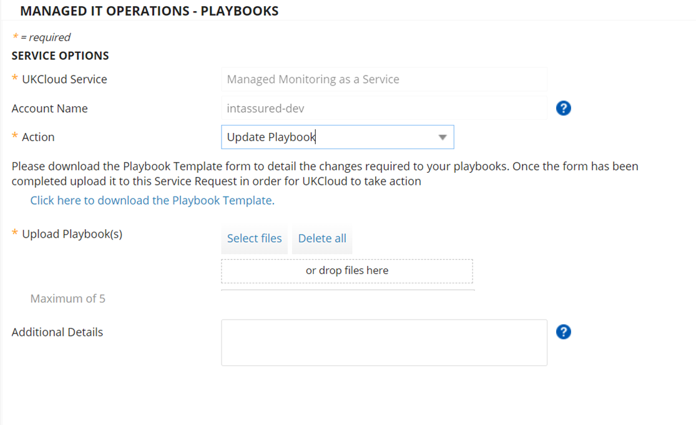

# How to update contact information for Managed IT Operations

## Overview

It's important to keep the contact information for your Managed IT Operations service up to date, so that, in the event of an alert that requires your attention, we can quickly get in touch with the relevant person within your organisation.

All contact information is captured using playbooks. A playbook is a set of instructions that determine the actions to perform in response to a certain scenario. In the case of contact information, for example, all alerts could go to `support@example.com`, but for an Active Director server, they might go to `adsupport@example.com`. In addition, you can add an escalation contact for urgent alerts, whereby our Cloud Operations team can email or call another agreed contact in certain circumstances.

## Updating contact information

### Adding a new contact

To add a new contact:

1. In My Calls, raise a ticket using the **Managed IT Operations - Playbooks** template.

2. From the **Action** list, select **Add Playbook**.

   

3. You'll be provided with a link to the Contact Playbook Submission form (UK-FRM-262). Click the link to download the document.

4. The document includes detailed instructions for how to complete the form and an example of a completed form. If you have any questions, contact UKCloud Support.

5. When you've finished completing the form, in your My Calls ticket either click **Select files** and browse to the completed spreadsheet or drag the spreadsheet into the template.

6. Provide any **Additional Details** regarding the playbook, if necessary.

7. When you're done, click **Review & Submit** then **Submit**.

   The Service Request will be fulfilled within the agreed SLA and a playbook ID will be provided to you as part of the closure of the request.

### Updating an existing contact

To update a contact:

1. In My Calls, raise a ticket using the **Managed IT Operations - Playbooks** template.

2. From the **Action** list, select **Update Playbook**.

   

3. You'll be provided with a link to the Contact Playbook Submission form (UK-FRM-262). Click the link to download the document.

   > [!TIP]
   > If you have the original form that you used when you initially created the playbook, you can edit that document with the updated details instead of downloading a new document.

4. In the **Playbook Code** field, enter the ID of the playbook that you want to update. If you're not sure of the playbook ID, contact UKCloud Support.

5. When you've finished providing the updated details in the form, in your My Calls ticket either click **Select files** and browse to the completed spreadsheet or drag the spreadsheet into the template.

6. Provide any **Additional Details** regarding the playbook, if necessary.

7. When you're done, click **Review & Submit** then **Submit**.

   The Service Request will be fulfilled within the agreed SLA.

### Removing an existing contact

If you want to completely remove a contact from your Managed IT Operations service, you need to delete the corresponding playbook.

1. In My Calls, raise a ticket using the **Managed IT Operations - Playbooks** template.

2. From the **Action** list, select **Delete Playbook**.

   

3. In the **Playbook Code(s) to delete** field, enter the ID of the playbook that contains the contact that you want to delete.

4. In the **Additional Details** field, you can enter information about the specific contact that you want to remove to confirm the details.

5. When you're done, click **Review & Submit** then **Submit**.

   The Service Request will be fulfilled within the agreed SLA.

## Related articles

- [*How to add devices to and remove devices from Managed IT Operations*](man-how-add-remove-device.md)

- [*How to change your service configuration for Managed Monitoring as a Service*](man-how-monitoring-change-config.md)

- [*How to define patching windows for Patching as a Service*](man-how-patching-define-window.md)

- [*How to provide notification of maintenance windows for Managed IT Operations*](man-how-notify-maintenance.md)

## Feedback

If you find a problem with this article, click **Improve this Doc** to make the change yourself or raise an [issue](https://github.com/UKCloud/documentation/issues) in GitHub. If you have an idea for how we could improve any of our services, send an email to <feedback@ukcloud.com>.
