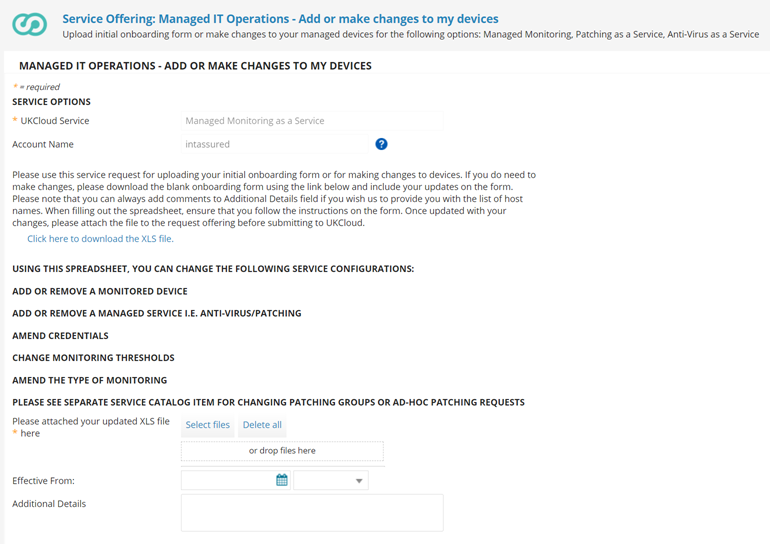
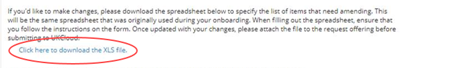

# How to add devices to and remove devices from Managed IT Operations

## Overview

Managed IT Operations provides several options focused on enhancing the general health of your compute assets:

- Managed Monitoring as a Service

- Anti-Virus as a Service

- Patching as a Service

- Runbook Automation (coming soon)

This article provides information about how to add devices to and remove devices from these Managed IT Operations service options.

> [!IMPORTANT]
> You must subscribe to Managed Monitoring as a Service to be able to also subscribe to any of the other service options.

To make changes, you'll need to fill in the appropriate details in the Managed IT Operations - Add or Remove Device spreadsheet (UKC-FRM-303) spreadsheet, which enables us to automate your requested changes. This is the same spreadsheet as the one you used to originally set up your service. The Service Request template includes a link to download the spreadsheet. When filling out the spreadsheet, ensure that you follow the instructions provided.

If you want to download the spreadsheet ahead of raising the request, click [here](https://cas.frn00006.ukcloud.com/Docs/UKCloud_Man_IT_Ops/UKC-FRM-303%20-%20Managed%20IT%20Operations%20-%20Add%20or%20Remove%20Devices.xlsx?AWSAccessKeyId=438-1048-5-aefff7-1&Expires=1642866877&Signature=imOIy0kAEXOxkvf8NZ5lJLUc4a0%3D).

> [!NOTE]
> If you're not sure how to complete the spreadsheet or need help with any of the details, contact UKCloud Support.

## Adding a device to a Managed IT Operations service

If you have a new device that you want monitored, you can add it to your Managed IT Operations service.

1. In My Calls, raise a ticket using the **Managed IT Operations - Make changes to my managed devices** template.

   

2. Download the spreadsheet linked in the template.

   

   > [!TIP]
   > Each tab in the spreadsheet includes instructions on how to complete that tab.

3. In the **Credentials** tab of the spreadsheet, add the details of any credentials required for the device.

4. On the **Device Information** tab, add the details of the device that you want to add, including the device name, IP address and OS family.

5. In the **AdministrativeCredentials** column, select the name of the credentials you created on the **Credentials** tab.

6. Specify the service to which you want to add the device by selecting **Yes** in the appropriate column.

   For example, to add the device to Managed Monitoring as a Service, select **Yes** from the list in the **ManagedMonitoring** column.

   

7. Make any changes to the relevant service option tab(s) as necessary.

   For example, if you're adding a device to Managed Monitoring as a Service, update the information on the **Monitoring** tabs as necessary.

   For more information about completing the different tabs see:

   - [*How to change your service configuration for Managed Monitoring as a Service*](man-monitoring-how-change-config.md)

   - [*How to define patching windows for Patching as a Service*](man-patching-how-define-window.md)

   > [!TIP]
   > Device names from the **Device Information** tab are auto-populated into each of the service option tabs. If the information doesn't auto-populate, in the **Data** ribbon, select **Refresh All**.
   >
   > 
   >
   > Device names will then either auto-populate or appear in the dropdown list, depending on which tab you're on.

8. When you've finished completing the spreadsheet, in your My Calls ticket either click **Select files** and browse to the completed spreadsheet or drag the spreadsheet into the template.

   

9. Enter the date from which you want the changes to be effective.

10. When you're done, click **Review & Submit** then **Submit**.

    As per our standard customer service targets, we aim to resolve your request within two working days.

## Removing a monitored device from a Managed IT Operations service

If you have a device that you no longer want to monitor, you can remove it from your Managed IT Operations service.

1. In My Calls, raise a ticket using the **Managed IT Operations - Make changes to my managed devices** template.

   

2. Download the spreadsheet linked in the template.

   

   > [!TIP]
   > Each tab in the spreadsheet includes instructions on how to complete that tab.

3. In the **Device Information** tab of the spreadsheet, in the column for the service from which you want to remove the device, select **No**.

   For example, to remove a device from Patching as a Service, select **No** from the list in the **Patching** column

4. When you've finished completing the spreadsheet, in your My Calls ticket either click **Select files** and browse to the completed spreadsheet or drag the spreadsheet into the template.

   

5. Enter the date from which you want the changes to be effective.

6. When you're done, click **Review & Submit** then **Submit**.

   As per our standard customer service targets, we aim to resolve your request within two working days.

## Related articles

- [*How to change your service configuration for Managed Monitoring as a Service*](man-monitoring-how-change-config.md)

- [*How to define patching windows for Patching as a Service*](man-patching-how-define-window.md)

- [*How to update contact information for Managed IT Operations*](man-how-update-contact-info.md)

- [*How to provide notification of maintenance windows for Managed IT Operations*](man-how-notify-maintenance.md)

## Feedback

If you find a problem with this article, click **Improve this Doc** to make the change yourself or raise an [issue](https://github.com/UKCloud/documentation/issues) in GitHub. If you have an idea for how we could improve any of our services, send an email to <feedback@ukcloud.com>.
