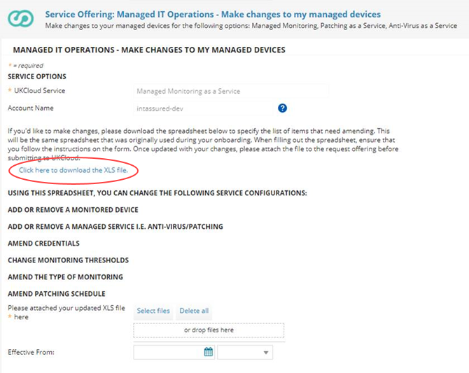
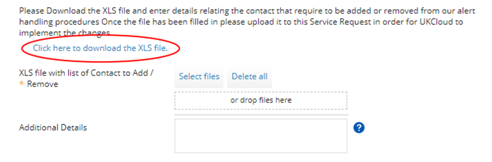
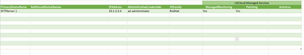
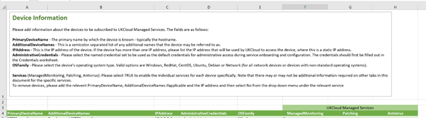

# How to change your service configuration for Managed IT Operations

## Overview

With Managed IT Operations, we provide several options to complement our Managed Monitoring as a Service offering:

- Anti-Virus as a Service

- Patching as a Service

- Runbook Automation (coming soon)

With Managed Monitoring as a Service, our Cloud Operations team monitors your devices, receiving and reacting to any abnormal events, only escalating those events that genuinely require your attention.

When we first provision the service, we set it up with default thresholds for the devices you've selected to monitor, unless you specified different thresholds in your initial request. At any time, you can raise a Service Request, via the [My Calls](https://portal.skyscapecloud.com/support/ivanti) section of the UKCloud Portal, to change these thresholds and other service configuration details.

This article provides information about the default monitoring thresholds and alerting procedures and shows you how to change your service configuration. It also covers any changes that you may want to make relating to the additional service options.

> [!IMPORTANT]
> You must subscribe to Managed Monitoring as a Service to be able to also subscribe to any of the additional service options.

## Managed Monitoring as a Service default configuration

### Default monitoring thresholds

Managed Monitoring as a Service thresholds determine when alerts are raised against your monitored devices. The following table shows the default thresholds used by the service. If you want to use different thresholds you can identify these in your initial request or change them later.

Item                                 | Alert type     | Default threshold
-------------------------------------|----------------|------------------
Processor load                       | Major Alert    | 80%
Processor load                       | Critical Alert | 90%
Available memory                     | Major Alert    | 85%
Available memory                     | Critical Alert | 95%
Swap space used                      | Major Alert    | 80%
Global disk space used               | Major Alert    | 75%
Global disk space used               | Critical       | 85%
Specific file system disk space used | Major Alert    | 75%
Specific file system disk space used | Critical Alert | 85%

### Default alert handling procedures

If a threshold is exceeded, a major or critical alert is raised as appropriate. The procedure followed for these alerts is dependent on the alert type and whether you have identified the device as critical. The following table shows the default alert handling procedures for the different alert types and criticality.

Alert type     | Critical item | UKCloud action
---------------|---------------|---------------
Major Alert    | No            | <ol><li>Incident logged against the escalation contact via the UKCloud Portal.</li><li>Email notification to escalation contact with ticket details.</li><li>Ticket remains as "Waiting for Customer" until customer acknowledges and closes the incident via the UKCloud Portal.</li></ol>
Major Alert    | Yes           | As above.
Critical Alert | No            | As above.
Critical Alert | Yes           | <ol><li>Incident logged against the escalation contact via the UKCloud Portal.</li><li>Email notification to escalation contact with ticket details.</li><li>Ticket remains as "Waiting for Customer" until customer acknowledges and closes the incident via the UKCloud Portal.</li><li>Phone call to escalation contact. If no response, then voicemail and update ticket with voicemail details.</li><ol>

## Making changes to your service configuration

To make any changes to your Managed Monitoring as a Service, you must log a Service Request via the [My Calls](https://portal.skyscapecloud.com/support/ivanti) section of the UKCloud Portal. For general information about raising a Service Request, see [*How to use My Calls in the UKCloud Portal*](../portal/ptl-how-use-my-calls.md).

If you want to make changes, you'll be provided with a link to download a spreadsheet to specify the list of items that need amending. This will be the same spreadsheet that was originally used during your onboarding. When filling out the spreadsheet, ensure that you follow the instructions on the form. If you want to download the file ahead of raising the request, click [here](https://cas.frn00006.ukcloud.com/Docs/UKCloud_Man_IT_Ops/UKC-FRM-303%20-%20Managed%20IT%20Operations%20-%20Add%20or%20Remove%20Devices.xlsx?AWSAccessKeyId=438-1048-5-aefff7-1&Expires=1642866877&Signature=imOIy0kAEXOxkvf8NZ5lJLUc4a0%3D). You can attach the file to the request offering before submitting to UKCloud.

You can change the following service configurations:

- [*Add or remove a monitored device*](#adding-or-removing-a-monitored-device)

- [*Add or remove a managed service option*](#adding-or-removing-a-managed-service) (for example, Anti-Virus or Patching)

- [*Amend credentials*](#amending-credentials)

- [*Change monitoring thresholds*](#changing-monitoring-thresholds)

- [*Amend the type of monitoring*](#amending-the-type-of-monitoring)

- [*Amend patching schedules*](#amending-patching-schedules)

### Adding a device to Managed Monitoring as a service

If there's a new device that you want to add to your Managed IT Operations service, you can let us know by raising a Service Request.

1. In My Calls, raise a ticket using the **Managed IT Operations - Make changes to my managed devices** template.

2. Download the Managed IT Operations - Add or Remove Device spreadsheet (UKC-FRM-303) linked in the template.

   

   > [!TIP]
   > If you want to download the spreadsheet in advance, you can download it from [here](https://cas.frn00006.ukcloud.com/Docs/UKCloud_Man_IT_Ops/UKC-FRM-303%20-%20Managed%20IT%20Operations%20-%20Add%20or%20Remove%20Devices.xlsx?AWSAccessKeyId=438-1048-5-aefff7-1&Expires=1642866877&Signature=imOIy0kAEXOxkvf8NZ5lJLUc4a0%3D)

3. On the **Credentials** tab, add the details of any credentials required for the device.

4. On the **Device Information** tab, add the details of the device that you want to add, including the device name, IP address and OS family.

5. In the **AdministrativeCredentials** column, select the name of the credentials you created on the **Credentials** tab.

6. Specify the service to which you want to add the device by selecting **Yes** in the appropriate column.

   For example, to add the device to Patching as a Service, select **Yes** from the list in the **Patching** column.

   

7. Make any changes to the relevant service tab as necessary.

   For example, if you're adding a device to Patching as a Service, update the information on the **Patching** tab as necessary.

   > [!TIP]
   > You can auto-populate device names from the first tab onto each of the service tabs. If the tab doesn't auto-populate, in the **Data** ribbon, select **Refresh All**.
   >
   > 
   >
   > The devices you populated on the **Device Information** tab will then either auto-populate or appear in the dropdown list, depending on which tab you're on.

8. When you're done, save the spreadsheet and upload it to the 

### Removing a monitored device

### Making changes to my devices

If there's a new device that you want to add to your Managed Monitoring as a Service, or if there's a device that you no longer want to be monitored, you can let us know by raising a Service Request.

1. In My Calls, raise a ticket using the **Managed IT Operations - Make changes to my managed devices** template.

2. Download the spreadsheet linked in the template.

   

3. Complete the spreadsheet.

   For more information about filling in the spreadsheet, see [*Filling out the Managed IT Operations spreadsheet*](#filling-out-the-managed-it-operations-spreadsheet).

### Filling out the Managed IT Operations spreadsheet

For the majority of changes, you'll need to populate the Managed IT Operations spreadsheet. This enables us to automate any changes you've requested and therefore provide a more efficient service.

1. In My Calls, raise a ticket using the appropriate Managed IT Operations template.

   For example, if you want to add new devices to your service, raise a ticket using the **Make changes to my managed devices** template

2. Within the template, you'll be provided with a link to the Managed IT Operations spreadsheet (UKC-FRM-303). Click the link to download the file.

   

   > [!TIP]
   > If you want to download the spreadsheet in advance, you can download it from [here](https://cas.frn00006.ukcloud.com/Docs/UKCloud_Man_IT_Ops/UKC-FRM-303%20-%20Managed%20IT%20Operations%20-%20Add%20or%20Remove%20Devices.xlsx?AWSAccessKeyId=438-1048-5-aefff7-1&Expires=1642866877&Signature=imOIy0kAEXOxkvf8NZ5lJLUc4a0%3D).

3. Fill out the appropriate tabs in the spreadsheet, depending on the configuration changes you want to make.

   > [!TIP]
   > At the top of each tab you can find information about how to complete that tab. If you have any questions, contact UKCloud Support.

   - **Credentials** - The credentials listed here should be those that need to be selected within the other tabs for use by individual services.

   - **Device Information** - Use this tab to add or remove devices from the various services. For example, if you want to add a device to Patching as a Service, complete the various fields and then select **Yes** in the **Patching** column. You will then need to complete the **Patching** tab.

     

     If you want to remove a device, change the value to **No** under the appropriate service.

   - **Monitoring - Device Settings** - Use this tab to define the monitoring method. The device field can be auto-populated from the **Device Information** tab.

   - **Monitoring - Overrides** - Use this tab to amend the default threshold and handling procedures listed [above](#managed-monitoring-as-a-service-default-configuration)

   - **Monitoring - Advanced** - Use this tab to add additional monitors to the default monitoring.

   - **Patching** - Use this tab to add, remove or change patching windows and methods.

4. If you're adding or removing devices, you'll need to populate the **Device Information** tab.

   

   Each tab includes instructions for how to complete the form.

   

5. To update monitoring methods, thresholds or add additional monitoring methods, complete the appropriate **Monitoring** tab.

   > [!TIP]
   > You can auto-populate device names from the first tab onto each of the **Monitoring** tabs. If the tab doesn't auto-populate, in the **Data** ribbon, select **Refresh All**.
   >
   > 
   >
   > The devices you populated on the **Device Information** tab will then either auto-populate or appear in the dropdown list, depending on which tab you're on.

6. For adding new devices to Patching as a Service or to change patching schedules, you'll need to complete the **Device Information** tab to add those devices to Patching as a Service. Once you select **Yes** from the dropdown list under Patching, you can then auto-populate it into the **Patching** tab. You must complete the **Patching** tab to select your preferred patching window. UKCloud will select the appropriate patching method based on the operating system of the device, so you should select **Automatically Select** from the options.

7. When you've finished completing the spreadsheet, in your ticket either click **Select files** and browse to the completed spreadsheet or drag the spreadsheet into the template.

8. When you're done, click **Review & Submit** then **Submit**.

   As per our standard customer service targets, we aim to resolve your request within two working days.

### Changing contact information

All contact information is captured using playbooks. A playbook is a set of instructions detailing whom we should contact in different scenarios. For example, alerts could go to `support@example.com`, but for an AD directory server, they might go to `adsupport@example.com`. In addition, you can add an escalation contact for urgent alerts, whereby our Cloud Operations team can email or call another agreed contact in certain circumstances.

To add a new contact:

1. In My Calls, raise a ticket using the **Managed IT Operations - Playbooks** template.

2. Select **Add Playbook**.

3. You'll be provided with a link to the Managed IT Operations Playbook (UK-FRM-262). Click the link to download the file.

4. Follow the instructions provided in the downloaded document to complete the form. If you have any questions, contact UKCloud Support.

5. The Service Request will be fulfilled within the agreed SLA and a playbook ID will be provided to you as part of the closure of the request.

To update a contact:

1. In My Calls, raise a ticket using the **Managed IT Operations - Playbooks** template.

2. Select **Update Playbook**.

3. You'll be provided with a link to the Managed IT Operations Playbook (UK-FRM-262). Click the link to download the file.

4. In the **Playbook code** field, enter the ID of the playbook that you want to change then upload. Alternatively, if you have the original form then you can upload this with the amendments included. If you're not sure of your playbook ID, contact UKCloud Support.

### Providing notification of maintenance windows

If you're planning maintenance that will affect a monitored device, provide details on the maintenance window, including any instructions for how we should deal with alerts that occur during the maintenance period.

1. In My Calls, raise a ticket using the **Managed IT Operations - Maintenance Window** template.

2. If you want to inform us of maintenance windows on multiple devices, from the **Maintenance Window on a Single Device?** list, select **No**.

   For more informatio about notifying us of maintenance windows on multiple devices, see [*Filling out the Managed IT Operations spreadsheet*](#filling-out-the-managed-it-operations-spreadsheet)

3. If you're adding maintenace information for a single device, in the **Device Name** field, enter the name of the device to which the maintenance window applies.

4. In the **Device IP Address** field, enter the IP address of the device.

5. In the **Start Date / Time** field, use the date picker to specify the beginning of the maintenance window.

6. In the **End Date / Time** field, use the date picker to specify the end of the maintenance window.

7. In the **Reason for Maintenance** field, enter details of what kind of maintenance is taking place during the specified period.

8. In the **Special Instructions for UKCloud during the Maintenance Window** field, let us know how you want us to respond to alerts during the maintenance window.

    

9. When you're done, click **Review & Submit** then **Submit**.

## Feedback

If you find a problem with this article, click **Improve this Doc** to make the change yourself or raise an [issue](https://github.com/UKCloud/documentation/issues) in GitHub. If you have an idea for how we could improve any of our services, send an email to <feedback@ukcloud.com>.
