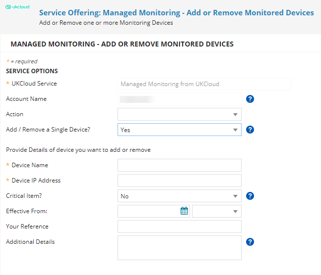
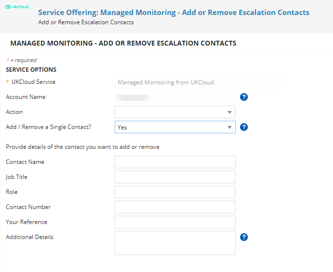
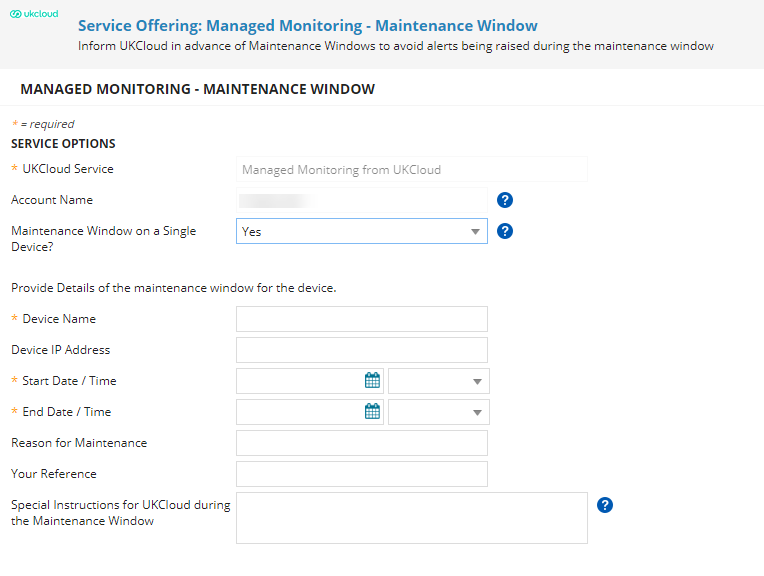
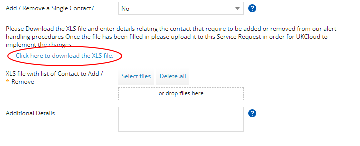

# How to change your service configuration for Managed Monitoring from UKCloud

## Overview

With Managed Monitoring from UKCloud, our Network Operations Centre (NOC) monitors your devices, receiving and reacting to any abnormal events, only escalating those events that genuinely require your attention.

When we first provision the service, we set it up with default thresholds for the devices you've selected to monitor, unless you specified different thresholds in your initial request. At any time, you can raise a Service Request to change these thresholds and other service configuration details.

This article provides information about the default monitoring thresholds and alerting procedures and shows you how to change your service configuration.

## Managed Monitoring from UKCloud default configuration

### Default monitoring thresholds

Managed Monitoring thresholds determine when alerts are raised against your monitored devices. The following table shows the default thresholds used by the service. If you want to use different thresholds you can identify these in your initial request or change them later.

Item                                | Alert type     | Default threshold
------------------------------------|----------------|------------------
Processor load                      | Major Alert    | 80%
Processor load                      | Critical Alert | 90%
Available memory                    | Major Alert    | 85%
Available memory                    | Critical Alert | 95%
Swap space used                     | Major Alert    | 80%
Global disk space used              | Major Alert    | 75%
Global disk space used              | Critical       | 85%
Specific Filesystem disk space used | Major Alert    | 75%
Specific Filesystem disk space used | Critical Alert | 85%

### Default alert handling procedures

If a threshold is exceeded, a major or critical alert is raised as appropriate. The procedure followed for these alerts is dependent on the alert type and whether you have identified the device as critical. The following table shows the default alert handling procedures for the different alert types and criticality.

Alert type     | Critical item | UKCloud action
---------------|---------------|---------------
Major Alert    | No            | <ol><li>Incident logged against the escalation contact via the UKCloud Portal.</li><li>Email notification to escalation contact with ticket details.</li><li>Ticket remains as "Waiting for Customer" until customer acknowledges and closes the incident via the UKCloud Portal.</li></ol>
Major Alert    | Yes           | As above.
Critical Alert | No            | As above.
Critical Alert | Yes           | <ol><li>Incident logged against the escalation contact via the UKCloud Portal.</li><li>Email notification to escalation contact with ticket details.</li><li>Ticket remains as "Waiting for Customer" until customer acknowledges and closes the incident via the UKCloud Portal.</li><li>Phone call to escalation contact, if no response then voicemail and update ticket with voicemail details.</li><ol>

## Making changes to your service configuration

To make any changes to your Managed Monitoring from UKCloud service, you must log a Service Request via the UKCloud Portal. For general information about raising a Service Request, see [*How to use My Calls in the UKCloud Portal*](../portal/ptl-how-use-my-calls.md).

If you want to make changes to more than one item, you'll be provided with a link to download a spreadsheet to specify the list of items that need amending. When filling out the spreadsheet, ensure that you fill in the correct tab, depending on the change required. If you want to download the file ahead of raising the request, click [here](https://cas.frn00006.ukcloud.com/Docs/Documents/UKC-FRM-257%20Managed%20Monitoring%20from%20UKCloud%20-%20%20make%20changes%20to%20my%20service.xlsx?AWSAccessKeyId=438-1048-5-aefff7-1&Expires=1608414781&Signature=jHVncOCED%2FOxxgc%2FKpKSGnJqQV8%3D). You can attach the file to the request offering before submitting to UKCloud.

You can change the following service configurations:

- [Add or remove a monitored device](#adding-or-removing-a-monitored-device)

- [Change escalation contact information](#changing-escalation-contact-information)

- [Change monitoring thresholds](#changing-monitoring-thresholds)

- [Provide advance notice of maintenance windows](#providing-notification-of-maintenance-windows)

### Adding or removing a monitored device

If there's a new device that you want to add to your Managed Monitoring from UKCloud service, or if there's a device that you no longer want to be monitored, you can let us know by raising a Service Request.

1. In My Calls, raise a ticket using the **Add or Remove Monitored Devices** Managed Monitoring template.

2. From the **Action** list, select:

    - **Add New Device** to add a device to the service

    - **Remove Existing Device** to remove an item from the service

    - **Add New Device and Remove Existing** if you want to both add and remove devices

3. If you want to add or remove multiple devices, from the **Add / Remove a Single Device?** list, select **No**.

    For more information about adding or removing multiple devices, see [Filling out the Managed Monitoring spreadsheet](#filling-out-the-managed-monitoring-spreadsheet).

4. If you're adding or removing a single device, in the **Device Name** field, enter the name of the device you want to add or remove.

5. In the **Device IP Address** field, enter the IP address of the device.

6. From the **Critical Item?** list, specify whether or not the device is critical to your environment.

    The critical status of a device determines the procedure followed when an alert is raised, as described in [*Default alert handling procedures*](#default-alert-handling-procedures).

7. In the **Effective From** field, use the data picker to specify when you want the item to be added or removed.

8. In the **Your Reference** field, if you have any reference of your own that you'd like to record against the request (for example, your own ticket number, project ID or change record number), you can record it here.

9. Enter any **Additional Details** as necessary.

    

10. When you're done, click **Review & Submit** then **Submit**.

    As per our standard customer service targets, we aim to resolve your request within two working days.

### Changing escalation contact information

It's important that you keep the escalation contact information held for your Managed Monitoring service up to date to ensure that the correct person is contacted if we need to escalate an alert.

1. In My Calls, raise a ticket using the **Add or Remove Escalation Contacts** Managed Monitoring template.

2. From the **Action** field, select:

    - **Add new contact** to add a new escalation contact for your Managed Monitoring service

    - **Remove existing contact** to remove a contact from your Managed Monitoring service

    - **Add a New Contact and Remove an Existing Contact** if you want to both add and remove contacts

    > [!TIP]
    > If you want to change the details of an existing contact, select **Add new contact** and specify in the **Additional Details** field which details have changed.

3. If you want to add or remove multiple contacts, from the **Add / Remove a Single Contact?** list, select **No**.

    For more information about adding or removing multiple contacts, see [Filling out the Managed Monitoring spreadsheet](#filling-out-the-managed-monitoring-spreadsheet).

4. If you're adding or removing a single contact, in the **Contact Name** field, enter the name of the contact you want to add or remove.

5. Enter a **Job Title** and **Role** for the contact.

6. In the **Contact Number** field, enter the telephone number to use to call this contact if an escalation occurs.

7. In the **Your Reference** field, if you have any reference of your own that you'd like to record against the request (for example, your own ticket number, project ID or change record number), you can record it here.

8. Enter any **Additional Details** as necessary.

    

9. When you're done, click **Review & Submit** then **Submit**.

### Changing monitoring thresholds

Monitoring thresholds determine under which circumstances alerts are escalated to you for your attention. The Managed Monitoring from UKCloud service defines default thresholds, but you can change these by raising a Service Request.

1. In My Calls, raise a ticket using the **Change Thresholds** Managed Monitoring template.

2. If you want to change thresholds for multiple devices, from the **Change Thresholds on a Single Device?** list, select **No**.

    For more information about changing thresholds for multiple devices, see [Filling out the Managed Monitoring spreadsheet](#filling-out-the-managed-monitoring-spreadsheet).

3. If you're changing thresholds for a single device, in the **Device Name** field, enter the name of the device for which you want to change the thresholds.

4. In the **Device IP Address** field, enter the IP address of the device.

5. Enter the thresholds for the following, as required:

    - Processor Load (Major and Critical Alerts)

    - Available Memory (Major and Critical Alerts)

    - Swap Space Used (Critical Alerts)

    - Global Disk Space Used (Major and Critical Alerts)

    - Specific Filesystem Disk Space Used (Major and Critical Alerts)

6. In the **Your Reference** field, if you have any reference of your own that you'd like to record against the request (for example, your own ticket number, project ID or change record number), you can record it here.

7. Enter any **Additional Details** as necessary.

    

8. When you're done, click **Review & Submit** then **Submit**.

### Providing notification of maintenance windows

If you're planning maintenance that will affect a monitored device, provide details of the maintenance window, including any instructions for how we should deal with alerts that occur during the maintenance period.

1. In My Calls, raise a ticket using the **Maintenance Window** Managed Monitoring template.

2. If you want to inform us of maintenance windows on multiple devices, from the **Maintenance Window on a Single Device?** list, select **No**.

    For more information about notifying us of maintenance windows on multiple devices, see [Filling out the Managed Monitoring spreadsheet](#filling-out-the-managed-monitoring-spreadsheet).

3. If you're adding maintenance information for a single device, in the **Device Name** field, enter the name of the device to which the maintenance window applies.

4. In the **Device IP Address** field, enter the IP address of the device.

5. In the **Start Date / Time** field, use the data picker to specify the beginning of the maintenance window.

6. In the **End Date / Time** field, use the date picker to specify the end of the maintenance window.

7. In the **Reason for Maintenance** field, enter details of what kind of maintenance is taking place during the specified period.

8. In the **Special Instructions for UKCloud during the Maintenance Window** field, let us know how you want us to respond to alerts during the maintenance window.

    

9. When you're done, click **Review & Submit** then **Submit**.

### Filling out the Managed Monitoring spreadsheet

If you want to change the configuration of multiple devices or contacts, rather than raising a separate Service Request for each device or contact, you can use the Managed Monitoring spreadsheet to specify all the changes you want to make in a single place.

1. In My Calls, raise a ticket using the appropriate Managed Monitoring template.

2. In the appropriate list, specify that you want to make changes to multiple devices or contacts.

    For example, if you want add multiple escalation contacts for your service, raise a ticket using the **Add or Remove Escalation Contacts** template and select **No** from the **Add / Remove a Single Contact?** list.

3. You'll be provided with a link to the Managed Monitoring spreadsheet (UKC-FRM-257). Click the link to download the file.

    

    > [!TIP]
    > If you want to download the spreadsheet in advance, you can download it from [here](https://cas.frn00006.ukcloud.com/Docs/Documents/UKC-FRM-257%20Managed%20Monitoring%20from%20UKCloud%20-%20%20make%20changes%20to%20my%20service.xlsx?AWSAccessKeyId=438-1048-5-aefff7-1&Expires=1608414781&Signature=jHVncOCED%2FOxxgc%2FKpKSGnJqQV8%3D).

4. Fill out the appropriate tabs of the spreadsheet, depending on the configuration changes you want to make.

    - Default Thresholds - For information only; do not change the contents of this tab

    - Default Handling Procedures - For information only; do not change the contents of this tab

    - Add Devices to Monitoring - Provide details of any devices you want to add to your Managed Monitoring service

    - Remove Devices from Monitoring - Provide details of any devices you want to remove from your Managed Monitoring service

    - Add Remove Escalation Contact - Provide details of any escalation contacts you want to add or remove

    - Change Thresholds - Provide details of any changes you want to make to monitoring thresholds

    - Maintenance Window Notification - Provide details of maintenance windows that will affect your monitored devices

    > [!NOTE]
    > Only provide details in one tab. If you want to make different types of changes (for example, adding devices and changing thresholds), raise a Service Request for each type of change, with a separate spreadsheet for each.

5. When you've finished completing the spreadsheet, in your ticket, either click **Select files** and browse to the completed spreadsheet or drag the spreadsheet into the template.

    

6. When you're done, click  **Review & Submit** then **Submit**.

## Feedback

If you find an issue with this article, click **Improve this Doc** to suggest a change. If you have an idea for how we could improve any of our services, visit the [Ideas](https://community.ukcloud.com/ideas) section of the [UKCloud Community](https://community.ukcloud.com).
