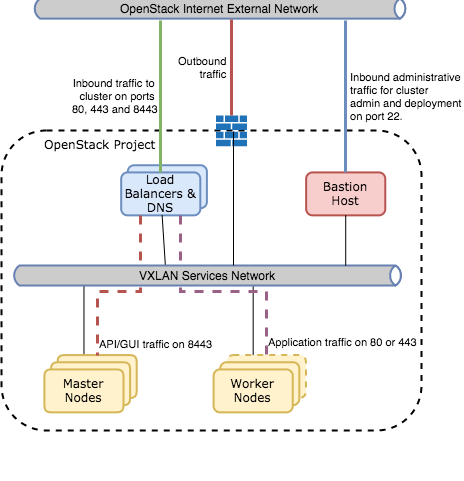

# UKCloud for OpenShift FAQs

### What is UKCloud for OpenShift?

UKCloud for OpenShift is a Platform as a Service (PaaS) solution providing container management and orchestration using either Red Hat OpenShift or Cloud Foundry technology to deliver a flexible, scalable cloud application platform. Unlike traditional managed PaaS offerings, it provides a modern application platform that accelerates end-to-end development, deployment and operation of digital applications, while raising overall application reliability and availability.

### Why deliver UKCloud for OpenShift as a cloud service?

Although UKCloud for OpenShift is a simple, benefits-rich service to consume, it is a complex platform of inter-dependent servers and services, whose deployment, configuration and maintenance requires time and expertise.

By offering this service, we take on all that complexity so that customers can immediately realise the value of UKCloud for OpenShift by simply consuming it.

### Is UKCloud for OpenShift a single-tenant or multi-tenant solution?

UKCloud for OpenShift is built as a single-tenant platform on-top of UKCloud's secure, assured multi-tenant UKCloud for OpenStack IaaS platform, helping to deliver the benefits of single tenant isolation with the economics and flexibility of multi-tenant infrastructure.

### How is UKCloud for OpenShift billed?

- **Red Hat OpenShift**. This service comprises of two charges elements:

  - **Starter Pack -** providing an initial footprint of 32GiB of RAM, billed by the month with a one-month minimum commitment
  - **Expansion Pack -** billed by the month with a one-month minimum commitment based upon the amour of additional RAM consumed

- **Open source Cloud Foundry**. This service comprises of two charging elements:

  - **Starter Pack --** providing an initial footprint of 32GiB of RAM, billed by the month with a one-month minimum commitment
  - **Expansion Pack -** billed by the hour based upon the amour of additional RAM consumed

### Does UKCloud offer a free trial?

Free trials are currently available for UKCloud for OpenShift. Please get in touch with your Account Manager to raise this request.

### Is there a free tier to your service?

Due to the complexities of providing a dedicated, single-tenant environment, a free tier is currently not offered on UKCloud for OpenShift.

### Where is the service hosted?

The service is delivered by UKCloud, a UK company, from two UK data centres separated by more than 100km, which are securely connected by high-bandwidth, low-latency dedicated connectivity.

### Does my data leave the UK?

As the service is delivered from UK data centres by a UK company, your data doesn't leave the UK when at rest.

### How is UKCloud for OpenShift supported?

UKCloud manages and supports UKCloud for OpenShift using our dedicated support team based in the UK. Support is available via helpdesk ticket or phone.

### What constitutes UKCloud for OpenShift?

We monitor, maintain and support our controlled UKCloud for OpenShift infrastructure and services, including:

- UKCloud-controlled components, such as the virtual infrastructure, storage, power and physical firewalls and routers

- UKCloud-maintained OpenShift services (for example, router service, DEAs, health manager, cloud controller, Master Nodes, Worker Nodes, Routing Layer).

### Can I use UKCloud for OpenShift in the UKCloud Elevated (previously IL3) domain?

UKCloud for OpenShift services are available in both our Assured (previously IL2) and Elevated (previously IL3) security domains.

### Is the service Pan Government Accredited?

UKCloud's existing PGA continues to apply to the infrastructure underpinning our services. But since the move to the Government Security Classification Policy (GSCP), we can no longer seek PGA for newer services, such as UKCloud for OpenShift.

We are now required to self-assert our services, with customers taking responsibility for assessing and selecting the most appropriate cloud services to meet their individual security requirements.

We provide confidence that our OpenShift service still meets the highest level of information assurance, which is why we continue to have our platform independently tested and validated, and have the findings made available to customers and partners. This enables SIROs to make an informed decision about any service they choose to consume.

### Can I use UKCloud for OpenShift over closed networks such as PSN and N3?

We plan for this service to be accredited for use over PSN, however this may not be available at launch. Connectivity to the N3 network will be considered when an appropriate sponsor submits a requirement.

### Does UKCloud offer any scheduled automated backups for UKCloud for OpenShift?

As standard, localised component failures are tolerated within the infrastructure through elimination of single points of failure (including physical server failure or disk failure).

Although UKCloud for OpenShift is designed to deploy and manage stateless apps (applications that can be killed and re-instantiated without risk of data loss), customers should ensure they maintain a master copy or backup copy of any persistent or dynamic data hosted on this service (such as MySQL DB) by using, for example, our Cloud Storage.

### What languages and frameworks are compatible with UKCloud for OpenShift?

The service supports many popular development frameworks and languages such as:

- Java
- Spring
- Ruby
- Sinatra
- Node.js
- Python
- PHP
- GoLang

### Does UKCloud for OpenShift support any data services?

Our OpenShift service provides popular open source data service packages deployable within the platform, all supported by the global open source community, including:

- MySQL, an open source relational database
- Postgres, a relational database based on PostgreSQL
- MongoDB, a scalable, open, document-based database
- RabbitMQ, for reliable, scalable and portable messaging for applications

Note that these services are offered 'as is' with no management, support or availability commitment from UKCloud. We strongly suggest customers ensure they maintain a master copy or backup copy of any persistent or dynamic data hosted on this service (such as MySQL DB) by using, for example, a data service provided by a managed service provider on our UKCloud for VMware platform.

### How scalable is UKCloud for OpenShift?

As a true cloud platform, UKCloud for OpenShift provides full elasticity and scalability. However, in order to protect the integrity of the platform and manage customer spend, soft limits on the number and size of application instances will be in place. These limits may be extended upon request.

### Which ports are open to the platform from the internet by default?

By default, ports 80 and 443 are open for customer application traffic. Further ports can be opened on request either at time of deployment or post-deployment by raising a [Service Request](https://portal.skyscapecloud.com/support/my_calls/new)

### How do I add users?

In order to add new users, you will need to raise a [Service Request](https://portal.skyscapecloud.com/support/my_calls/new) on the UKCloud Portal.

### What monitoring of the services is provided by default in a trial?

By default, no specific monitoring service is integrated. However, we recommend external monitoring services such as Datadog or Coscale for production-grade OpenShift hosted applications. Alternatively, a simple monitoring solution can be implemented by the customer themselves - an example is outlined here: [How to monitor your OpenShift cluster](oshift-how-monitor-cluster.md)

### What monitoring of the services is provided on a billable service?

By default, no specific monitoring service is integrated. It is our expectation that customers may want to use a third party or their own monitoring service to ensure cluster availability. There is a metrics service deployed into the cluster that provides utilisation stats of the cluster, and a wide range of metrics about both the cluster itself and the containers running within it can be extracted via the API to this service.

### Can I integrate external monitoring SaaS providers or my own monitoring agents to the service?

We will happily work with customers during a trial period to integrate an external monitoring service that enables customer monitoring of the cluster and applications where infrastructure level configuration is required.

### How do I add extra capacity to my cluster?

To add extra capacity to you cluster, you will need to raise a [Service Request](https://portal.skyscapecloud.com/support/my_calls/new) on the UKCloud Portal. We hope to provide portal integration to enable customers to be in control of this in the future.

### Can I have integrated container logging deployed with the platform?

Yes, this can be requested at time of deployment, or added post-deployment. The services can be run on either the master nodes or the worker nodes in the cluster. By default, we would place them on the master nodes, but you may wish to change this placement to be more suitable for the specific cluster performance you desire.

### How much control do I have over the policies and configuration of the platform once it has been deployed?

Customers have full administrative rights over the cluster configuration via the UI and API. Due to the varied nature of configurations that customers may want, such as the ability to merge projects and add service accounts for applications, we provide customers with the ability to self-serve on cluster administration from the beginning. Only infrastructure level tasks are controlled by UKCloud, such as adding users, scaling environments and patching.

### Can I run a privileged container?

Yes, it is possible to run a privileged container. However, this is not recommended as it goes against security best practices.

### What is the underlying architecture of the starter deployment?

## Feedback

If you have any comments on this document or any other aspect of your UKCloud experience, send them to <products@ukcloud.com>.
