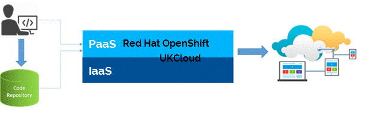

# Getting Started Guide for UKCloud for OpenShift

## Overview

UKCloud for OpenShift delivers a secure, private deployment of Red Hat&trade; OpenShift deployed on an assured, trusted platform connected to the internet and to public sector networks, including PSN, HSCN and Janet.

UKCloud provides a fully provisioned, single-tenant OpenShift instance to each customer, enabling developers to totally focus on delivering business value, without having to worry about any infrastructure considerations.

This Getting Started Guide provides an overview of the functionality available with UKCloud for OpenShift and includes links to OpenShift documentation for further detail.

### Intended audience

This guide is intended for developers who want to leverage the benefits of Docker and Kubernetes containerisation technologies as part of their development, continuous integration or continuous delivery cycles.

## Introduction to UKCloud for OpenShift

IT projects are traditionally complex, requiring careful management of server hardware, storage, networking, operating systems, middleware, as well as development of the actual application. UKCloud for OpenShift removes complexity and enables you to focus on creating business value through development, testing and scaling of your applications.

UKCloud deploys, scales and monitors the platform, which frees up your DevOps resource to focus on adding value further up the stack - for example, in automated software testing or tuning autoscaling.

You can use UKCloud for OpenShift to:

- Host front-end web applications services to ensure that your environment:

  - Can scale to handle any demands placed on it

  - Will auto-heal in the event of problems to maintain high levels of availability

- Create an Internet of Things (IoT) endpoint enabling internet devices to talk to your cloud applications, with all the benefits described above

- Provide an elastic analytics platform for capturing and analysing machine data and social media feeds, to generate valuable intelligence such as sentiment analysis

- Support modern microservice architecture and bring manageability and scalability to your applications

### UKCloud-deployed Red Hat OpenShift Container Platform

OpenShift Container Platform is an open source PaaS, developed and supported by Red Hat and based around common technologies such as Docker containers and the Kubernetes container cluster manager for enterprise application development.

UKCloud for OpenShift provides a full Red Hat OpenShift Container Platform that has been deployed by UKCloud and is ready to consume without delay. We deploy an OpenShift project in which you can run multiple pods, with each pod containing a group of related Docker
containers.

**OpenShift documentation:** [*Architecture*](https://docs.openshift.com/container-platform/3.11/architecture/index.html) and [*Container Security Guide*](https://docs.openshift.com/container-platform/3.11/security/index.html)

## Before you begin

To complete the steps in this guide, you must have access to an OpenShift environment, along with an internet-enabled device capable of running an HTML5 capable browser.

As part of your onboarding, UKCloud will provide you with a URL and credentials to access your OpenShift environment.

In addition, we recommend the installation of the OpenShift CLI on your device.

**OpenShift documentation:** [*Get Started with the CLI*](https://docs.openshift.com/container-platform/3.11/cli_reference/get_started_cli.html)

## Initial environment

UKCloud will provision you with an OpenShift Foundation Pack, providing 48GiB of container resources to run the management applications and 48GiB of container resources to run the management services.

To deploy applications to your cluster you'll need to request Runtime Packs at deployment time. Runtime Packs come in three sizes: small (16GiB 2vCPU), medium (32GiB 4vCPU) and large (64GiB 8vCPU). If you'd like to expand an existing cluster you can request this via a Service Request through the [My Calls](https://portal.skyscapecloud.com/support/ivanti) section of the UKCloud Portal.

## Using the web console

The OpenShift Container Platform web console is a user interface accessible from a web browser. Developers can use the web console to visualize, browse, and manage the contents of projects.

If your OpenShift cluster uses OpenShift Container Platform (OCP) 3.10 or later, you can log in to the console, via our single sign on service, using your UKCloud Portal credentials. Additionally, if you've set up two-factor authentication (2FA) in the Portal, when logging in using your Portal credentials, you'll be prompted for a 2FA code.

> [!NOTE]
> To log in to the OpenShift web console using your Portal credentials, your Portal account must have been granted access to the cluster.

If your OpenShift cluster uses an earlier version of OCP, you will need to use your separate OpenShift credentials to log in to the console.

**OpenShift documentation:** [*Web Console Walkthrough*](https://docs.openshift.com/container-platform/3.11/getting_started/developers_console.html)

## Using the command-line interface

With the OpenShift Container Platform command line interface (CLI), you can create applications and manage OpenShift Container Platform projects from a terminal.

If your OpenShift cluster uses OpenShift Container Platform (OCP) 3.10 or later, when you enter the login command, you'll be given a URL to use to log in using your Portal credentials. Go to this URL and you'll be prompted for your Portal credentials and, if you've set up 2FA, your 2FA code. This will take you to a page with your API token, the command to run to log in to the CLI and curl request to use to log in to the CLI.

Alternatively, you can obtain the CLI login command (including login token) from the OpenShift console by clicking your user name and selecting **Copy Login Command**.

> [!NOTE]
> The token in the log in command supplied through the URL or OpenShift console is valid only for a limited time. If you require a more longer lasting token, you can use a service account token. For more information see the OpenShift [*Service Accounts*](https://docs.openshift.com/container-platform/3.11/dev_guide/service_accounts.html) documentation.

**OpenShift documentation:** [*Basic Walkthrough Using the CLI*](https://docs.openshift.com/container-platform/3.11/getting_started/developers_cli.html) and [*CLI Reference*](https://docs.openshift.com/container-platform/3.11/cli_reference/index.html)

## Using the API

The OpenShift Container Platform distribution of Kubernetes includes the Kubernetes v1 REST API and the OpenShift v1 REST API. These are RESTful APIs accessible via HTTP(s) on the OpenShift Container Platform master servers.

These REST APIs can be used to manage end-user applications, the cluster, and the users of the cluster.

**OpenShift documentation:** [*REST API Reference*](https://docs.openshift.com/container-platform/3.11/rest_api/index.html)

## Developing and deploying applications

OpenShift Container Platform is designed for building and deploying applications. You can begin your application's development from scratch using OpenShift Container Platform directly or develop locally then use OpenShift Container Platform to deploy your fully developed application.

**OpenShift documentation:** [*Developer Guide*](https://docs.openshift.com/container-platform/3.11/dev_guide/index.html)

## Creating and using images

Containers in OpenShift Container Platform are based on Docker-formatted container images. An image is a binary that includes all the requirements for running a single container, as well as metadata describing its needs and capabilities. Containers only have access to resources defined in the image unless you give the container additional access when creating it.

**OpenShift documentation:** [*Creating images*](https://docs.openshift.com/container-platform/3.11/creating_images/index.html) and [*Using images*](https://docs.openshift.com/container-platform/3.11/using_images/index.html)

## Next steps

In this Getting Started Guide, you've learned the basics about UKCloud for OpenShift. For more information, see the OpenShift documentation at [*OpenShift Container Platform 3.11 Documentation*](https://docs.openshift.com/container-platform/3.11/welcome/index.html)

## Glossary

This section provides a glossary of terms specific to UKCloud for OpenShift.

**cluster**&nbsp;&nbsp;One or more masters and a set of nodes.

**container**&nbsp;&nbsp;A lightweight mechanism for isolating running processes so that they are limited to interacting with only their designated resources.

**Docker**&nbsp;&nbsp;A software container platform for building and managing containerised applications.

**image**&nbsp;&nbsp;A binary that includes all of the requirements for running a single container, as well as metadata describing its needs and capabilities.

**Kubernetes**&nbsp;&nbsp;Manages containerized applications across a set of containers or hosts and provides mechanisms for deployment, maintenance, and application-scaling.

**master server**&nbsp;&nbsp;The host or hosts that contain the master components, including the API server, controller manager server, and etcd. The master manages nodes in its Kubernetes cluster and schedules pods to run on nodes.

**microservices**&nbsp;&nbsp;A method of developing an application as a collection of smaller independent services.

**node**&nbsp;&nbsp;Provides the runtime environment for a container. Each node in a Kubernetes cluster has the required services to be managed by the master. Nodes also have the required services to run pods, including the Docker service, a kubelet, and a service proxy.

**OpenShift**&nbsp;&nbsp;Red Hat's secure and comprehensive enterprise-grade container platform based on industry standards, Docker and Kubernetes.

**PaaS**&nbsp;&nbsp;Platform-as-a-Service. The capability provided to the consumer is to deploy onto the cloud infrastructure consumer-created or acquired applications created using programming languages, libraries, services, and tools supported by the provider. The consumer does not manage or control the underlying cloud infrastructure including network, servers, operating systems, or storage, but has control over the deployed applications and possibly configuration settings for the application-hosting environment.

**pod**&nbsp;&nbsp;A group of related containers placed onto the same host.

## Feedback

If you find an issue with this article, click **Improve this Doc** to suggest a change. If you have an idea for how we could improve any of our services, visit the [Ideas](https://community.ukcloud.com/ideas) section of the [UKCloud Community](https://community.ukcloud.com).
