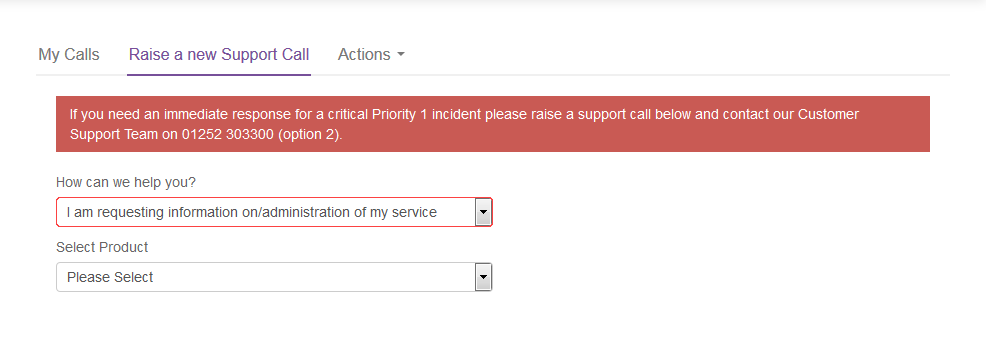

# How to use the Hawkular Metrics API

## Overview

This guide is intended to give you enough information to forumulate basic memory usage or cpu queries against nodes in your cluster. For more advanced usage please refer to the Hawkular documentation at: https://www.hawkular.org/hawkular-metrics/docs/user-guide/#_metrics

## Using the API

1. Firstly, you must ensure that the user you will be using to query the API has reader permissions for the corresponding OpenShift project to the Hawkular-Tenant you are querying. If you are querying the _system tenant then the user must have cluster-reader permissions.

2. To get a list of all counters and gauages you can use you would run the following:

    curl -X GET https://hawkular-metrics.$(cluster-url)/hawkular/metrics/metrics "Content-Type: application/json" -H "Hawkular-Tenant: _system" -H "Authorization: Bearer $token"
    
    Where $token is a variable storing the output of oc whoami -t from an OpenShift user with the correct permissions to view metrics and cluster-url is the domain suffix of your cluster.
    
    For example; if your cluster URL is https://ocp.openshift-test.cna.ukcloud.com:8443 your query would be the following:
    
    curl -X GET https://hawkular-metrics.openshift-test.cna.ukcloud.com/hawkular/metrics/metrics "Content-Type: application/json" -H "Hawkular-Tenant: _system" -H "Authorization: Bearer $token"

3. If necessary, switch to the account that includes the OpenShift cluster.

3. In the navigation panel, expand **Contacts**, then select **All Contacts**.

    

4. From the **Actions** menu, select **Add new contact**.

    

5. On the *New Contact* page, provide the user's name and contact information, then click **Save**.

    

6. After you've created the user account, you must raise a Service Request to grant the user access to the OpenShift cluster.

    a. In the navigation panel, expand **Support**, then select **My Calls**.

    

    b. Select the **Raise a new Support Call** tab.

    

    c. From the **How can we help you?** list, select **I am requesting information on/administration of my service**.

    

    d. From the **Select Product** list, select **Cloud Native Application Platform (OpenShift)**.

    e. From the **What is the nature of your query?** list, select **Uncategorised**.

    f. In the **Request Summary** field, enter `Add Portal users to OpenShift cluster`.

    g. In the **Please provide any further details regarding your request** field, enter the name(s) of the user(s), and their username(s), that you want to add to the OpenShift cluster, along with the URL of the cluster that the user(s) should be added to. If there are multiple clusters the user(s) needs adding to then specify all of the cluster URLs here and it can be completed as one task.

    h. When you're done, click **Submit**.

7. When the Service Request is resolved, the identified users can log in to the OpenShift web console and CLI using their UKCloud Portal credentials.

    If you've enabled two-factor authentication (2FA) in the account that includes the OpenShift cluster and users have set up 2FA for their user accounts, they will be prompted to provide a 2FA code when logging in to OpenShift.

## Feedback

If you find an issue with this article, click **Improve this Doc** to suggest a change. If you have an idea for how we could improve any of our services, visit [UKCloud Ideas](https://ideas.ukcloud.com). Alternatively, you can contact us at <products@ukcloud.com>.
