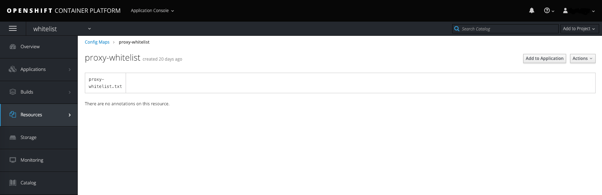
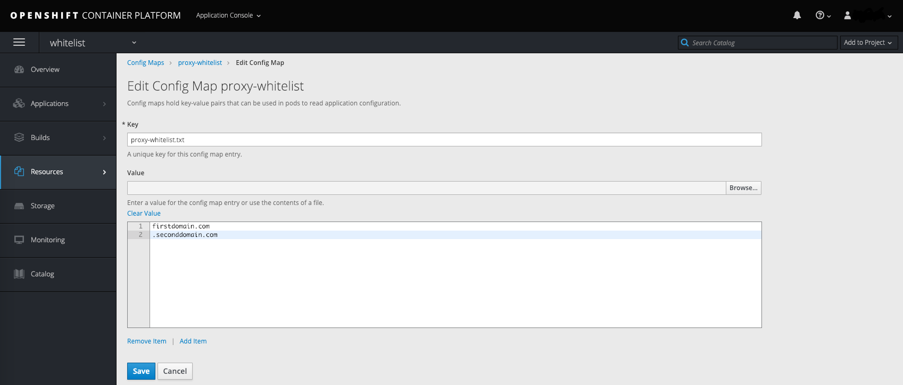

# How to permit outbound access to internet hosts in deployments with government community network connectivity

## Overview

This article outlines the necessary steps to whitelist domain names within the Squid proxy. Squid is an enabled service within v3.11 OpenShift clusters deployed with connectivity to government community networks (such as: HSCN, PSN, Janet). Whitelisted domains can be accessed on the internet via the proxy, enabling you to request external resources/data on nodes that previously only had connectivity to government community networks. Added domains should be scrutinised as the relevant authority of the community network may require you to submit documentation regarding these for you to receive accreditation.

## Prerequisites

To complete the steps in this guide, you must have access to a cluster that is running OpenShift Container Platform v3.11 (or newer) with connectivity to a government community network. Squid proxy is not currently enabled within environments that do not have access to a government community network.

You must also have access to either:

- the OpenShift Web console

- `oc`, the OpenShift command-line client (CLI). For more information, see OpenShift's [*Get Started with the CLI*](https://docs.openshift.com/container-platform/3.11/cli_reference/get_started_cli.html)

## Destination domain whitelist

Squid proxy is installed as a service on the control plane load balancers. Within the Squid configuration, we have specified an ACL (Access Control List) as being a list of destination domains (present in a file on the file system), which we will refer to as the whitelist for the remainder of this article. Outbound traffic from the cluster's internal network will pass through the proxy with the destination domain being compared against the whitelist for each connection attempt; if the domain exists then outbound internet traffic is permitted, otherwise it is denied with a HTTP 403 error.

By default, the following domains are added to the whitelist (and cannot be removed) to facilitate installation, testing and ongoing operation of the cluster:
```
registry.access.redhat.com
registry.redhat.io
<UKCloud Object Storage Endpoint>
<UKCloud SSO Endpoint>
```

A scheduled job (which runs at 0 minutes past every hour) on the OpenShift cluster Bastion host reads a Config Map named `proxy-whitelist` within the `whitelist` project. If there are any modifications to this Config Map, the job overwrites the previous custom entries within the whitelist and triggers a reconfigure task on the Squid proxy to enable the updated domains to be accessed.

### Assigning non cluster-admin users rights to edit the whitelist 

By default, only users who have been assigned the cluster-admin role will be able to view/edit the `proxy-whitelist` ConfigMap within the `whitelist` project. It is possible to grant non cluster-admin users rights to edit this object but this should be done with careful deliberation. The ability to access hosts on the internet, from nodes that previously only had access to government community networks, exposes the cluster to additional risk (should a domain be whitelisted that hosts malicious content for example). For this reason, only trusted users should be permitted to determine these domains to reduce the risk of a malicious domain being unwittingly added.

To allow non cluster-admin users to edit this object, use the following Role Based Access Control (RBAC) commands:

>[!TIP]
>To add multiple users to these roles, separate each username within the `username` variable with a space.

```bash
export username=<replace-with-username>
# Create roles
oc create role view-project --verb=get,list,watch --resource=namespaces --verb get --resource=projects -n whitelist
oc create role get-configmap --verb=get,list --resource=configmaps -n whitelist
oc create role edit-proxy-whitelist --verb=patch,update --resource=configmaps --resource-name=proxy-whitelist -n whitelist
# Bind roles to desired user
oc policy add-role-to-user view-project $username -n whitelist --role-namespace='whitelist'
oc policy add-role-to-user get-configmap $username -n whitelist --role-namespace='whitelist'
oc policy add-role-to-user edit-proxy-whitelist $username -n whitelist --role-namespace='whitelist'
```

### Modifying the whitelist

There are two tools you can use to modify the `proxy-whitelist` Config Map. As previously stated you will need to have the necessary rights to edit this object within the `whitelist` project. 

#### Web console

1. To view the `proxy-whitelist` Config Map within the `whitelist` project, navigate to the following URL (ensuring you replace \<your-deployment-name>):

   `https://ocp.<your-deployment-name>.cna.ukcloud.com:8443/console/project/whitelist/browse/config-maps/proxy-whitelist`

   

>[!TIP]
>To whitelist all subdomains, precede the domain with a `.` for example `.domain.com`

2. Click **Actions** then **Edit** to modify the values within the `proxy-whitelist.txt` key. Each domain should be on its own line:

   

3. Click **Save** when finished.

#### oc client

>[!NOTE]
>To authenticate using the `oc` client you will need an API token. Retrieve this by logging in to the Web Console and clicking your name in the top right then choosing **Copy Login Command**. This can then be pasted from your buffer into a terminal where you have the `oc` client installed.

1. Change to the `whitelist` project: 
   
   ```bash
   $ oc project whitelist
   ```
2. Edit the `proxy-whitelist` Config Map:

   ```bash
   $ oc edit cm proxy-whitelist
   ```

   This will display the object definition in yaml format in your default text editor:

   ```
   # Please edit the object below. Lines beginning with a '#' will be ignored,
   # and an empty file will abort the edit. If an error occurs while saving this file will be
   # reopened with the relevant failures.
   #
   apiVersion: v1
   data:
     proxy-whitelist.txt: ""
   kind: ConfigMap
   metadata:
     creationTimestamp: 2019-01-18T01:18:44Z
     name: proxy-whitelist
     namespace: whitelist
     resourceVersion: "5385199"
     selfLink: /api/v1/namespaces/whitelist/configmaps/proxy-whitelist
     uid: ff7df4a9-1abe-11e9-965a-fa163ecc60e0
   ```

3. Within the object definition data attribute is the `proxy-whitelist.txt` key. By default this will be an empty single line string but you can modify this to be a multi-line string by changing `""` to `|-` as below and indenting the domains you want to add with two spaces. For example:

   ```
   proxy-whitelist.txt: |-
     firstdomain.com
     .seconddomain.com
   ```

4. Save your changes to persist to the Config Map, otherwise cancel your edit to not make any changes.

## Further reading

https://wiki.squid-cache.org/SquidFaq/SquidAcl

## Feedback

If you find an issue with this article, click **Improve this Doc** to suggest a change. If you have an idea for how we could improve any of our services, visit [UKCloud Ideas](https://ideas.ukcloud.com). Alternatively, you can contact us at <products@ukcloud.com>.