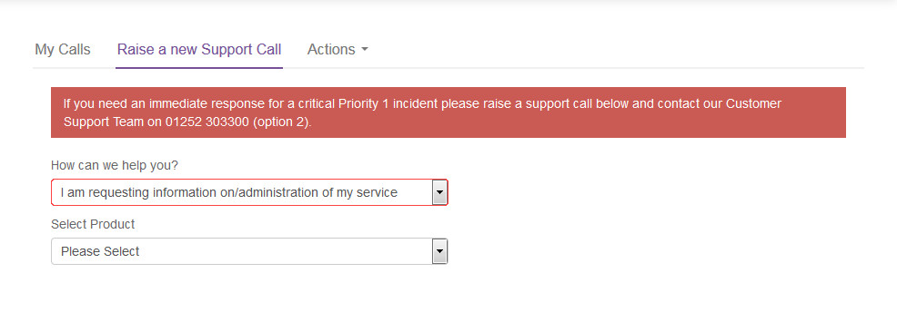

# How to create new UKCloud for OpenShift users in the UKCloud Portal

## Overview

If your cluster is using OpenShift Container Platform 3.10 or later, you can create users in the UKCloud Portal so that users need to remember only one lot of credentials and can also take advantage of two-factor authentication (2FA) that is provided via the Portal.

> [!NOTE]
> If your cluster is using an earlier version of OpenShift Container Platform, you must create users within OpenShift. For more information see the OpenShift [*Managing Users*](https://docs.openshift.com/container-platform/3.9/admin_guide/manage_users.html) documentation.

## Creating a new OpenShift user

To create a new user:

1. Log in to the UKCloud Portal

    For more detailed instructions, see the [*Getting Started Guide for the UKCloud Portal*](../portal/ptl-gs.md).

    > [!NOTE]
    > You must log in as a Portal administrator for the account that includes the OpenShift cluster.

2. If necessary, switch to the account that includes the OpenShift cluster.

3. In the navigation panel, expand **Contacts**, then select **All Contacts**.

    

4. From the **Actions** menu, select **Add new contact**.

    

5. On the *New Contact* page, provide the user's name and contact information, then click **Save**.

    

6. After you've created the user account, you must raise a Service Request via the [My Calls](https://portal.ukcloud.com/support/ivanti) section of the UKCloud Portal to grant the user access to the OpenShift cluster.

    a. In the navigation panel, expand **Support**, then select **My Calls**.

    

    b. Select the **Raise a new Support Call** tab.

    

    c. From the **How can we help you?** list, select **I am requesting information on/administration of my service**.

    

    d. From the **Select Product** list, select **Cloud Native Application Platform (OpenShift)**.

    e. From the **What is the nature of your query?** list, select **Uncategorised**.

    f. In the **Request Summary** field, enter `Add Portal users to OpenShift cluster`.

    g. In the **Please provide any further details regarding your request** field, enter the name(s) of the user(s), and their username(s), that you want to add to the OpenShift cluster, along with the URL of the cluster that the user(s) should be added to. If there are multiple clusters the user(s) needs adding to then specify all of the cluster URLs here and it can be completed as one task.

    h. When you're done, click **Submit**.

7. When the Service Request is resolved, the identified users can log in to the OpenShift web console and CLI using their UKCloud Portal credentials.

    If you've enabled two-factor authentication (2FA) in the account that includes the OpenShift cluster and users have set up 2FA for their user accounts, they will be prompted to provide a 2FA code when logging in to OpenShift.

## Feedback

If you find an issue with this article, click **Improve this Doc** to suggest a change. If you have an idea for how we could improve any of our services, visit [UKCloud Ideas](https://ideas.ukcloud.com). Alternatively, you can contact us at <products@ukcloud.com>.
