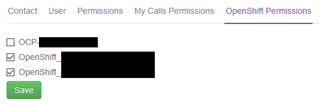

# How to manage OpenShift access in the UKCloud Portal

## Overview

If your cluster is using OpenShift Container Platform 3.10 or later, you can manage access to OpenShift clusters in the UKCloud Portal so that users need to remember only one lot of credentials and can also take advantage of two-factor authentication (2FA) that is provided via the Portal.

> [!NOTE]
> UKCloud engineers will sometimes need to add their user accounts (ending in *@ukcloud.com*) to your UKCloud Portal account and OpenShift environment to diagnose issues in response to customer tickets or monitoring alerts. The access will be removed when it is no longer required, however the user may continue to show in the output of the `oc get users` command. If you have any concerns about a user showing in your account, [raise a service request](../portal/ptl-how-use-my-calls.md) for advice.

## Managing access to an OpenShift cluster

> [!NOTE]
> If your cluster is using OpenShift Container Platform 3.9, [raise a service request](../portal/ptl-how-use-my-calls.md) to add new users.

1. Log in to the UKCloud Portal

    For more detailed instructions, see the [*Getting Started Guide for the UKCloud Portal*](../portal/ptl-gs.md).

    > [!NOTE]
    > You must log in as a Portal administrator.

2. If necessary, switch to the account that contains the services you want the user to be able to access.

3. If the user does not already have a UKCloud Portal user account, you'll need to create an account for them first. For more information, see [*How to create a new user in the UKCloud Portal*](../portal/ptl-how-create-users.md).

4. To grant the user permissions to log into your OpenShift cluster, in the navigation panel, expand **Contacts**, then select **All Contacts**.

    

5. On the *Contacts* page, use the **Search** field to find the user to whom you want to assign OpenShift permissions and then click the **Edit** button.

    

6. On the *Edit contact* page, select the **OpenShift Permissions** tab.

    
    
7. Select the check box(es) for the cluster(s) that you want the user to have access to, then click **Save**

    

    If you've enabled two-factor authentication (2FA) in the account that includes the OpenShift cluster and the user has set up 2FA for their user account, they'll be prompted to provide a 2FA code when logging in to OpenShift.
    
> [!NOTE]
> By default, the user will be able to create new projects in OpenShift but they will be unable to view existing projects. Additional cluster or project roles can be added to the user if required. See the OpenShift [*Managing role bindings*](https://docs.openshift.com/container-platform/3.11/admin_guide/manage_rbac.html#managing-role-bindings) documentation.

## Feedback

If you find a problem with this article, click **Improve this Doc** to make the change yourself or raise an [issue](https://github.com/UKCloud/documentation/issues) in GitHub. If you have an idea for how we could improve any of our services, send an email to <feedback@ukcloud.com>.
