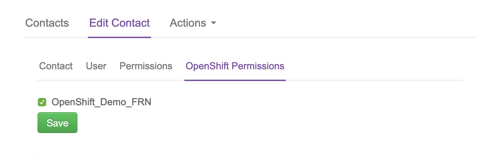

# How to create new UKCloud for OpenShift users in the UKCloud Portal

## Overview

If your cluster is using OpenShift Container Platform 3.10 or later, you can create users in the UKCloud Portal so that users need to remember only one lot of credentials and can also take advantage of two-factor authentication (2FA) that is provided via the Portal.

> [!NOTE]
> If your cluster is using an earlier version of OpenShift Container Platform, you must create users within OpenShift. For more information see the OpenShift [*Managing Users*](https://docs.openshift.com/container-platform/3.9/admin_guide/manage_users.html) documentation.

## Creating a new OpenShift user

To create a new user:

1. Log in to the UKCloud Portal and create a new Portal user.

    For more detailed instructions, see the [*How to create a new user in the UKCloud Portal*](../portal/ptl-how-create-users.md).

    > [!NOTE]
    > You must log in to the Portal as an administrator for the account that includes the OpenStack cluster.

2. After you've created the Portal user, you must raise a Service Request to add the user to the SSO group.

    In the navigation panel, expand **Support**, then select **My Calls**.

    

3. Select the **Raise a new Support Call** tab.

    

4. From the **How can we help you?** list, select **I am requesting information on/administration of my service**.

    

5. From the **Select Product** list, select **Cloud Native Application Platform (OpenShift)**.

6. From the **What is the nature of your query?** list, select **Uncategorised**.

7. In the **Request Summary** field, enter `Add Portal users to OpenShift SSO group`.

8. In the **Please provide any further details regarding your request** field, enter the name(s) of the user(s), and their username(s), that you want to add to the SSO group, along with the URL of the cluster that you are adding the user(s) to. If you are adding the user(s) to multiple clusters then specify all of the cluster URLs here and it can be completed as one task.

9. When you're done, click **Submit**.

## Adding a user to an OpenShift cluster

> [!NOTE]
> To perform the following steps, you must be an administrator of the SSO group for the OpenStack cluster for which you are granting access. The initial account created when the cluster was deployed will be an SSO administrator. If you want other users to be assigned this permission, raise a Service Request.

To add a user to an OpenShift cluster:

1. In the UKCloud Portal navigation panel, expand **Contacts**, then select **All Contacts**.

2. Locate the user and click the **Edit** button for that user.

3. On the **Edit Contact** tab, select the **OpenShift Permissions** tab.

4. Select the OpenShift cluster that you want to add the user to, then click **Save**.

    

   The user can now log in to the OpenShift web console and CLI for the selected cluster using their UKCloud Portal credentials.

    If you've enabled two-factor authentication (2FA) in the account that includes the OpenShift cluster and users have set up 2FA for their user accounts, they'll be prompted to provide a 2FA code when logging in to OpenShift.

## Feedback

If you find an issue with this article, click **Improve this Doc** to suggest a change. If you have an idea for how we could improve any of our services, visit [UKCloud Ideas](https://ideas.ukcloud.com). Alternatively, you can contact us at <products@ukcloud.com>.
