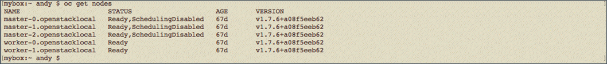
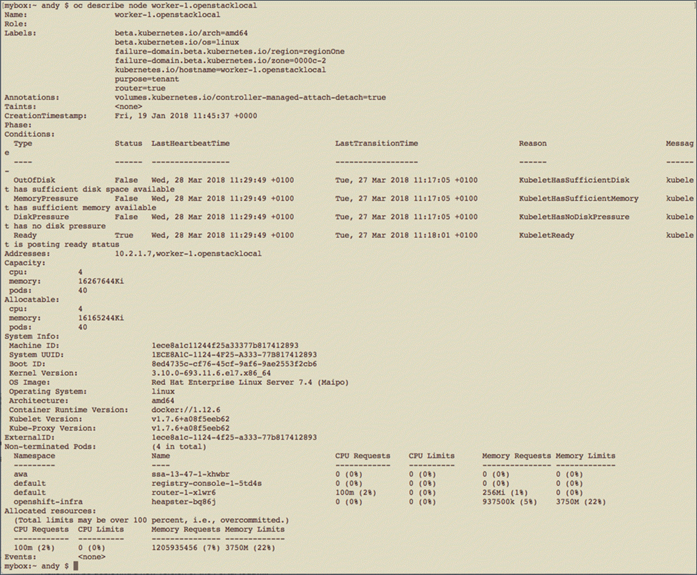
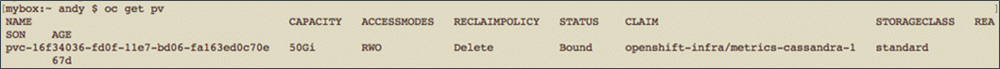
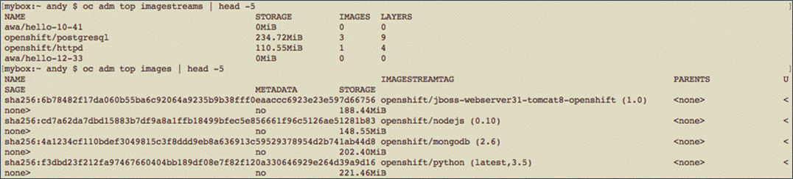

# How to obtain usage metrics to use for OpenShift capacity management

## Overview

This article provides examples of the self-service commands you can execute against your UKCloud for OpenShift cluster to gain usage metrics and statistics to help manage your ongoing capacity requirements.

A UKCloud deployed OpenShift cluster comprises a single Starter Pack, plus a number of Runtime Packs as required by your workload demands.

- **Starter Pack** - Provides the foundation OpenShift services to support the orchestration and management of the container runtime environments, along with additional infrastructure nodes to support services such as log aggregation and metric collection.

    Each customer environment requires only a single Starter Pack.

- **Runtime Pack** - Nodes on which your containerised applications and services run. You have the choice of difference size Runtime Packs.

    You can call off Runtime Packs individually, however, we strongly recommend the initial deployment of two or more Runtime Packs for production environments to provide resilience to your workloads in the event of the failure of a single Runtime Pack.

    To add or remove Runtime Packs, raise a Service Request via the UKCloud Portal.

The sections in this guide, show you how to obtain various statistics about the platform, including:

- Overall status of each node in the cluster
- Uptime per node
- CPU usage
- Memory usage
- Block storage consumption (used by persistent volumes)
- Object storage consumption (used by the registry)

### Intended audience

To complete the steps in this guide you must have access to and a working knowledge of `oc`, the OpenStack command-line client (CLI). For more information, see OpenShift's [*Get Started with the CLI*](https://docs.openshift.com/container-platform/3.9/cli_reference/get_started_cli.html).

## Identifying capacity statistics

The OpenStack CLI provides the ability to list the nodes in your cluster and then retrieve status information about a specific node. You can use this information to determine if the nodes in your cluster have enough available disk space and memory.

1. To obtain the list of nodes that make up the OpenStack cluster, enter the following command:

       oc get nodes

2. The results show you the overall readiness of each node and how long they've been running. For example:

    

3. To find the detailed status of a node, enter the following command:

       oc describe node <nodename>

4. The results show a large amount of information about disk status (pressure and out-of-disk), memory pressure and usage, CPU usage and resource consumption from any running pods. For example:

    

5. You can also obtain some of the above information via the REST API, by using something like:

       curl -H "Authorization: Bearer $token" -H 'Accept: application/json' https://ocp.\$clustername:8443/api/v1/nodes

For more information about accessing this data, see [*How to monitor your OpenShift cluster*](oshift-how-monitor-cluster.md).

## Identifying block storage consumption

For capacity management, it's also useful to know much block storage your cluster is using.

1. To obtain block storage consumption (persistent volumes) information, enter the following command:

       oc get pv

2. The results will look similar to the following, where we can see there is one item consuming 50 GB of storage.

    

## Identifying object storage consumption

Object storage is used only for the OpenShift registry, therefore, you can calculate how much object storage your cluster is using by adding up the resources in the registry.

1. To obtain information about resources in the registry, enter the following two commands:

       oc adm top imagestreams
       oc adm top images

2. The output from these commands will look something like the following:

    

    > [!NOTE]
    > For the `oc adm top` command to work, Hawkular must be running in your cluster. This command can also report on nodes and pods.

3. The appendix at the end of this guide provides some sample Python code to sum the sizes of resources from these two `oc adm top` commands.

## Other monitoring options

You can find a simple example of a custom monitoring application, using the REST API described above, in [*How to monitor your OpenShift cluster*](oshift-how-monitor-cluster.md) and as a [UKCloud blog post](https://ukcloud.com/hub/news/simple-openshift-monitoring/).

You can also perform monitoring using Hawkular, which is built into the product. You can access Hawkular from the browser-based console at:

`https://ocp.<your-deployment-name>.cna.ukcloud.com:8443`

Or directly at:

`https://hawkular-metrics.<your-deployment-name>.cna.ukcloud.com/hawkular/metrics`

## Next steps

Further cluster capacity management options are discussed at:

<https://blog.openshift.com/full-cluster-capacity-management-monitoring-openshift>

## Appendix - Example code for adding up storage contents

You can use the following code to add up the values from `oc adm top`.

``` python
#!/usr/bin/env python3

"""
Add up storage values.

oc adm top imagestreams gives us storage usage for each storage use for each imagestream, and oc adm top images gives us the same for images

Storage is suffixed with 'MiB' or 'GiB', so each value needs converting to a number before we can add them up.

Output from oc adm top is tabulated, so input-processing is needed.
"""

import re
import subprocess
import sys

VERBOSE = False

def add_sizes(command_output, size_column):
    sum_sizes = 0
    for row in command_output.split("\n"):
        if row == '' or re.match('NAME\t+', row):
            continue
        values = re.split('\t+', row)
        storage = values[size_column]

        if 'MiB' in storage:
            multiplier = 1
        elif 'GiB' in storage:
            multiplier = 1024
        else:
            print("ERROR: Found unexpected storage size {}".format(storage))
            sys.exit(1)

        mtch = re.match('([\d.]+)[MG]iB$', storage)
        if mtch:
            size = float(mtch.group(1)) * multiplier
            sum_sizes += size
            if VERBOSE:
                print("{}\t{} ".format(storage, size))
            else:
                print("Did not match -- {}".format(storage))
    return sum_sizes

output = subprocess.run(['oc', 'adm', 'top', 'imagestreams'],
                        stdout=subprocess.PIPE,
                        stderr=subprocess.PIPE) 
imagestream_size = add_sizes(output.stdout.decode('utf-8'), 1)
```

## Feedback

If you find an issue with this article, click **Improve this Doc** to suggest a change. If you have an idea for how we could improve any of our services, visit [UKCloud Ideas](https://ideas.ukcloud.com). Alternatively, you can contact us at <products@ukcloud.com>.