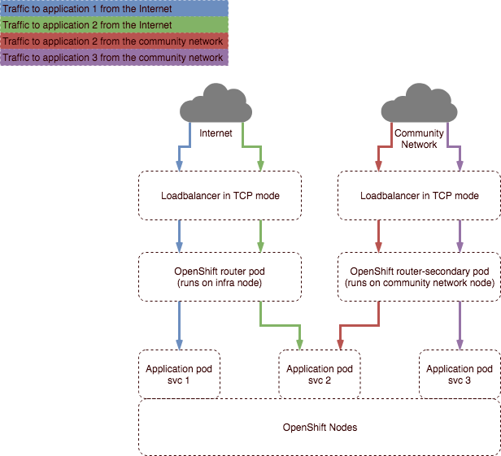

# How to publish application routes to multiple networks

## Overview

This article provides instructions on how to make use of multiple external networks from within an OpenShift cluster. If you've requested an OpenShift cluster with multiple networks from UKCloud you'll have multiple data planes - usually one for the internet and one for the community network you’ve requested be added to your deployment. Building applications that listen on these networks is relatively straightforward but requires some specific configuration to be put in place on your application routes. This guide should help explain how you go about exposing your application on the relevant networks.

### Intended audience

To complete the steps in this guide you must have access to and a working knowledge of `oc`, the OpenShift command-line client (CLI). For more information, see OpenShift's [*Get Started with the CLI*](https://docs.openshift.com/container-platform/3.9/cli_reference/get_started_cli.html).


## High level overview

Firstly, an explanation of what gets deployed: the cluster will have front-end load balancers that sit outside OpenShift, which essentially do TCP passthrough of incoming traffic to the OpenShift routers deployed inside your cluster. As a cluster administrator, you can see the OpenShift routers by viewing the `default` project. You'll also have another set of routers that run on the community network facing nodes that provide termination of inbound traffic from the community network.



The three scenarios shown in the above diagram are as follows:

1. Traffic from the internet to application-1 (blue lines)

2. Traffic from the internet and a community network to application-2 (green and red lines)

3. Traffic from a community network to application-3 only (purple lines)

We'll be using some basic example applications to demonstrate publishing routes in each of these three application scenarios.

## Process and code examples

### Scenario 1 - Traffic from the internet to application-1

First, we'll create a project called `routersharding` and the three applications to demonstrate with:

```
$ oc new-project routersharding
Now using project "routersharding" on server "https://console.x-y-zzz-abcdef:8443".
 
$ oc new-app centos/ruby-22-centos7~https://github.com/openshift/ruby-ex.git --name=application-1
 
$ oc new-app centos/ruby-22-centos7~https://github.com/openshift/ruby-ex.git --name=application-2
 
$ oc new-app centos/ruby-22-centos7~https://github.com/openshift/ruby-ex.git --name=application-3
 
$ oc get svc
NAME            TYPE        CLUSTER-IP       EXTERNAL-IP   PORT(S)    AGE
application-1   ClusterIP   x.y.144.215   <none>        8080/TCP   1m
application-2   ClusterIP   x.y.122.177   <none>        8080/TCP   1m
application-3   ClusterIP   x.y.247.162   <none>        8080/TCP   1m
 
$ oc expose svc application-1
route "application-1" exposed
$ oc get routes
NAME            HOST/PORT                                                         PATH      SERVICES        PORT       TERMINATION   WILDCARD
application-1   application-1-routersharding.demo-env.region1.cna.ukcloud.com             application-1   8080-tcp                 None
```

Now to see that your route has been published, you can describe the route and see where it's been exposed, or you can review the routes in the default router by opening a session to the router pod and reviewing the configuration.

Find a router pod - in this case labelled `router-<buildno>-<uniqueid>`:

```
$ oc project default
Now using project "default" on server "https://console.x-y-zzz-abcdef:8443".
 
$ oc get pods
NAME                       READY     STATUS    RESTARTS   AGE
docker-registry-1-466xv    1/1       Running   0          16h
registry-console-2-bff2q   1/1       Running   0          18h
router-4-bjqz2             1/1       Running   0          8h
router-4-q5g6g             1/1       Running   0          8h
router-secondary-2-f2p8z   1/1       Running   0          1d
router-secondary-2-nr2lm   1/1       Running   0          15d
```

Remotely launch an interactive shell in a router and look at the `routes.json` file to see our route is published:

```
$ oc rsh router-4-bjqz2
sh-4.2$ cat /var/lib/haproxy/router/routes.json | grep application-1-routersharding
    "Host": "application-1-routersharding.demo-env.region1.cna.ukcloud.com",
``` 

Similarly, we can see that no routes are currently published on the `router-secondary` pods:

```
$ oc get pods
NAME                       READY     STATUS    RESTARTS   AGE
docker-registry-1-466xv    1/1       Running   0          1h
registry-console-2-bff2q   1/1       Running   0          3h
router-1-6fzkh             1/1       Running   0          1h
router-1-pzjrj             1/1       Running   0          50d
router-secondary-2-f2p8z   1/1       Running   0          1d
router-secondary-2-nr2lm   1/1       Running   0          15d
 
$ oc rsh router-secondary-2-f2p8z
sh-4.2$ cat /var/lib/haproxy/router/routes.json
{}
```

So that shows the basic route is now published, which fulfils scenario 1 shown in the diagram above.

### Scenario 2 - Traffic from the internet and a community network to application-2

To make the route appear on the secondary router and achieve scenario 2, we need to label the route appropriately so that it's also exposed on the `router-secondary` pods. By default, we setup the secondary routers with a label based route selector of `"router-secondary=true"`. 

Here we see the route selector label setup on the secondary router. This indicates that this route will publish routes that are labelled with `"router-secondary=true"`:

```
$ oc describe dc router-secondary | grep ROUTE_LABELS
      ROUTE_LABELS:                router-secondary=true
``` 

Now we need to switch back to our application project and make the changes to our application b to meet scenario 2:

```
$ oc project routersharding
Now using project "routersharding" on server "https://console.x-y-zzz-abcdef:8443".
```
 
First, we expose the route on the default router as before:

```
$ oc expose svc application-2
route "application-2" exposed
# we can apply the label to expose our route on the secondary router with the following command
$ oc label route application-2 "router-secondary=true"
route "application-2" labelled
``` 

By describing the route, we can now see it's been exposed on both routers (see `exposed on` lines below):

```
$ oc describe route application-2
Name:           application-2
Namespace:      routersharding
Created:        3 minutes ago
Labels:         app=application-2
            router-secondary=true
Annotations:        openshift.io/host.generated=true
Requested Host:     application-2-routersharding.demo-env.region1.cna.ukcloud.com
              exposed on router router 3 minutes ago
              exposed on router router-secondary 2 minutes ago
Path:           <none>
TLS Termination:    <none>
Insecure Policy:    <none>
Endpoint Port:      8080-tcp
Service:    application-2
Weight:     100 (100%)
Endpoints:  10.128.4.24:8080
```

Reviewing the routes on the `router-secondary` pods as before also shows our route now exposed there:

```
$ oc rsh router-secondary-2-f2p8z
sh-4.2$ cat /var/lib/haproxy/router/routes.json
{
  "routersharding:application-2": {
    "Name": "application-2",
    "Namespace": "routersharding",
    "Host": "application-2-routersharding.demo-env.region1.cna.ukcloud.com",
    "Path": "",
    "TLSTermination": "",
    "Certificates": null,
    "VerifyServiceHostname": false,
    "Status": "saved",
    "PreferPort": "8080-tcp",
    "InsecureEdgeTerminationPolicy": "",
    "RoutingKeyName": "8647b1a7d5f913923a2eae0e1d02df09",
    "IsWildcard": false,
    "Annotations": {
      "openshift.io/host.generated": "true"
    },
    "ServiceUnits": {
      "routersharding/application-2": 100
    },
    "ServiceUnitNames": {
      "routersharding/application-2": 256
    },
    "ActiveServiceUnits": 1,
    "ActiveEndpoints": 1
  }
}
```

### Scenario 3 - Traffic from a community network to application-3 only

The final scenario for `application-3` requires modification of the original routers to ensure they don’t select routes with a specific label (by default they expose all of the routes we expose). We’ll recreate the same application in a new project called `test-project1` to demonstrate this.

First, we edit the existing default router to tell it not to select routes that have a label of `isolated=true`:

```
$ oc project default
Now using project "default" on server "https://console.x-y-zzz-abcdef:8443".
 
$ oc set env dc/router ROUTE_LABELS='isolated != true'
deploymentconfig "router” updated
```
 
We can now create a new basic route with that label and see that it doesn't appear on any router:

```
$ oc expose svc application-3 --labels="isolated=true"
route "application-3" exposed
 
$ oc describe route application-3
Name:           application-3
Namespace:      routersharding
Created:        19 seconds ago
Labels:         isolated=true
Annotations:        openshift.io/host.generated=true
Requested Host:     application-3-routersharding.demo-env.region1.cna.ukcloud.com
Path:           <none>
TLS Termination:    <none>
Insecure Policy:    <none>
Endpoint Port:      8080-tcp
 
Service:    application-3
Weight:     100 (100%)
Endpoints:  10.129.2.20:8080
```
 
Notice that this doesn't appear to be exposed on any routers. We can check this on the routers quickly as we have previously:

```
$ oc project default
Now using project "default" on server "https://console.x-y-zzz-abcdef:8443".
$ oc rsh router-4-bjqz2
sh-4.2$ cat /var/lib/haproxy/router/routes.json | grep application-3-routersharding
<no results>
```
 
Similarly, it's not appearing on our secondary router either:

```
$ oc rsh router-secondary-2-f2p8z
sh-4.2$ cat /var/lib/haproxy/router/routes.json | grep application-3-routersharding
<no results>
```
 
Now we can just expose this route on the secondary routers by tagging it with the appropriate label for those routers:

```
$ oc project routersharding
Now using project "routersharding" on server "https://console.x-y-zzz-abcdef:8443".
 
$ oc label route application-3  "router-secondary=true"
route "application-3" labeled
 
$ oc describe route application-3
Name:           application-3
Namespace:      routersharding
Created:        3 minutes ago
Labels:         isolated=true
            router-secondary=true
Annotations:        openshift.io/host.generated=true
Requested Host:     application-3-routersharding.demo-env.region1.cna.ukcloud.com
              exposed on router router-secondary 4 seconds ago
Path:           <none>
TLS Termination:    <none>
Insecure Policy:    <none>
Endpoint Port:      8080-tcp
 
Service:    application-3
Weight:     100 (100%)
Endpoints:  10.129.2.20:8080
# notice how this route now is showing as exposed on router-secondary. We can verify this as before.
$ oc project default
Now using project "default" on server "https://console.x-y-zzz-abcdef:8443".
$ oc rsh router-secondary-2-f2p8z
$ oc rsh router-secondary-2-f2p8z
sh-4.2$ cat /var/lib/haproxy/router/routes.json
{
  "routersharding:application-2": {
    "Name": "application-2",
    "Namespace": "routersharding",
    "Host": "application-2-routersharding.demo-env.region1.cna.ukcloud.com",
    "Path": "",
    "TLSTermination": "",
    "Certificates": null,
    "VerifyServiceHostname": false,
    "Status": "saved",
    "PreferPort": "8080-tcp",
    "InsecureEdgeTerminationPolicy": "",
    "RoutingKeyName": "8647b1a7d5f913923a2eae0e1d02df09",
    "IsWildcard": false,
    "Annotations": {
      "openshift.io/host.generated": "true"
    },
    "ServiceUnits": {
      "routersharding/application-2": 100
    },
    "ServiceUnitNames": {
      "routersharding/application-2": 256
    },
    "ActiveServiceUnits": 1,
    "ActiveEndpoints": 1
  },
  "routersharding:application-3": {
    "Name": "application-3",
    "Namespace": "routersharding",
    "Host": "application-3-routersharding.demo-env.region1.cna.ukcloud.com",
    "Path": "",
    "TLSTermination": "",
    "Certificates": null,
    "VerifyServiceHostname": false,
    "Status": "",
    "PreferPort": "8080-tcp",
    "InsecureEdgeTerminationPolicy": "",
    "RoutingKeyName": "187190814c4acaea9156fd0ca476bd4f",
    "IsWildcard": false,
    "Annotations": {
      "openshift.io/host.generated": "true"
    },
    "ServiceUnits": {
      "routersharding/application-3": 100
    },
    "ServiceUnitNames": null,
    "ActiveServiceUnits": 1,
    "ActiveEndpoints": 0
  }
}
```

The above shows both the routes we've created in this demo now on `router-secondary`.

> [!NOTE]
> If you want to expose applications on a private network, the above logic still applies. The only differences are that the deployment config for the router is called `router-private` and the route label required to expose your routes is `router-private=true`.

## Further reading

OpenShift documentation on router sharding: https://docs.openshift.com/container-platform/3.9/architecture/networking/routes.html#router-sharding

OpenShift blog post on router sharding: https://blog.openshift.com/openshift-router-sharding-for-production-and-development-traffic/

## Feedback

If you find an issue with this article, click **Improve this Doc** to suggest a change. If you have an idea for how we could improve any of our services, visit the [Ideas](https://community.ukcloud.com/ideas) section of the [UKCloud Community](https://community.ukcloud.com).
