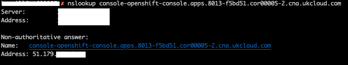
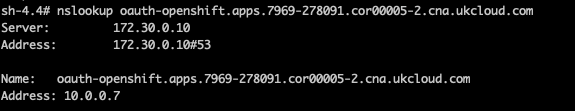

# How to restrict access to OpenShift routes by IP address

## Overview

This knowledge centre article explains how OpenShift developers can restrict access to the routes they create to their deployed services in OpenShift by IP address. Restricting access in this way increases the security of a route by allowing only trusted IPs to access the OpenShift route.

### Intended audience

OpenShift developers who have created and deployed services into OpenShift, and created and exposed routes for those services. This article describes how to further secure access to those exposed routes by allowing only trusted IPs to access them.

## Restricting access to a route

After creating and exposing a route in OpenShift in the usual manner, you can then add an annotation to the route specifying the IP address(es) that you would like to whitelist.

> [!IMPORTANT]
> Whitelisting an IP address automatically blacklists everything else.

You apply the annotation to a route in the following manner:

    oc annotate route <route_name> haproxy.router.openshift.io/ip_whitelist="<ip_address>"

## Examples

To allow a single IP address through to the route, use the following:

    oc annotate route <route_name> haproxy.router.openshift.io/ip_whitelist="192.168.1.10"

To allow several IP addresses through to the route, separate each IP with a space (do not use commas to separate IPs):

    oc annotate route <route_name> haproxy.router.openshift.io/ip_whitelist="192.168.1.10 192.168.1.11 192.168.1.12"

To allow a CIDR block through to the route, declare the CIDR block as so:

    oc annotate route <route_name> haproxy.router.openshift.io/ip_whitelist="192.168.1.10/24"

You can even use a mix of IP addresses and a CIDR block:

    oc annotate route <route_name> haproxy.router.openshift.io/ip_whitelist="192.168.1.10 180.5.61.153 192.168.1.0/24 10.0.0.0/8"

To delete the IPs from the annotation, you can run the command:

    oc annotate route <route_name> haproxy.router.openshift.io/ip_whitelist-
    
## Known Issues   

As of OpenShift version 4.4+ pod DNS lookups will return the internal IP of a route rather than the public IP. This means traffic will not leave the cluster for pod to route communication. In order for a whitelisted route to accept traffic from a pod in the same cluster you must whitelist the internal cluster subnet. The following screenshots show a lookup from a local client machine and from inside a pod demonstrating the difference in resolution:

DNS lookup on local machine

 

DNS lookup from inside a pod

 

In this case you would want to run the following command to whitelist your route (assuming your cluster local subnet is 10.0.0.0/24):

    oc annotate route <route_name> haproxy.router.openshift.io/ip_whitelist="10.0.0.0/24"

## More information

For further information, see the following documentation: [v3](https://docs.openshift.com/container-platform/3.11/architecture/networking/routes.html) [v4](https://docs.openshift.com/container-platform/4.5/networking/routes/route-configuration.html)

> [!IMPORTANT]
> This functionality is available by default in UKCloud OpenShift deployments of version 3.10 or newer. For all previous versions customers need to raise a request with UKCloud to have this functionality enabled.

## Feedback

If you find a problem with this article, click **Improve this Doc** to make the change yourself or raise an [issue](https://github.com/UKCloud/documentation/issues) in GitHub. If you have an idea for how we could improve any of our services, send an email to <feedback@ukcloud.com>.
