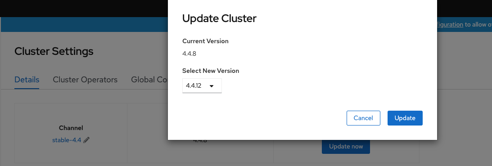

# Supported customer update strategy for version 4 clusters

## Update Information

In OpenShift version 4, updates of the cluster and operating system of the nodes have been exposed to the customer through the cluster. You can update clusters through the UI and the cluster will then deal with updating the relevant operator components and the OS version of the RHCOS nodes running as masters, infras and workers. The OS version of the nodes is tied to the version of the cluster and is thoroughly tested by Red Hat pipelines prior to release.

## Supported Strategy

There are three update channels available to choose from:

- **Candidate** - This is an unsupported channel that will provide release candidate z stream releases. Do not update via this channel or both UKCloud and Red Hat will be unable to support the cluster.

- **Fast** - This channel is fully supported. Updates are released to this channel after performing well in the candidate channel.

- **Stable** - This is the recommended channel for production clusters. Updates are released to this channel after data has been collected by Red Hat from customers running updates from the fast channel and stability of the updates has been confirmed.

> [!NOTE]
> UKCloud asks that all customers remain on the stable channel for production clusters. We recommend using the fast channel only if you require specific bug fixes or security patches.

## Upgrading your cluster

### Prerequisites

- You must be a cluster admin user

- You must contact UKCloud Support and ask for an etcd backup to be taken to ensure there is a restore point in case of corruption during the update

### Process

1. In the UI, navigate to **Administration > Cluster Settings**.

2. Ensure the correct channel is selected. If an update is available there will be a large blue **Update Now** button. 

3. Click **Update Now**.

4. In the *Update Cluster* dialog box, from the **Select New Version** list, select the version to upgrade to, then click **Update**.

    

## Further information

For some additional information regarding upgrading a cluster, see the following OpenShift documentation:

- <https://docs.openshift.com/container-platform/4.5/updating/updating-cluster.html>

## Feedback

If you find a problem with this article, click **Improve this Doc** to make the change yourself or raise an [issue](https://github.com/UKCloud/documentation/issues) in GitHub. If you have an idea for how we could improve any of our services, send an email to <feedback@ukcloud.com>.
