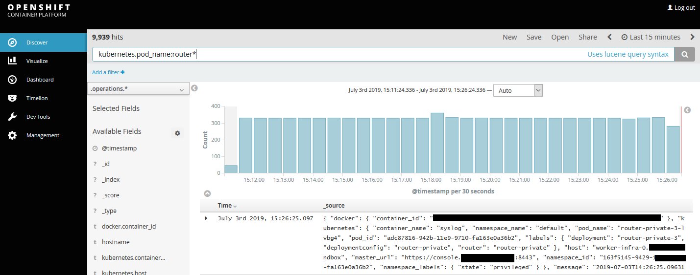

# How to view your OpenShift router logs

## Overview

UKCloud for OpenShift enables you to develop, deploy, and manage digital and container-based applications seamlessly across local physical or virtual environments, with full portability to and from UKCloud.

This guide explains how you can view the connection logs generated by the OpenShift routers in your environment.

### Intended audience

This guide assumes familiarity with the Linux command line, and with the `oc` command set to manage an OpenShift cluster.

### Prerequisites

To complete the steps in this guide, you must have the `oc` command installed and have a suitable account on your OpenShift cluster. Specifically, it is assumed you know the authentication credentials that need to be supplied to `oc login`.

Your OpenShift cluster must be version 3.11 or later, and must be enabled for router logging. If your OpenShift routers do not have the "syslog" sidecar container enabled then raise a request on the UKCloud portal requesting this functionality.

## Viewing the logs for a specific router

1. Log in to OpenShift on the command line and change to the default project:

       $ oc login ...
       $ oc project default

2. Check if the routers have the syslog container enabled:

       $ oc get pods | grep router
       router-4-45r2t             2/2       Running   0          12d
       router-4-n7jg2             2/2       Running   0          12d
       router-private-3-lvbg4     2/2       Running   0          12d
       router-private-3-s2nbr     2/2       Running   0          12d
       
       # Since the container count for each router shows 2/2, the syslog container is present

    If your routers do not have the syslog sidecar container, raise a request in the UKCloud portal to request this functionality is added. Your cluster must be v3.11 or later.

3. View the logs for a specific router:

       # For router "router-4-45r2t":
       $ oc logs router-4-45r2t -c syslog
       2019-07-03T13:41:28.573805+00:00 worker-infra-0 haproxy[506]: 37.69.33.21:49342 [03/Jul/2019:13:41:28.570] fe_sni~ be_secure:openshift-logging:logging-kibana/pod:logging-kibana-1-r8rkj:logging-kibana:10.177.0.13:3000 0/0/0/3/3 200 22810 - - --VN 10/5/0/1/0 0/0 "GET /bundles/2e90d5152ce92e3eb62ba053c7b9d2cb.woff HTTP/1.1"
       2019-07-03T13:41:28.578731+00:00 worker-infra-0 haproxy[506]: 37.69.33.21:49345 [03/Jul/2019:13:41:28.575] fe_sni~ be_secure:openshift-logging:logging-kibana/pod:logging-kibana-1-r8rkj:logging-kibana:10.177.0.13:3000 0/0/0/2/2 200 23286 - - --VN 10/5/1/2/0 0/0 "GET /bundles/697573f67bcfdd2c45e3e63c7380dd67.woff HTTP/1.1"
       ...
       
The logs are shown in the HTTP haproxy log format. See https://cbonte.github.io/haproxy-dconv/1.7/configuration.html#8.2.3 for a guide on the fields.
       

## Viewing logs for all routers in the cluster

The router syslog containers send their logs to the cluster's Elasticsearch database in the `openshift-logging` project. This can be viewed using Kibana as follows:

1. Locate the URL to access Kibana. This can be found in the openshift-logging project using the Web UI or by using the command-line client as below:
      
       $ oc describe route logging-kibana -n openshift-logging | grep Host
       Requested Host:         kibana.cnap-testing.frn00006.cna.ukcloud.com
       
2. Access Kibana by opening the URL using HTTPS (eg https://kibana.cnap-testing.frn00006.cna.ukcloud.com) in a web browser. Login with your OpenShift/SSO credentials if prompted.

3. In the query box, enter "kubernetes.pod_name:router*" and click the Search/Magnifying Glass button. This will return the logs for all routers. By default, logs for the last 15 minutes is shown. This can be changed using the picker in the top right of the page.

## Next steps

For more information about UKCloud for OpenShift service, see:

- [*Getting Started Guide for UKCloud for OpenShift*](oshift-gs.md)

- [*UKCloud for OpenShift FAQs*](oshift-faq.md)

## Feedback

If you find an issue with this article, click **Improve this Doc** to suggest a change. If you have an idea for how we could improve any of our services, visit [UKCloud Ideas](https://ideas.ukcloud.com). Alternatively, you can contact us at <products@ukcloud.com>.
