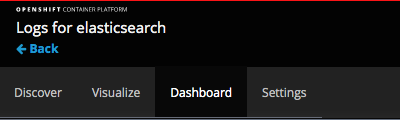
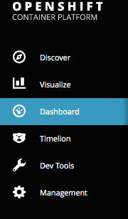
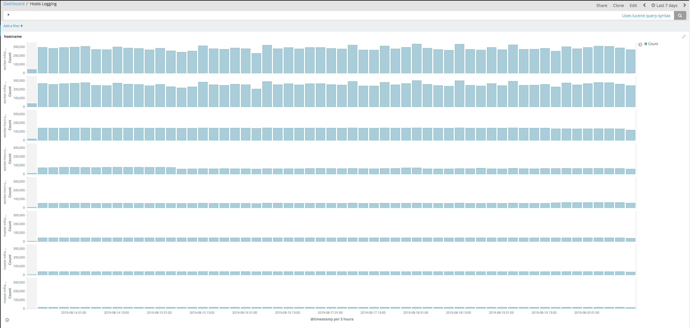
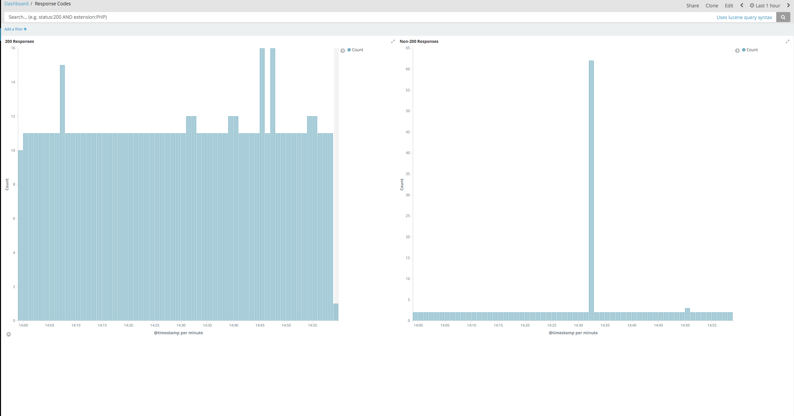

# Custom dashboards provided with aggregated logging Kibana

## Overview

This article provides details about the two custom dashboards we configure with the Kibana deployment in your cluster: Hosts Logging and Response Codes. It describes the data that we provide in these dashboards and what information you can derive from that data.

## Intended audience

The Hosts Logging dashboard is available in 3.9-3.11 clusters and the Response Codes dashboard is available in 3.11 clusters.

## How to access the custom dashboards

Open the kibana route. Depending on your cluster version, it will have the following format: `https://kibana.xxxx-xxxxx.region.cna.ukcloud.com` or `https://kibana.xxx-xxx-xx-xxxxx.region.cna.ukcloud.com`.

This will take you to the Kibana UI. From here you can select the dashboards option. 

On 3.9 clusters:

On 3.10+ clusters:

## Dashboards

### Hosts Logging

The Hosts Logging dashboard contains a graph for each host in the cluster that shows amount of messages on the Y axis and time on the X axis. You can use this dashboard to look for an increase in messages being generated on hosts when new applications are deployed. This can help determine if you need to expand the persistent storage of your Elasticsearch: [*Expand OpenShift persistent storage*](https://docs.ukcloud.com/articles/openshift/oshift-how-expand-persistent-vols.html)

You can also use the Hosts Logging dashboard to ensure that all hosts are sending logs to Elasticsearch. If a host is not showing it may indicate a problem with the fluentd container on that node. 

### Response Codes

The Response Codes dashboard contains graphs that are generated by reading the syslog container logs from the router pods in the default project. As access logging is only present in OpenShift 3.11, this dashboard is available only in 3.11 clusters.
This dashboard analyses log entries and creates the following graphs:

* A graph showing all 200 responses when cluster routes are accessed

* A graph showing non-200 responses when cluster routes are accessed

If you see errors accessing routes or if your end users report errors accessing routes, you can use the Response Codes dashboard to easily identify spikes in route errors and analyse application logs at the time the errors occurred. It can also help us in the same way if we need to investigate infrastructure level network issues.

## Feedback

If you find an issue with this article, click **Improve this Doc** to suggest a change. If you have an idea for how we could improve any of our services, visit the [Ideas](https://community.ukcloud.com/ideas) section of the [UKCloud Community](https://community.ukcloud.com).
