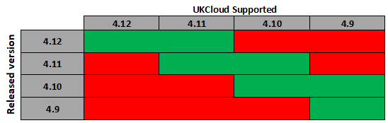

# UKCloud for OpenShift life cycle and patch management

## Overview

This article outlines the lifecycle of UKCloud-supported OpenShift releases, along with UKCloud's approach to patching existing OpenShift environments so that you can effectively plan, deploy and support your infrastructure. The purpose of this article is to provide as much transparency as possible, but UKCloud may make exceptions from the process described should the need arise.

### Intended audience

Administrators and operators of the UKCloud for OpenShift service.

## Lifecycle management

Red Hat's official versioning for their OpenShift Container Platform is _**X.Y**_ where _**X**_ indicates the major version and _**Y**_ indicates a minor version.

Although Red Hat officially fully support each major _**X**_ version of the OpenShift Container Platform for five years, as a service provider, this duration is too long for UKCloud to ensure the highest levels of security, performance and features. As such, UKCloud will officially support the current **_(X.Y)_** and previous two minor versions **_(X.Y-1) and (X.Y-2)_**. As minor versions are released roughly every six months, this provides the assurance that your environments will be fully support by UKCloud for a minimum of twelve months.

### Upgrades of major _**X**_ and minor _**Y**_ versions

Currently, UKCloud does not offer in-place upgrades. This provides you with total flexiblility to upgrade at a time convenient to you, as well as providing the ability to test existing code and applications against any new versions prior to moving in to production.

To facilitate any upgrades, UKCloud will deploy a new environment based on the latest tested and approved release of OpenShift to customers free of charge for thirty days in order to conduct any testing and migrate workloads over to the new environment. At the end of thirty days UKCloud will shutdown and remove the customers old environment to prevent any double-charging.

> [!NOTE]
UKCloud will actively work with you during this period to help ensure a smooth migration and will not turn off any old environments until until you advise us that it's safe to do so.

### Patching within current version
Red Hat routinely releases patches for vulnerabilities or issues identified within the currently supported version of OpenShift. Once UKCloud has reviewed and tested any patches as being fit for release in to production, we will advise you of the patch and schedule a convenient time to apply it.

## Feedback

If you find an issue with this article, click **Improve this Doc** to suggest a change. If you have an idea for how we could improve any of our services, visit [UKCloud Ideas](https://ideas.ukcloud.com). Alternatively, you can contact us at [products@ukcloud.com](mailto:products@ukcloud.com).
