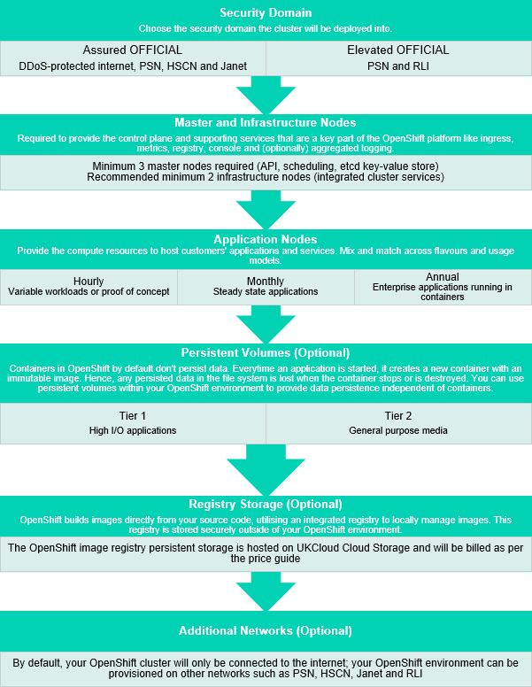

# UKCloud for Managed OpenShift Service Definition

## What is UKCloud for Managed OpenShift?

UKCloud for Managed OpenShift provides a secure, private deployment of Red Hat's OpenShift Container Platform. The service is delivered as a managed platform, enabling developers to build automation pipelines and leverage the benefits of containerised solutions, helping to deliver modern, cloud-native applications and accelerate digital transformation.

UKCloud deploys, scales, monitors and updates the platform, freeing up your DevOps resources to focus on adding value further up the stack through the rapid delivery of quality controlled code, all without having to worry about the underlying infrastructure or platform services.

## What the service can help you achieve

- Deliver new software features faster, focusing on customer value rather than infrastructure complexities

- Cope with unpredictable spikes in traffic and customer demand

- Realise more value from your DevOps team by enabling them to focus on the 'Dev' rather than 'Ops'

- Create a standard approach to deployment, ensuring consistency across all users

- Perform platform maintenance with less disruption to applications

- Try out new ideas in a low-risk sandboxed environment

- Remove the cost and complexity of provisioning, managing and scaling the underlying infrastructure, OS and middleware components

- Avoid lock-in – OpenShift can be deployed on a wide choice of IaaS platforms

## Product options

The service enables you to select from a number of configuration options including choice of security domain, network connectivity and flavours of nodes in the cluster.

The following product options apply only to OpenShift Container Platform (OCP) v4 or higher.

## Pricing and packaging

UKCloud for Managed OpenShift pricing starts at £1.13. Full pricing with all options, including licensing and connectivity, is available in the [UKCloud Pricing Guide](https://ukcloud.com/pricing-guide).

## Accreditation and information assurance

The security of our platform is our number one priority. We've always been committed to adhering to exacting standards, frameworks and best practice. Everything we do is subject to regular independent validation by government accreditors, sector auditors and management system assessors. Details are available on the [UKCloud website](https://ukcloud.com/governance/).

## Connectivity options

UKCloud provides one of the best-connected cloud platforms for the UK Public Sector. We enable access to our secure platform by DDoS-protected internet, PSN, Janet, HSCN, RLI and your own leased lines via our HybridConnect or CrownConnect services. The full range of flexible connectivity options is detailed in the [UKCloud Pricing Guide](https://ukcloud.com/pricing-guide).

## An SLA you can trust

We understand that enterprise workloads need a dependable service that underpins the reliability of the application to users and other systems, which is why we offer one of the best SLAs on G-Cloud. For full details on the service SLA, including measurements and service credits, see the [*SLA definition*](../other/other-ref-sla-definition.md).

## The small print

For full terms and conditions, including onboarding and responsibilities, refer to the [*Terms and conditions documents*](../other/other-ref-terms-and-conditions.md).

For more information about this service, see the [*Service Scope*](oshift-sco.md) and [*FAQs*](oshift-faq.md).

## Why UKCloud?

UKCloud is dedicated to the digital transformation of our nation's public services through our flexible, secure and cost-effective multi-cloud platform and the expertise of our people and partners. We believe that diversity of technology drives value and innovation and so we bring together different cloud technologies, with different deployment models spanning on-premises (private cloud), on-campus (Government's Crown Campus) and off-campus global public cloud services. This enables you to choose the right cloud for creating new workloads or migrating or replacing existing applications to the cloud with specialist SaaS solutions.

We recognise the importance of public services to UK citizens and businesses, which is why we include the highest level of support to all our customers at no extra cost. This includes dedicated 24/7 UK support, a Network Operations Centre (NOC), utilising protective and proactive monitoring tools, and access to UKCloud's experts. UKCloud can also provide outcome-based professional services or managed services to help you with digital transformation.

## Feedback

If you find a problem with this article, click **Improve this Doc** to make the change yourself or raise an [issue](https://github.com/UKCloud/documentation/issues) in GitHub. If you have an idea for how we could improve any of our services, send an email to <feedback@ukcloud.com>.
