# Getting Started Guide for UKCloud for OpenStack

## Overview

This Getting Started Guide covers basic topics like where to find your instances (virtual machines, or VMs, in VMware terminology), as well as more in-depth topics such as instance storage choice (ephemeral or volume storage) and its implications.

### Intended audience

This guide is intended for users who want to learn more about UKCloud for OpenStack.

## Logging in to the OpenStack Horizon dashboard

1. Go to the URL provided in your welcome email.

    The examples in this guide use `https://cor00005.cni.ukcloud.com/`.

2. Enter your login credentials and click **Connect**.

    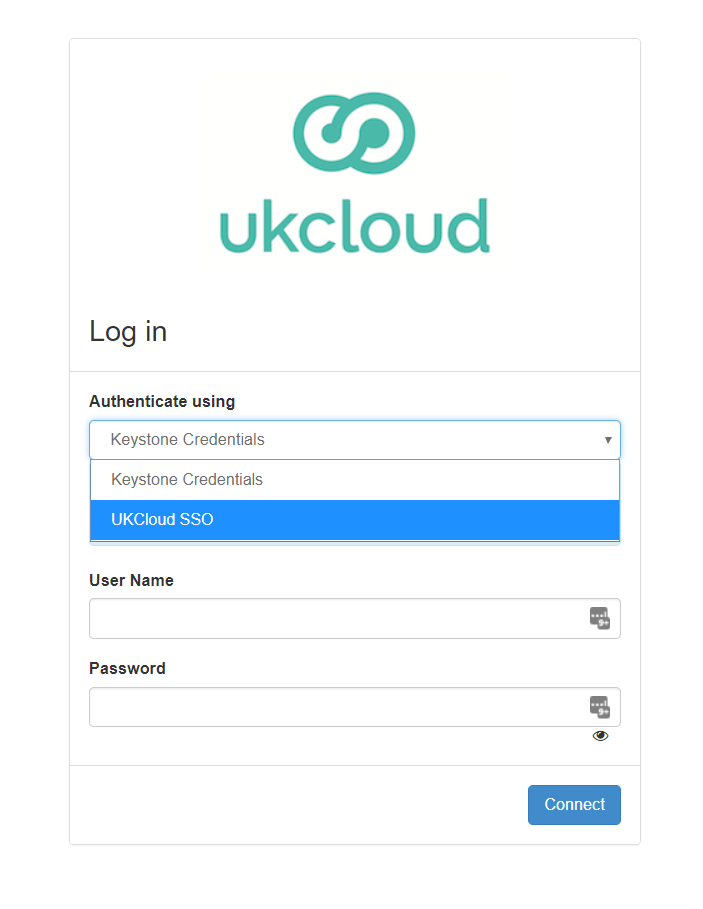

3. After logging in, the first screen you'll see is the *Overview* page.

    From here you can get a summary of your project and view your resource usage and the quotas configured on the project.

    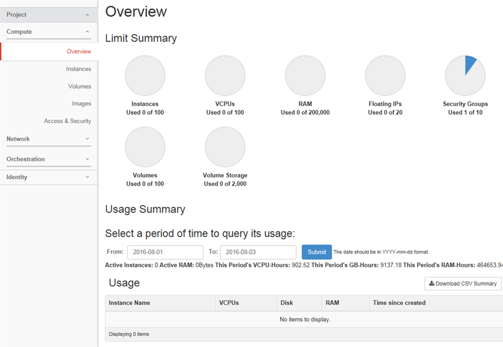

## Creating your network infrastructure

Before you can begin creating instances, you must first build the required network components. In a freshly provisioned project, the only resource that will exist initially is a shared external network called `internet`.

You need to create the following minimum set of resources:

- A router using the internet external network

- A network and associated subnet, specifying the network address using CIDR notation (for example, 192.168.1.0/24), and DHCP settings for DNS, any static routes, and so on.

- A router interface to connect the router to your new subnet

When you have created these elements, you can view them in the *Network Topology* page in the Horizon dashboard.

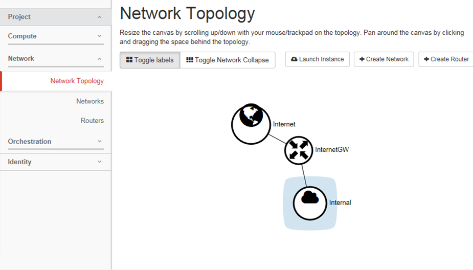

You can create your network infrastructure in one of the following ways:

- Using Horizon to manually create your infrastructure (see [Using Horizon to manually create your infrastructure](#using-horizon-to-manually-create-your-infrastructure))

- Using the OpenStack Heat orchestration tool to create stacks (see [Using the OpenStack Heat orchestration tool to create stacks](#using-the-openstack-heat-orchestration-tool-to-create-stacks))

- Using the OpenStack API and automation (see [Using the OpenStack API and automation](#using-the-openstack-api-and-automation))

- Using the OpenStack CLI clients (see [Command-line clients for UKCloud for OpenStack](ostack-ref-cli-clients.md))

### Using Horizon to manually create your infrastructure

The *Network Topology* page is a useful page to get started with. This page provides a resizable, moveable and interactive view of your OpenStack project, along with easily accessible buttons for manually creating routers and networks and for launching instances.

To create your network infrastructure:

1. In the Horizon dashboard, expand the **Network** menu on the left side of the screen and select **Network Topology**.

    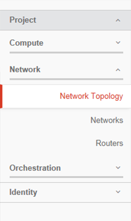

2. On the *Network Topology* page, click the **Create Router** button.

    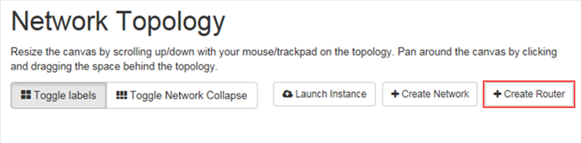

3. In the *Create Router* dialog box, enter a **Router Name**.

4. From the **Admin State** list, ensure that **UP** is selected so that the router is online at the point of creation.

5. From the **External Network** list, select the external network to which you want to attach your router.

    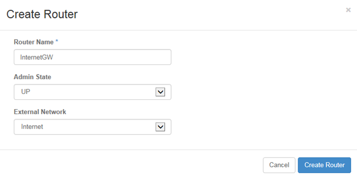

6. Click **Create Router**.

7. Back on the *Network Topology* page, click the **Create Network** button.

    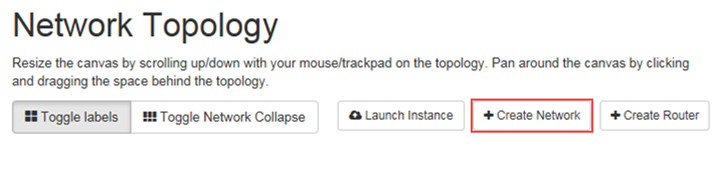

8. On the *Network* page of the *Create Network* wizard, enter a **Network Name** and click **Next**.

    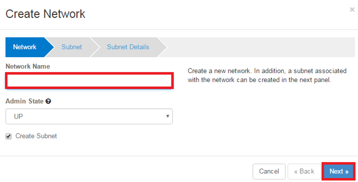

9. On the *Subnet* page, enter a **Subnet Name**.

10. In the **Network Address** field, allocate your network a suitable address space.

11. In the **Gateway IP** field, enter an IP address from the address space for the router you created earlier to use to access the network.

    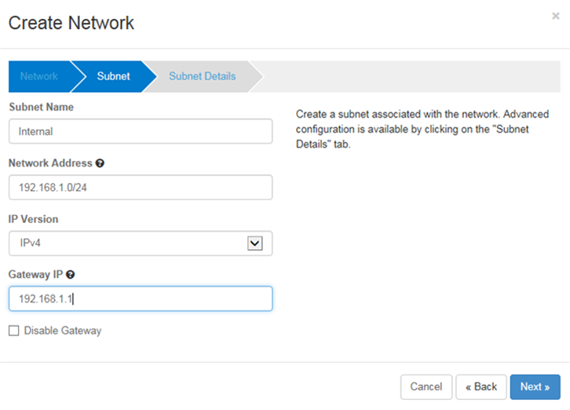

12. Click **Next**.

13. On the *Subnet Details* page, the only field you'll probably want to change is **DNS Name Servers**.

    UKCloud does not provide DNS as a service, so to start with you could make use of Google's public 8.8.8.8 service. You can update this field later if you intend to run your own DNS caching service.

14. If you leave the **Allocation Pools** field blank, then by default the whole address space is used for the pool.

    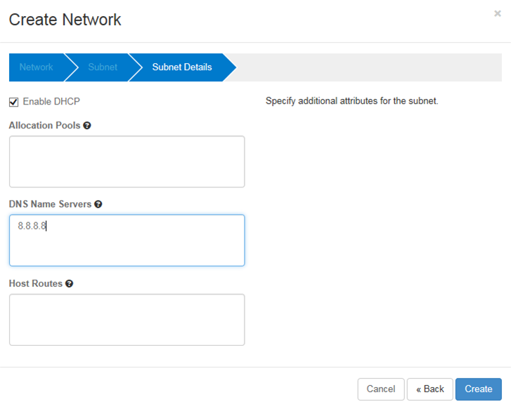

15. Click **Create**.

16. To add the router interface to link your new network to the router, on the *Network Topology* page, select the router and click the **Add Interface** button.

    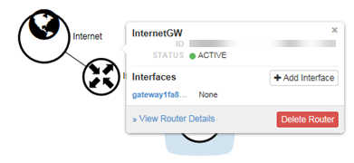

17. In the *Add Interface* dialog box, from the **Subnet** list, select your subnet and then click **Add Interface**.

    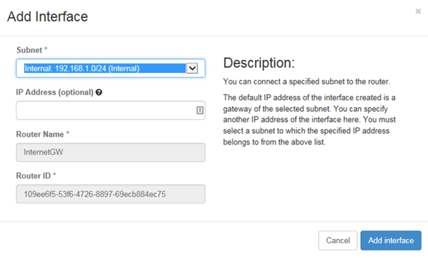

## Understanding access and security

### Security groups

In OpenStack, rather than deploying a perimeter firewall to protect your network from the outside world, every instance is protected by its own firewall. This instance firewall is applied at the network level, independent of any additional firewall the guest operating system may be using. The instance firewall is controlled by applying one or more *security groups* to the instance, either at instance creation or real-time at any point during the lifecycle of the instance. Where multiple security groups are specified, all the firewall rules in those security groups are applied.

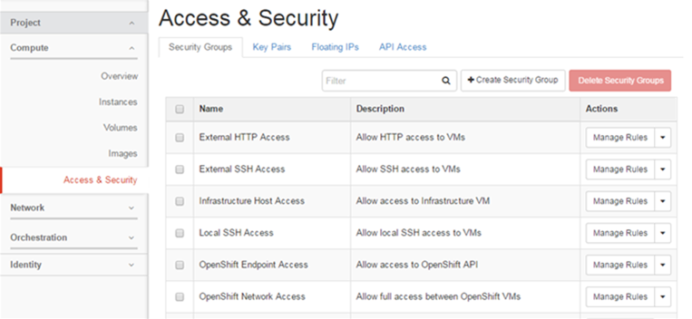

A security group consists of one or more rules. Each rule is composed of
five elements:

- **Role** --- Custom or predefined protocol type (for example, TCP, UDP or ICMP)

- **Direction** --- Ingress or Egress

- **Open Port or Port Range** --- Open either a single port or a range of ports

- **Remote** --- The source of the traffic to be allowed via this rule (source address for an inbound rule, or destination address for an outbound rule)

- The ether type (that is IPv4 or IPv6) --- Not currently available

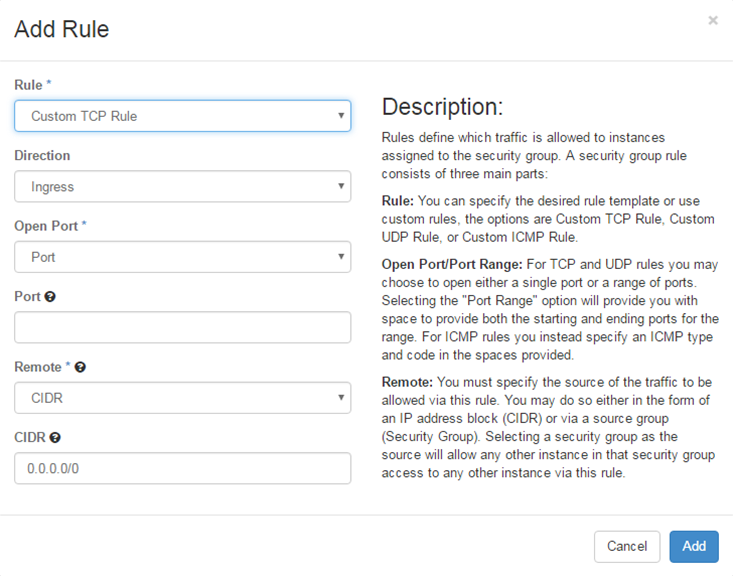

When adding a new rule to a security group, you can choose from a pre-populated list of common rules, for example, SSH, DNS, HTTP or SMTP, or you can specify your own custom rule.

### SSH key pairs

Another change if you're used to using vCloud Director, is the authenticated access to your instances. OpenStack, like most other cloud providers, doesn't use templates that allow password controlled access.
The standard cloud method of authenticating access to a new instance is to use SSH key pair authentication --- your SSH client uses the private key and OpenStack injects the public key into your new instance using
the cloud-init package pre-installed in the instance image.

Before you launch any instances on OpenStack, you need to set up at least one SSH key pair. You can use OpenStack to create a new key pair for you, or if you have an existing SSH key pair, you can import the
public key so that OpenStack can use it to inject into new instances.

To see what public keys have already been set up for your use:

1. In the Horizon dashboard, expand the **Compute** menu on the left side of the screen and select **Access & Security**.

    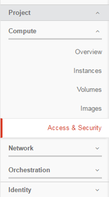

2. Select the *Key Pairs* tab.

    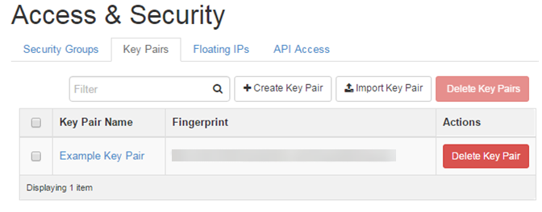

3. If you want OpenStack to create a key pair for you:

    - Click the **Create Key Pair** button.

    - In the *Create Key Pair* dialog box, enter a **Key Pair Name** and then click **Create Key Pair**.

        OpenStack creates the key pair and downloads it in your web browser. Save the file somewhere safe as you will need it when connecting your SSH client to your instances.

        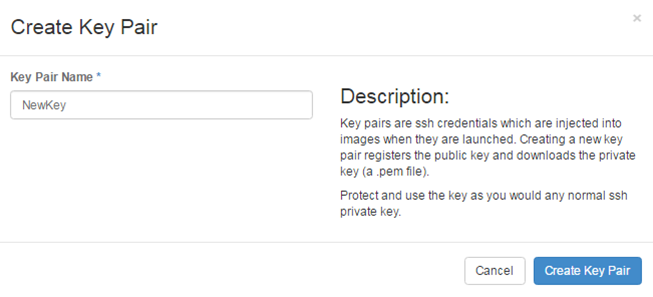

4. To import an existing public key:

    - On the *Key Pairs* tab of the *Access & Security* page, click the **Import Key Pair** button.

    - In the *Import Key Pair* dialog box, enter a **Key Pair Name** and paste the contents of your existing public key file into the **Public Key** field.

        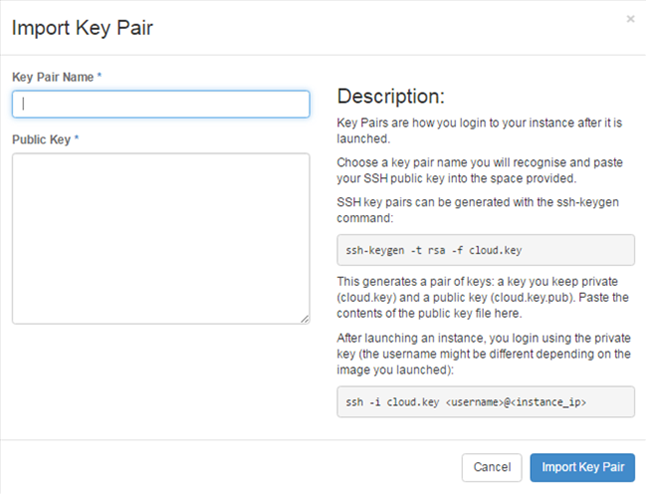

    - Click **Import Key Pair**.

#### Note for Windows users

If you're using a Windows desktop environment, the chances are that you're using the PuTTY program for your SSH client. The PuTTY SSH client doesn't use OpenSSH format files for the key pair files. It does however provide a PuTTYgen program that can import and export in the correct format as outlined below.

- If you want OpenStack to create your key pair:

    1. Open PuTTYgen.

    2. From the **Conversions** menu select **Import key**.

        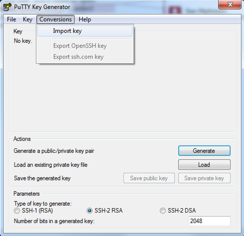

    3. Select the downloaded private key file generated by OpenStack.

    4. Click the **Save private key** button to save the imported key as a `ppk` file that PuTTY can use for authentication.

- If you want to import an existing key:

    1. Open PuTTYgen.

    2. Click the **Generate** button.

    3. Copy the public key from the top of the dialog box.

        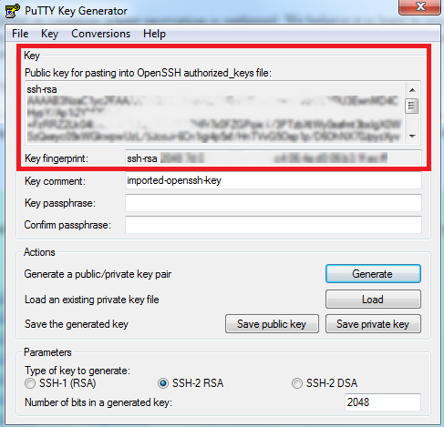

    4. Paste the public key into the **Public Key** field in Horizon's *Import Key Pair* dialog box.

## Launching your instances

Now that you've considered security, created a network and a subnet, and you've connected them to your external network with a router, you can start to think about launching some instances attached to the network. There are a few choices you need to make when launching your instances. The following sections outline how to achieve this task via the Horizon dashboard, however you can also use the OpenStack CLI, HEAT templates or the OpenStack API.

### Choosing your image

When you create an instance in OpenStack, its disk is cloned from an *image* managed by OpenStack. The image may be a custom image that has been developed for a specific purpose and uploaded to your project. It may also be a custom image that has been specifically shared between two projects. More likely, you'll start by using one of the public images that we provide and manage on our platform.

You can see the images that are available for you to use by expanding the **Compute** menu on the left side of the Horizon dashboard and clicking **Images**.

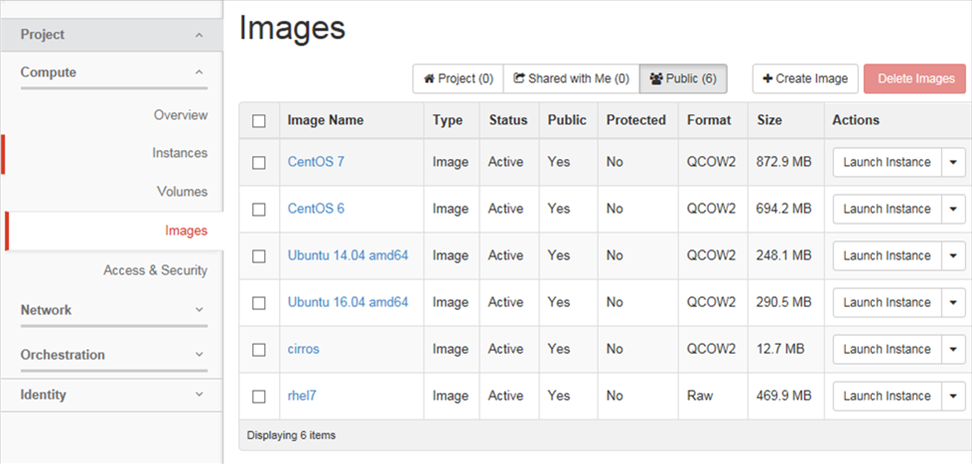

### Choosing your instance size

If you're already familiar with UKCloud's vCloud Director-based Enterprise Compute Cloud service, then you may be used to being able to choose exactly how many vCPUs and how much memory a VM is allocated.

In OpenStack, you choices are restricted to a number of pre-defined *flavors* that define how many vCPUs, how much memory and how much storage an instance may use. Although full details for each flavor are
available through the Horizon UI, there's no overall list available showing all the different flavors and sizes of instances. However, if you've installed the OpenStack CLI tools (see
<http://docs.openstack.org/user-guide/common/cli-install-openstack-command-line-clients.html>),
you can run the following command to retrieve a list of the flavors and their makeup

    \> openstack flavor list

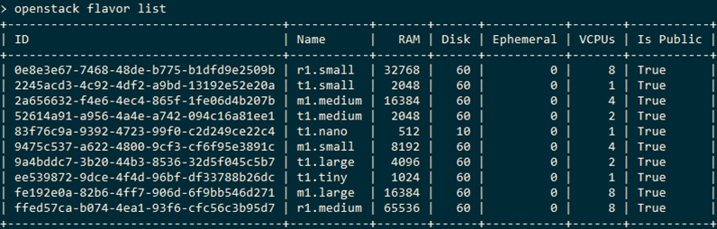

### Choosing your storage type

There are two storage options available for use with your instances:

- Ephemeral storage (default)

- Persistent volume storage

#### Ephemeral storage

When you create an instance, the default behaviour is to clone your chosen disk image onto the physical disk attached to the host that will be running the instance. This is not dedicated locally attached storage to your instance, but rather a RAID array of fast SSD disks that is shared by all the instances running on the host hypervisor.

The performance of the ephemeral storage makes for very fast disk access. However, as the disk image is stored locally on the host hypervisor, you're at risk of data loss in the event of hardware failure on the host. For scheduled maintenance on the host, you can live‑migrate instances onto other hosts with minimal interruption. If the host were to suffer a hardware failure, it's likely that you'd lose the data stored on the disk image, so you should architect your application to expect and be able to recover from failure.

#### Persistent volume storage

As an alternative to ephemeral storage you can clone your chosen disk image to an OpenStack *volume*, which is a persistent storage option backed by a Ceph storage array. The volume is then network mounted onto the host hypervisor and the instance booted from the network attached storage. For scheduled maintenance on the host, these instances are more easily managed onto other hosts. In the event of a hardware failure on the host, the volume can just be mounted to another host and the instance restarted without any data loss.

For more information about volumes, see [Working with volumes](#working-with-volumes).

### Creating an instance

You can create a new instance in the Horizon UI.

1. Click or select **Launch Instance** on one of the following pages:

    - *Images* page (under the **Compute** menu)

    - *Instances* page (under the **Compute** menu)

    - *Network Topology* page (under the **Networks** menu)

2. On the *Details* tab of the *Launch Instance* dialog box, enter an **Instance Name** and select a **Flavor**.

    As you select a flavor from the list, the dialog box updates to reflect the **VCPUs**, **Disk** and **RAM** that the selected flavour gives you and the green bars under **Project Limits** update to show what your usage would be after launching the instance. If you select a flavour that would take you over your project's quota, the bar is red rather than green.

    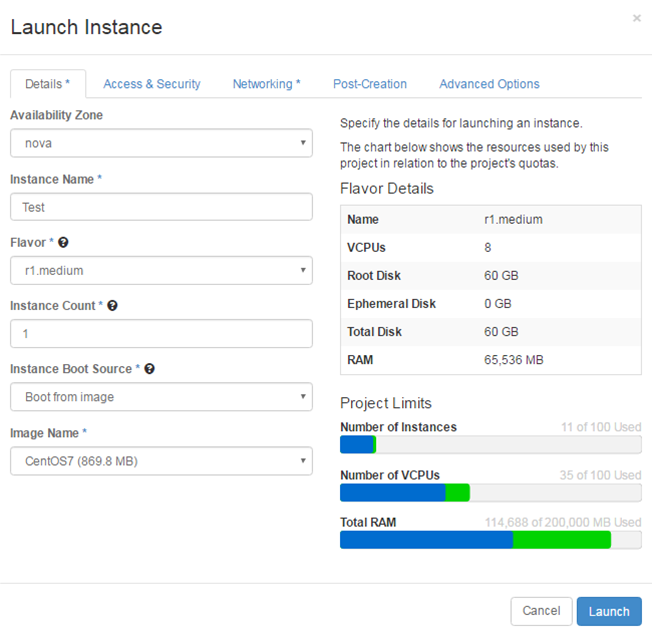

3. From the **Instance Boot Source** list, select:

    - **Boot from image** to create an instance that boots from the local ephemeral storage.

    - **Boot from image (creates a new volume)** to create an instance that boots from a volume

4. From the **Image Name** list, select your preferred image.

    If you're creating an image that boots from a volume, you can choose what size to create the boot disk without being restricted to the disk allocation specified by the selected flavour.

    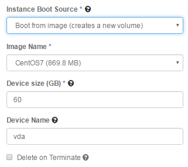

5. On the *Access & Security* tab, from the **Key Pair** list, select the SSH key pair you want to inject into your new instance.

    If there is only one SSH key pair configured in your project, it will be automatically selected.

6. Select one or more **Security Groups** to apply to the instance.

    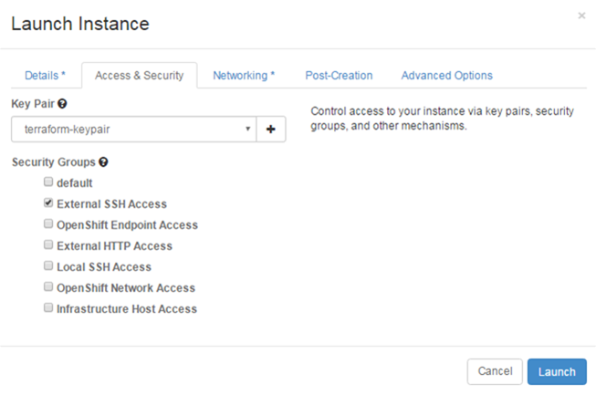

7. On the *Networking* tab, from the **Available networks** list, select the network that you want to create the new instance on.

    If your project has only a single network defined, that network will already be listed under **Selected networks**.

    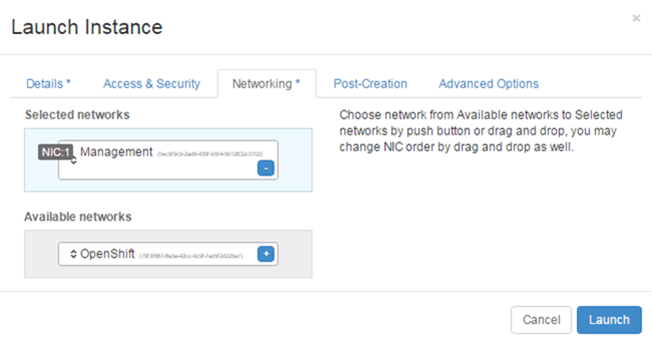

8. Click **Launch** and OpenStack reports that your new instance is launching.

    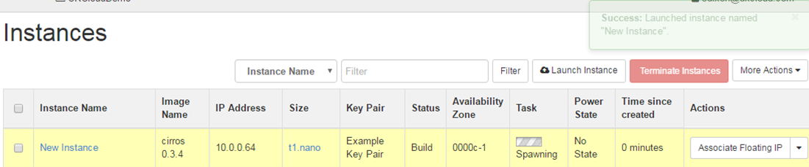

### Accessing your instance

Having successfully launched your new instance, you'll want to log in and start installing your applications. To access your new instance from the outside world, you have to associate a *floating IP address* to the instance.

A floating IP address is a public routable address that is allocated to your project. Having allocated an address to your project, you can then choose to associate it to a particular instance. When you've done this, a DNAT rule is automatically created on the router you created earlier to forward all incoming traffic to your chosen instance.

To associate a floating IP address to your new instance:

1. On the *Instances* page, from the **Actions** list for your instance, select **Associate Floating IP**.

    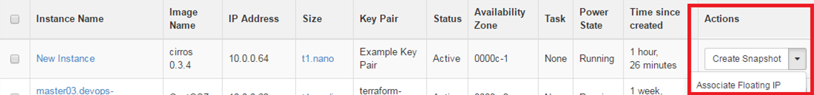

2. In the *Manage Floating IP Associations* dialog box, from the **IP Address** list, select the floating IP address that you want to allocate to the instance.

    If you don't have any spare floating IP addresses allocated to your project, you can click the **+** button next to the **IP Address** list to allocate a new address.

    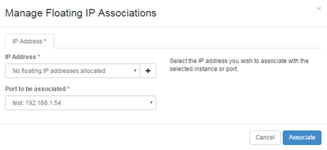

    - In the *Allocate Floating IP* dialog box, from the **Pool** list, select the pool from which to allocate the floating IP address.

        Currently the only option is **internet**, but the list will expand as additional networks come online.

        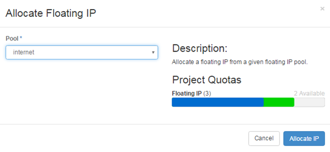

    - Click **Allocate IP** to allocate the new floating IP address to your project.

    - Back in the *Manage Floating IP Associations* dialog box, associate the new address with your instance.

3. Click **Allocate IP**.

    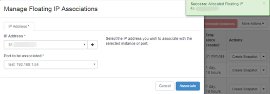

4. You can use your SSH client to connect to the floating IP address, authenticating the connection with the private key that matches the key pair you selected when you launched the instance.

You can find more information about using and controlling instances and images on OpenStack in the Red Hat documentation at <https://access.redhat.com/documentation/en/red-hat-openstack-platform/8/instances-and-images-guide/instances-and-images-guide>.

## Working with volumes

### Creating a volume

Volumes are block devices that you can attach to instances. Because volumes are replicated across OpenStack's storage array, effectively providing three copies of data from a resilience perspective, they provide the basis of our persistent storage offering.

1. In the Horizon dashboard, expand the **Compute** menu on the left side of the screen and select **Volumes**.

2. On the *Volumes* page, click the **Create Volume** button.

3. In the *Create Volume* dialog box, enter a **Volume Name** and **Description**.

4. From the **Volume Source** list, select:

    - **No source, empty volume** to create a totally empty volume for customer to populate with their data (this is the default option)

    - **Image** to enable customer to create a prepopulated volume from a previously created image

5. From the Volume Type list, select:

    - **Tier 1** for our most performant block storage for workloads requiring consistently higher disk throughput

    - **Tier 2** for block storage with typical performance characteristics for use by production applications or storage (this is the default option)

6. From the **Size** list, select the size of your volume in GiB.

7. From the **Availability Zone** list, select the availability zone to which you want to target your volume.

    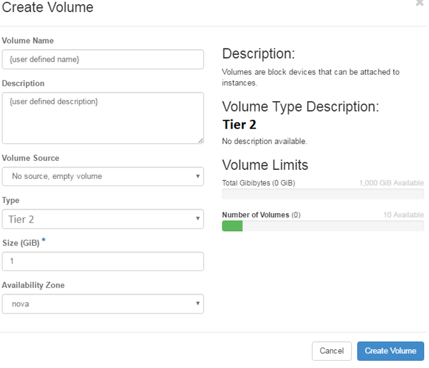

8. Create **Create Volume**.

### Retyping a volume

You can retype a volume to take an existing volume of a particular volume type and converting it to another (that is, from Tier 1 to Tier 2 or vice versa).

#### Retyping a volume attached to an instance

Due to a dependency on the underlying hypervisor, it is not currently possible to retype a volume that is attached to an instance. If you want to retype a volume that is attached to an instance, you must first detach the volume from the instance.

1. To detach the volume from the instance, in the Horizon dashboard, expand the **Compute** menu on the left side of the screen and select **Volumes**.

2. On the *Volumes* page, for the volume that you want to detach, from the list on the far right of the page, select **Manage Attachments**.

    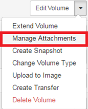

3. In the *Manage Volume Attachments* dialog box, click the **Detach Volume** button.

    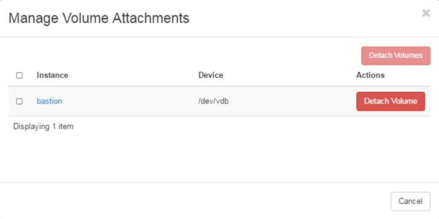

4. Retype the volume by following the steps in [Retyping an independent volume](#retyping-an-independent-volume).

5. On the *Volumes* page, for the volume that you want to reattach, from the list on the far right, select **Manage Attachments**.

6. In the *Manage Volume Attachments* dialog box, from the **Attach to Instance** list, select the instance to which you want to reattach the volume and click the **Attach Volume** button.

    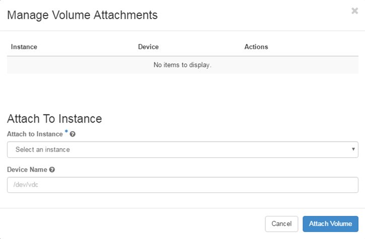

> [!NOTE]
> If you attempt to retype a volume that is still attached to an instance, the process will attempt to run but will fail without notification.

#### Retyping an independent volume

If the volume that you want to retype is not attached to an instance, you can retype it.

1. Ensure that the volume is detached from any instances.

    For information about how to detach an volume from an instance, see [Retyping a volume attached to an instance](#retyping-a-volume-attached-to-an-instance).

2. In the Horizon dashboard, expand the **Compute** menu on the left side of the screen and select **Volumes**.

3. On the *Volumes* page, for the volume that you want to retype, from the list on the far right of the page, select **Change Volume Type**.

    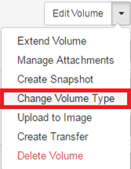

4. In the *Change Volume Type* dialog box, from the **Type** drop down list, select the new type for the volume.

5. From the **Migration Policy** list, ensure that you select **On Demand**.

    > [!NOTE]
    > If any other option is selected, the retyping process will not work.

    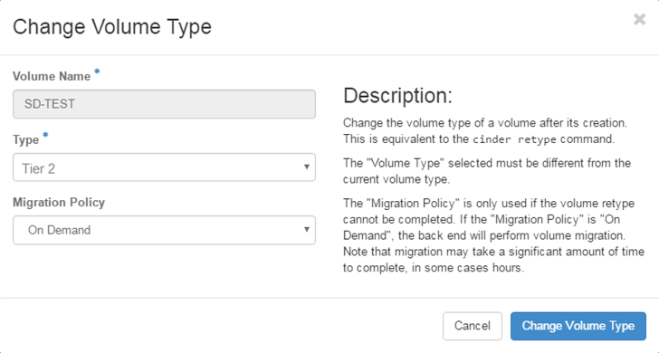

6. Click **Change Volume Type**.

    > [!NOTE]
    > You may notice duplicate volumes while the retyping process is running. These duplicate volumes will disappear when the process has completed.

    > [!IMPORTANT]
    > Do not attach a retyped volume to an instance until the retyping process has completed successfully.

#### Retyping an independent volume using the OpenStack CLI

To retype a volume using the OpenStack CLI, use the following command:

    \> cinder retype *volume* *volume-type*

Where:

- *`volume`* is the name or ID of the volume that you want to retype

- *`volume-type`* is the new volume type

## Working with the API and automation

### Using the OpenStack Heat orchestration tool to create stacks

OpenStack provides an orchestration tool out of the box. The Heat tool enables you to describe your infrastructure as a text file, referred to as a *Heat template*, defining one or more resources using a YAML format. Having defined your resources in your Heat template, you then
use the template to create a *stack*. The stack contains the instantiation of the resources defined in the YAML file, along with a history of events and operations that have happened to the resources in the stack.

For an example of what a basic Heat template looks like, take a look at <https://github.com/UKCloud/automation_examples/blob/master/heat/example.yaml>

The example.yaml template creates the same router, network, subnet and router interface that you created manually above. In addition, the template defines an SSH key pair, security groups and launch instances. We'll look at these other resource elements in more detail later.

To use a template to create a stack in your project:

1. In the Horizon dashboard, expand the **Orchestration** menu on the left side of the screen and select **Stacks**.

    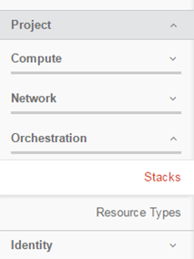

2. On the *Stacks* page, click the **Launch Stack** button.

    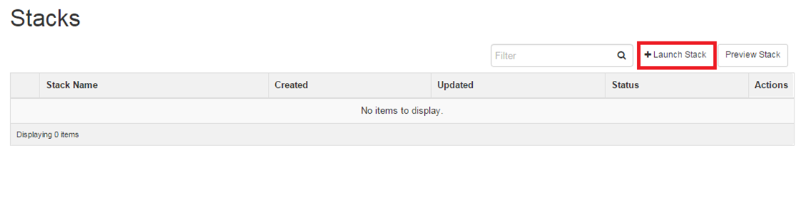

3. On the *Select Template* page, from the **Template Source** list, select **URL**.

4. In the **Template URL** field, enter the URL of the Raw version of the template that you want to use (for example, the example.yaml template).

    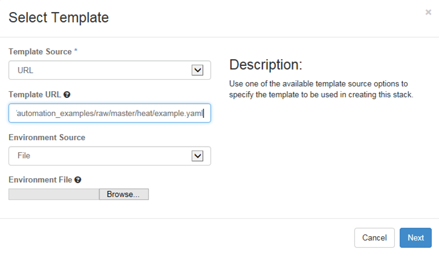

5. Click **Next**.

6. On the *Launch Stack* page, enter a **Stack Name** and select the **flavour** and **image** as required.

    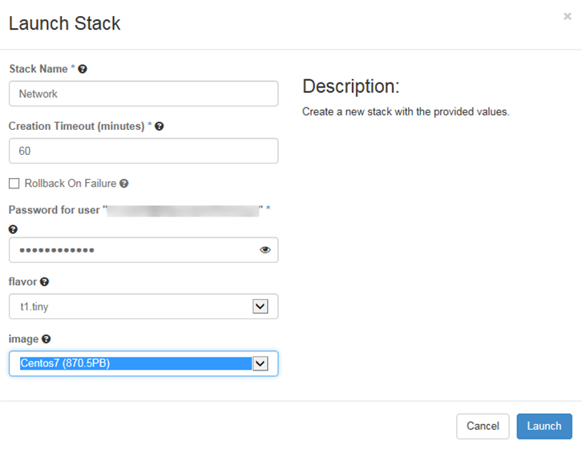

7. Click **Launch** to start creating the stack resources in the background.

    You can go back to the *Stacks* page to view progress, drill down into the resources defined in the stack and see the events as they happen.

You can also use an updated Heat template to apply an update to resources in a stack. You can also destroy an entire stack, cleaning up all the resources that you previously created. This makes Heat a very powerful tool for creating short‑lived test and preproduction environments on‑demand that may form part of a continuous delivery pipeline.

## Using the OpenStack API and automation

OpenStack also provides a fully functional API to enable programmatic control over your project. The Horizon UI you used earlier is itself a client that makes calls to this underlying API.

Although you can write your own code to interact with the API, there are a number of different libraries already available covering most popular programming languages.

Alternatively, there is also a growing number of DevOps automation tools available (for example, Terraform and Ansible) that interact with the OpenStack API to orchestrate the creation and ongoing management of your infrastructure.

For an example Terraform configuration to create a similar network infrastructure to the one you created in the previous examples, take a look at <https://github.com/UKCloud/automation_examples/tree/master/terraform-os>.

Whatever library or automation tools you choose to use, you'll need to know a few important details to make a connection to and authenticate against the API.

1. In the Horizon dashboard, expand the **Compute** menu on the left side of the screen and select **Access & Security**.

    

2. On the *Access and Security* page, select the *API Access* tab.

3. On the *API Access* tab, you can see all the relevant API endpoints for making connections to the various OpenStack subsystems, including the **Identify** endpoint, which provides the initial authentication process, that you'll typically need when configuring connections.

    You can also download your user's OpenStack RC file for use in the following section.

    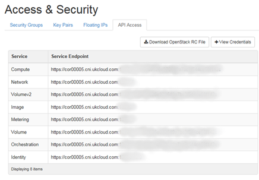

## Using the OpenStack command-line client

The OpenStack project provides a command‑line client that enables you to access the project API through easy‑to‑use commands. For example, the Compute service provides a NOVA command‑line client.

You can run the commands from the command line, or include the commands in scripts to automate tasks. If you provide OpenStack credentials, such as your user name and password, you can run these commands on any computer.

The following file is a bash shell script format file that sets up all the relevant environment variables in the Linux shell session so that you can use the OpenStack CLI tools. The OpenStack CLI tools, just like the Horizon UI, also communicate with the OpenStack API. This means you
can examine the contents of the RC file to find the settings that you may need to pass into, for example, a Terraform provider definition when configuring it to manage your OpenStack project.

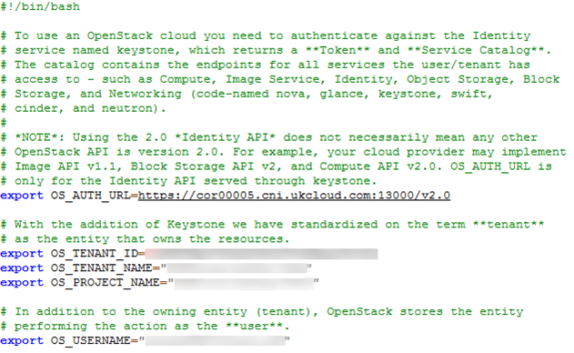

The key values to note here are the `OS\_AUTH\_URL`, `OS\_TENANT\_NAME` and `OS\_USERNAME` environment variables, as these will be common to any API authentication request.

In addition, creating the line export `OS\_INTERFACE=public` in the RC file should address any issues you may have accessing the Admin API endpoints.

## Next steps

In this Getting Started Guide, you've learned how to use the OpenStack Horizon UI to set up UKCloud for OpenStack and create new instances. You've also learned about the other tools available including the OpenStack API and command-line client.

You can find additional information in the following places:

- **OpenStack API** --- For more information about using the API, see the OpenStack documentation at <http://developer.openstack.org/api-guide/quick-start/>

- **OpenStack Client** --- For more information about using the OpenStack Client, see the OpenStack documentation at <http://docs.openstack.org/user-guide/cli.html>

- **HEAT templates** --- You can find more information about the Heat orchestration tool and the resources you can use in the YAML format templates in the OpenStack documentation at <https://wiki.openstack.org/wiki/Heat> and <http://docs.openstack.org/developer/heat/template_guide/index.html>

- **Terraform** --- For information about using Terraform and the OpenStack provider, see the Terraform documentation at <https://www.terraform.io/intro/> and <https://www.terraform.io/docs/providers/openstack/index.html>

- **Ansible** --- For information on Ansible's support for working with OpenStack resources, see the Ansible documentation at <http://docs.ansible.com/ansible/list_of_cloud_modules.html#openstack>

## Related videos

- [OpenStack Horizon dashboard overview](https://vimeo.com/305934797)

## Glossary

This section provides a glossary of terms specific to UKCloud for OpenStack.

**UKCloud for OpenStack**&nbsp;&nbsp;A UKCloud IaaS service that provides a cloud platform specifically designed around the needs of digital communities, and engineered to facilitate true cloud-native applications.

**ephemeral storage**&nbsp;&nbsp;A UKCloud for OpenStack storage option that exists only as long as the associated OpenStack instance exists.

**flavor**&nbsp;&nbsp;An OpenStack construct that defines how many vCPUs, how much memory and
how much storage an instance may use.

**floating IP address**&nbsp;&nbsp;A public routable address that is allocated to your project and can then be associated to an instance to route external traffic to the instance.

**Heat template**&nbsp;&nbsp;A YAML‑formatted text file that defines your infrastructure.

**image**&nbsp;&nbsp;A file containing a virtual disk with a bootable operating system, used
to create virtual machine instances within UKCloud for OpenStack.

**instance**&nbsp;&nbsp;A customer provisioned compute resource within OpenStack, similar to the
virtual machine concept within VMware.

**persistent volume storage**&nbsp;&nbsp;A UKCloud for OpenStack block storage option that is always available, regardless of the state of the VM.

**private key**&nbsp;&nbsp;The part of the SSH key pair that your SSH client uses to authenticate
with an instance.

**public key**&nbsp;&nbsp;The part of the SSH key pair that is stored in the instance.

**security group**&nbsp;&nbsp;An OpenStack construct that consists of one or more rules that control access to an instance.

**SSH key pair**&nbsp;&nbsp;A method of authentication used by OpenStack to authenticate access to instances that includes a public key and a private key. The SSH client uses a private key that is paired to a public key in the instance.

**stack**&nbsp;&nbsp;An OpenStack construct that contains the resources created from a Heat
template.

**volume**&nbsp;&nbsp;A persistent storage option backed by a Ceph storage array that is
network mounted onto the host hypervisor.

## Feedback

If you have any comments on this document or any other aspect of your UKCloud experience, send them to <products@ukcloud.com>.
