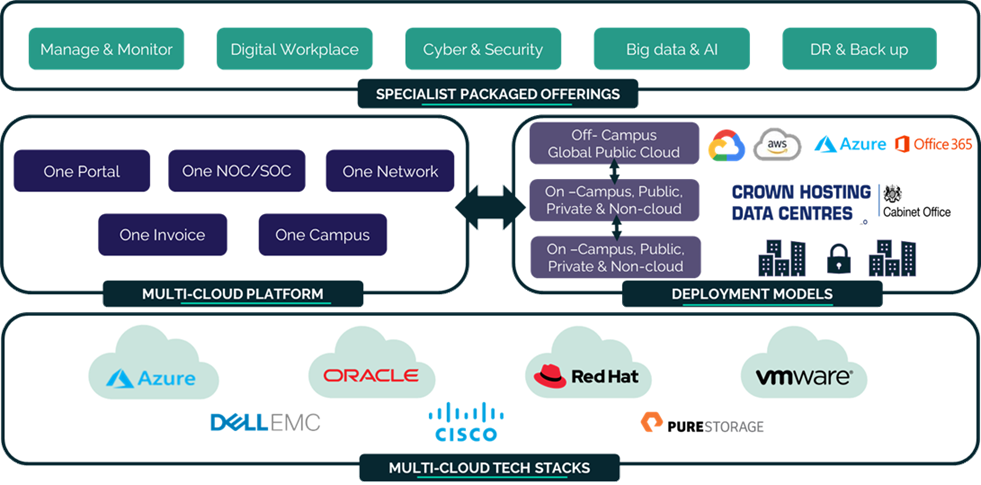

# UKCloud for OpenStack

<!-- begin Tagline -->

  

    
<strong>Develop agile cloud native workloads underpinned by open source technology</strong>

  

<!-- end Tagline -->

<!-- begin Introduction -->

  
 
    <!-- brief introduction -->
    
UKCloud for OpenStack provides you with all the tools you need to modernise legacy workloads and kick-start your journey to cloud-native. By hosting your applications on our government-grade platform, you can start to deliver a true cloud-native experience for your most secure and sensitive systems. Enjoy the benefits of elastic infrastructure as code and rapid deployment times with UKCloud for OpenStack.

    <!-- the big picture - propositions -->
    
UKCloud for OpenStack takes your <a href="https://ukcloud.com/solutions/data-centre-modernisation/"><strong>data centre modernisation</strong></a> and <a href="https://ukcloud.com/solutions/digital-workplace/"><strong>digital transformation</strong></a> journeys to the next level. Start creating truly cloud-native applications that harness the latest <a href="https://ukcloud.com/solutions/public-sector-innovation/"><strong>innovative technologies</strong></a> and all the benefits of a <a href="https://ukcloud.com/solutions/secure-cloud/"><strong>secure</strong></a> and <a href="https://ukcloud.com/solutions/sovereign-cloud/"><strong>sovereign cloud</strong></a>.

  

  

    

      <iframe src="https://www.youtube.com/embed/KyL_yHNjkqI" style="position:absolute;top:0;left:0;width:100%;height:100%;"title="YouTube video player" frameborder="0" allow="accelerometer; autoplay; clipboard-write; encrypted-media; gyroscope; picture-in-picture" allowfullscreen></iframe>
    

  

<!-- end Introduction -->

<!-- begin Getting Started -->

  

    <h2>Let's get started!</h2>
  

  

    
For a general product overview, including benefits, product options and packaging information, see the <a href="https://ukcloud.com/app/uploads/2022/08/ukc-svc-242-ukcloud-for-openstack-service-definition-13.0.pdf"><strong>Service Definition</strong></a>. If you need more in-depth product details, see the <a href="ostack-sco.md"><strong>Service Scope</strong></a>.

    
The <a href="ostack-gs.md"><strong>Getting Started Guide</strong></a> provides an overview of the functionality available with UKCloud for OpenStack and introduces some of the key concepts and tasks, including setting up your infrastructure and security and launching instances.

  

<!-- end Getting Started -->

<!-- begin List of Articles -->

  

    <h2>Key topics</h2>
  

  

    
Once you understand the basics of UKCloud for OpenStack, take a look at the articles listed below to get an idea of what else you can do.

  

  

    
<strong>Working with instances</strong>

  

  

    
<strong>Working with networks</strong>

  

  

    
<strong>Automation and orchestration</strong>

  

  

    
<a href="ostack-how-static-ip.md">Create static IPs for OpenStack instances</a>

    
<a href="ostack-how-recover-instance.md">Manage how your instance recovers from a host failure</a>

    
<a href="ostack-how-cloud-config.md">Configure an instance using cloud-config</a>

    
<a href="ostack-how-convert-vms.md">Convert virtual machines</a>

    
<a href="ostack-how-install-rhui.md">Install RHUI on an existing OpenStack instance</a>

    
<a href="ostack-how-use-instance-metadata.md">Use OpenStack instance metadata</a>

    
<a href="ostack-ref-public-image-versioning.md">OpenStack public image versioning</a>

    
<a href="ostack-ref-live-migration.md">Live migrations</a>

  

  

    
<a href="ostack-how-configure-ipsec-vpn.md">Configure IPsec VPN in OpenStack</a>

    
<a href="ostack-how-use-octavia.md">Use Octavia Load Balancing as a Service</a>

  

  

    
<a href="ostack-how-create-heat-template.md">Create and deploy a basic Heat template</a>

    
<a href="ostack-ref-cli-clients.md">Command-line clients for UKCloud for OpenStack</a>

    
<a href="ostack-ref-auto-scaling.md">Auto Scaling for UKCloud for OpenStack</a>

    
<a href="ostack-how-use-api-sso.md">Use the OpenStack API with an SSO user</a>

    
<a href="ostack-how-use-cli.md">Use the OpenStackClient on Microsoft operating systems</a>

  

  

    
<strong>Managing workloads</strong>

  

  

    
<strong>Security</strong>

  

  

    
<strong>Working with backups</strong>

  

  

      
<a href="ostack-how-share-images.md">Share images between projects</a>

      
<a href="ostack-how-transfer-volumes.md">Transfer volumes between projects</a>

      
<a href="ostack-how-move-resources.md">Move resources between OpenStack regions</a>

      
<a href="ostack-ref-migrations.md">OpenStack region migration tooling</a>

      
<a href="ostack-how-use-hystax.md">Migrate workloads on OpenStack using Hystax Acura</a>

  

  

      
<a href="ostack-how-use-barbican.md">Use Barbican Key Management as a Service</a>

      
<a href="ostack-how-manage-accounts-portal.md">Manage UKCloud for OpenStack accounts in the UKCloud Portal</a>

      
<a href="ostack-how-retrieve-windows-password.md">Retrieve your Windows password on UKCloud for OpenStack</a>

  

  

      
<a href="ostack-how-use-triliovault.md">Use TrilioVault for self-service backup</a>

  

<!-- end List of Articles -->

<!-- begin Find More -->

  

    <h2>Want to know more?</h2>
  

  

    
Find answers to common questions in our UKCloud for OpenStack <a href="ostack-faq.md"><strong>FAQ</strong></a>. Use the table of contents on the left to browse all UKCloud for OpenStack articles or use the search box at the top to search the whole Knowledge Centre.

    
For more information about UKCloud and how we work, browse our <a href="https://ukcloud.com/"><strong>website</strong></a>.

  

<!-- end Find More -->

<!-- begin Videos -->

  

    <h2>See it in action</h2>
  

  

    

      <iframe src="https://www.youtube.com/embed/XcQYz--CNiM" style="position:absolute;top:0;left:0;width:100%;height:100%;" frameborder="0" allow="accelerometer; autoplay; encrypted-media; gyroscope; picture-in-picture" allowfullscreen></iframe>
    

    
<a href="https://www.youtube.com/watch?v=XcQYz--CNiM">OpenStack Horizon Dashboard Overview</a>

  

  

    

      <iframe src="https://www.youtube.com/embed/c471rZ2euHQ" style="position:absolute;top:0;left:0;width:100%;height:100%;" frameborder="0" allow="accelerometer; autoplay; encrypted-media; gyroscope; picture-in-picture" allowfullscreen></iframe>
    
  
    
<a href="https://www.youtube.com/watch?v=c471rZ2euHQ">OpenStack Self-Service Backup and Restoration (TrilioVault)</a>

  

  

  

<!-- end Videos -->

<!-- begin How to Buy -->

  

    <h2>How to buy</h2>
  

  

    
The <a href="https://ukcloud.com/pricing-guide"><strong>UKCloud Pricing Guide</strong></a> lists all our product pricing. For examples of how pricing works for UKCloud for OpenStack, take a look at our <a href="ostack-ref-pricing.md"><strong>Pricing information</strong></a> article.

    
If you're interested in buying UKCloud for OpenStack, or would like a quote:

  

  

    
<strong>If you're already a UKCloud customer</strong>

    
Raise a Service Request, contact your Service Delivery Manager or email <a href="mailto:servicedelivery@ukcloud.com"><strong>servicedelivery@ukcloud.com</strong></a>

  

  

    
<strong>If you're new to UKCloud</strong>

    
<a href="https://ukcloud.com/contact/"><strong>Contact us</strong></a> via our website or call us on 01252 303 300

  

<!-- end How to Buy -->

<!-- begin Additional Products -->

  

    <h2>Additional options</h2>
  

  

    
To get the most out of our platform, see below for some additional options and products you might want to consider using with UKCloud for OpenStack (additional charges apply).

  

  

    
<strong>Product options</strong>

  

  

    
<strong>Complementary products</strong>

  

  

      
<a href="ostack-sco-triliovault.md"><strong>Self Service Backup and Restoration (TrilioVault).</strong></a> On-platform self-service backup and restoration for OpenStack.

      
<a href="ostack-sco-hystax.md"><strong>Hystax Acura Workload Migration.</strong></a> Migrate workloads between UKCloud for OpenStack regions.

      
<a href="../other/other-ref-storage-overview.md"><strong>Tier 1 storage.</strong></a> Improved performance for workloads requiring higher disk throughput and IOPS.

  

  

      
<a href="https://ukcloud.com/app/uploads/2022/08/ukc-svc-251-managed-it-operations-service-definition-13.0.pdf"><strong>Managed IT Operations.</strong></a> Reduce the amount of time spent on managing your IT infrastructure.

      
<a href="https://ukcloud.com/app/uploads/2022/08/ukc-svc-239-security-operations-service-service-definition-13.0.pdf"><strong>Security Operations Service.</strong></a> People, processes and tooling to assist with cyber monitoring capabilities.

      
<a href="https://ukcloud.com/app/uploads/2022/08/ukc-svc-232-ukcloud-professional-services-service-definition-13.0-1.pdf"><strong>Professional Services.</strong></a> Help with solution design and digitisation projects.

      
<a href="https://ukcloud.com/app/uploads/2022/08/ukc-svc-230-cross-domain-security-zone-service-definition-13.0-1.pdf"><strong>Cross Domain Security Zone.</strong></a> Enable data communication between assured and elevated security domains.

      
<a href="https://ukcloud.com/app/uploads/2022/08/ukc-svc-236-private-cloud-service-definition-13.0.pdf"><strong>Private Cloud.</strong></a> For workloads that require custom configurations, such as large instances, or complex licensing requirements.

      
<a href="https://ukcloud.com/app/uploads/2022/08/ukc-svc-229-cloud-storage-service-definition-13.0-2.pdf"><strong>Cloud Storage.</strong></a> Cost effective unstructured object storage for data archive.

  

  

    
If you want to find out more about any of these options or products, contact your Service Delivery Manager or email <a href="mailto:servicedelivery@ukcloud.com"><strong>servicedelivery@ukcloud.com</strong></a>

  

<!-- end Additional Products -->

<!-- begin Why UKCloud -->

  

    <h2>Why UKCloud?</h2>
  

  

    
<strong><a href="https://ukcloud.com/our-platform/">The right cloud for every platform.</a></strong> Modernise legacy workloads across the board by rehosting traditional systems with UKCloud for VMware or exploring new and emerging technologies with OpenShift. We can help you build a cloud specific to your needs.

  

  

    
<strong><a href="https://ukcloud.com/ukcloud-support/customer-experience/">An award-winning customer experience.</a></strong> The customer sits at the heart of everything we do. Whether that's through our 24/7 support function – a service we provide at no extra charge – or by giving every single one of our customers a dedicated Service Delivery Manager.

  

  

    
<strong><a href="https://ukcloud.com/sectors/">Dedicated to the public sector.</a></strong> From our unique assurance and connectivity options to the people we employ &ndash; everything we do comes back to our mission to help public sector organisations deliver better digital services at a lower cost.

  

  

    
<strong><a href="https://ukcloud.com/governance/">Uncompromising security and integrity.</a></strong> Our UK-based data centres help protect your organisation from regulations such as GDPR, whilst our unique assurance and connectivity options enable you to move your most secure and sensitive systems to the cloud.

  

  

    
<strong><a href="https://ukcloud.com/solutions/public-sector-innovation/">Champions of innovation.</a></strong> We've partnered with over 300 specialist organisations who have built their pioneering digital services on top of our government-grade infrastructure. From AI to RPA, our partner ecosystem has you covered.

  

  

    
<strong><a href="https://ukcloud.com/why-ukcloud/social-value-overview/">Committed to doing the right thing.</a></strong> From paying our taxes to undergraduate and apprentice programmes. From Carbon Neutral solutions to charity work. Everything we do can be traced back to our commitment to doing the right thing.

  

  

    
  

<!-- end Why UKCloud -->

<!-- begin Feedback -->

  

    <h2>Get in touch</h2>
  

  

    
  

<!-- end Feedback -->
