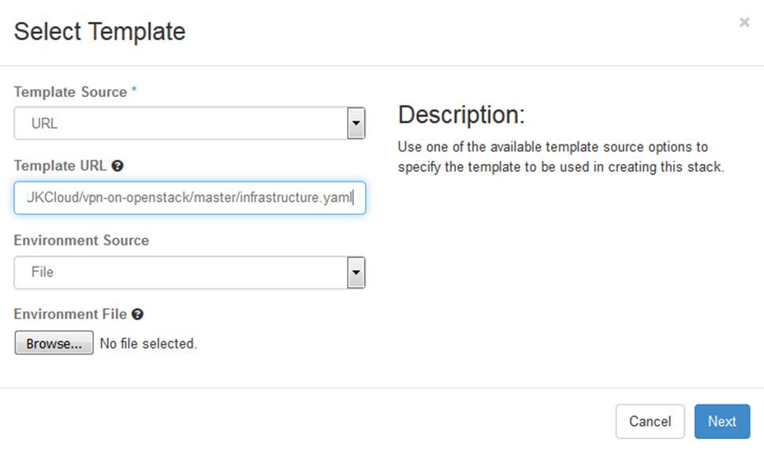
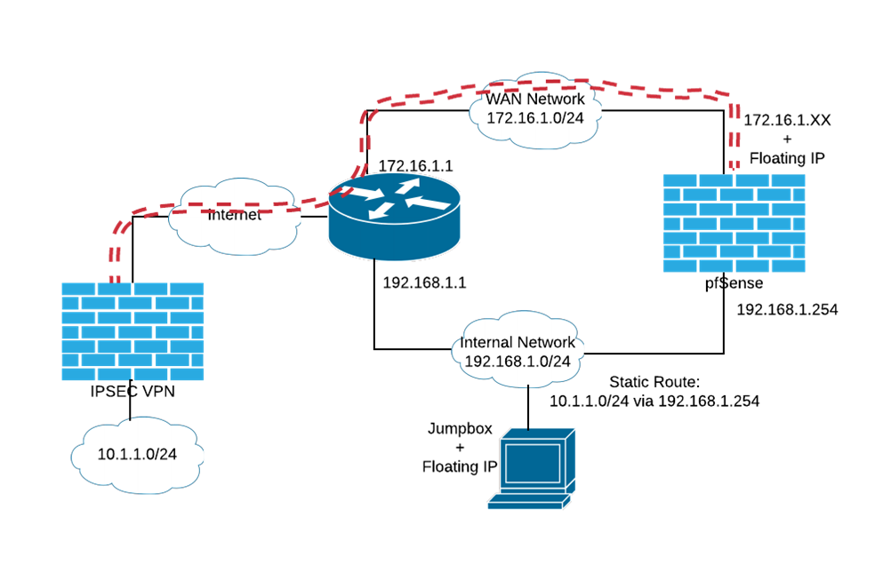
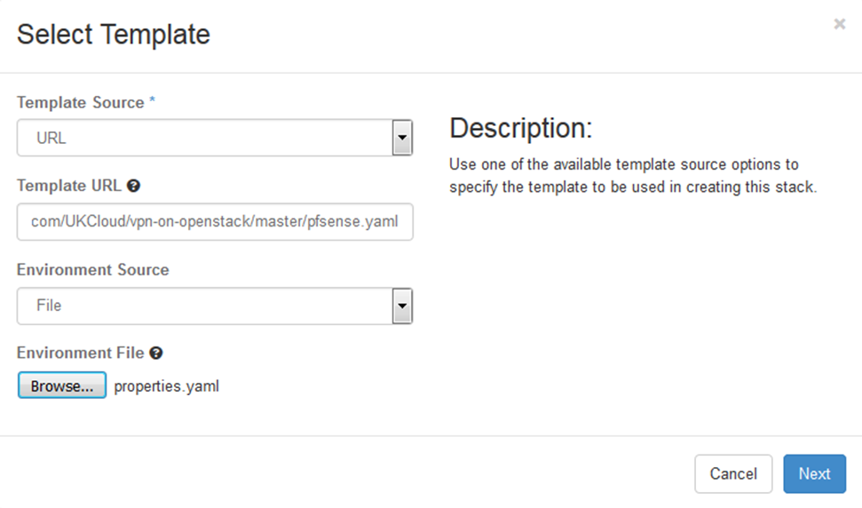
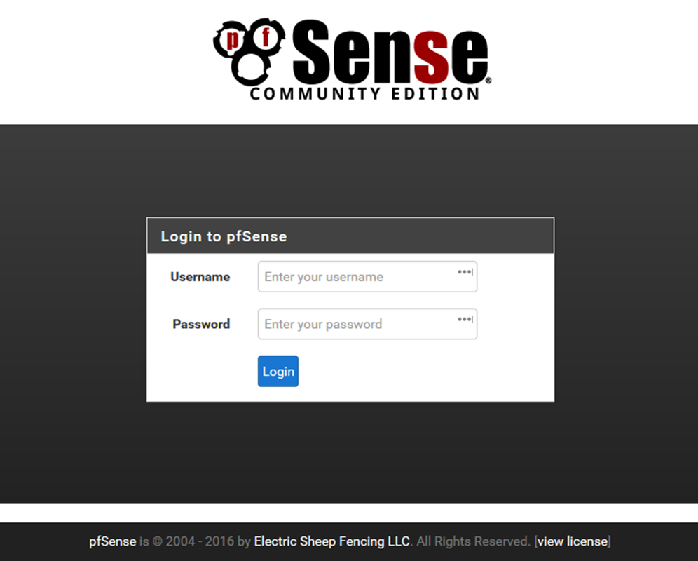
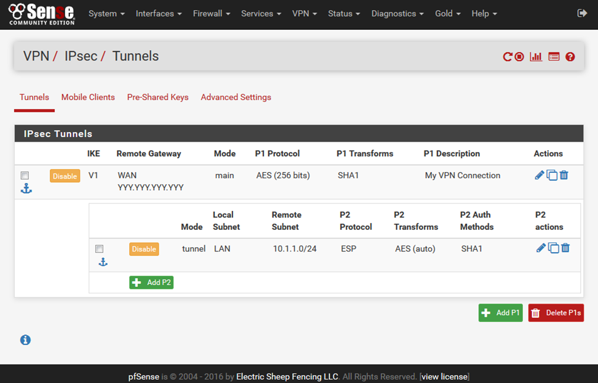
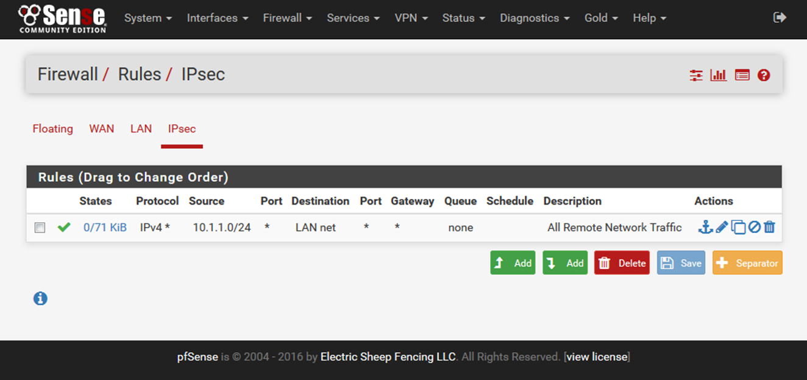
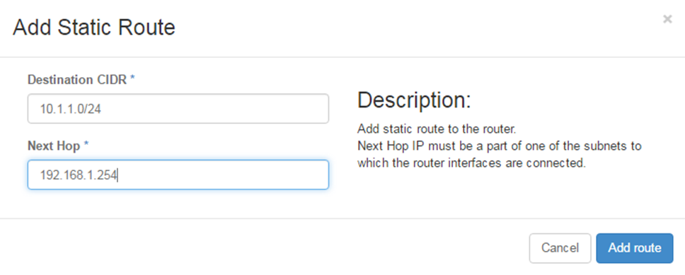
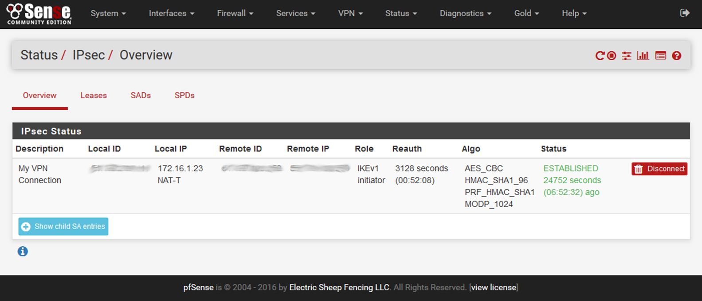

# How to configure IPsec VPN in OpenStack

## Overview

This article provides instructions for deploying an instance into your OpenStack project to function as a VPN endpoint, enabling secure connection:

- To other projects

- To vCloud Director VDCs

- Back to your own infrastructure in-house

## Before you begin

This article uses a pfSense virtual firewall appliance to provide the IPsec VPN endpoint. UKCloud provides a UKCloud for OpenStack image for the pfSense appliance in the public catalog, however, you can upload your own image if you prefer.

You can find the HEAT templates and other files used in this article in the UKCloud GitHub repository at <https://github.com/UKCloud/vpn-on-openstack>.

The repository contains the following:

- `pfsense.yaml` - A HEAT template to deploy all the resources needed for an IPsec VPN endpoint

- `properties.yaml` - The HEAT parameters used with the `pfsense.yaml` template

- `infrastructure.yaml` - A sample HEAT template to deploy all the prerequisite infrastructure used by the `pfsense.yaml` template

- `vshield-configuration-yaml` - A sample configuration to set up a edge gateway as an IPsec endpoint on a VDC

### Network infrastructure requirements

The `pfsense.yaml` HEAT template used in this article assumes that you've already started deploying network resources and instances in your OpenStack project, and that you now want to set up an IPsec VPN tunnel to connect your project to external resources.

It assumes that the following resources already exist:

- A network and subnet on which you're creating instances

- A router to connect your subnet to your internet-facing external network

- An SSH keypair used to create instances

- A jumpbox or bastion Linux server instance created on your subnet

- A floating IP address allocated and assigned to your jumpbox instance

- A security group allowing inbound SSH access to your jumpbox instance

If you've not already created these resources, we've provided a sample HEAT template (`infrastructure.yaml`) in the GitHub repository to get you started. This template creates the resources listed above for you, including an internal network with the subnet `192.168.1.0/24` that uses:

- An allocation pool of `192.168.1.20-192.168.1.200`

- Google's public DNS server: `8.8.8.8`

To deploy the `infrastructure.yaml` template, pass the following URL directly into the OpenStack Horizon dashboard:

`https://raw.githubusercontent.com/UKCloud/vpn-on-openstack/master/infrastructure.yaml`



Alternatively, you can clone the repository locally and use the OpenStack CLI to create the stack with the following command:

`openstack stack create --parameter flavor=t1.small --parameter image="CentOS 7" --wait -t infrastructure.yaml Infrastructure`

## Setting up the VPN stack

The pfSense appliance assumes that if will have at least two network interface controllers (NICs) attached to it: one attached to the WAN and one or more attached to internal networks. To fit this into an existing infrastructure deployed in your project, and to avoid any nasty routing loops, the `pfsense.yaml` HEAT template creates a new WAN network along with an interface on your existing router. This provides the WAN interface for pfSense and has a floating IP address associated with it for the internet-facing endpoint of the VPN tunnel.

The LAN interface of the pfSense appliance attaches to your existing internal network. Both WAN and LAN interfaces in the pfSense appliance image in the public catalog are configured for DHCP. This enables the interface to seamlessly configure against your existing infrastructure.



### Preparing your configuration

Use the `pfsense.yaml` and `properties.yaml` files provided in the UKCloud GitHub repository to prepare your infrastructure.

1. If you haven't already done so, clone or take a copy of the repository on the UKCloud GitHub:

    <https://github.com/UKCloud/vpn-on-openstack>

2. Update the `properties.yaml` files to suit your deployed infrastructure.

    For example, if you used the `infrastructure.yaml` HEAT template provided to build your core infrastructure, the properties should look similar to the following:

    ```none
    parameters:
      key_name: jumpbox_key
      pfsense_flavor: t1.tiny
      router: InternetGW
      internal_network: Internal
      internal_address: 192.168.1.254
      internal_net_cidr: 192.168.1.0/24
      remote_net_cidr: 10.1.1.0/24
    ```

    where:

    - `InternetGW` is the name of your router

    - `Internal` is the name of your existing network

    - `internal_address` is the address on your existing network that will be assigned to the LAN interface on the appliance

> [!NOTE]
> The `pfsense.yaml` HEAT template assumes that your VPN tunnel is connecting to only a single remote network. If you need to route to multiple remote networks, after completing the deployment, you'll need to follow a few more configuration steps. For more information, ask to speak to one of our DevOps consultants or Cloud Architects.

### Launching the stack

Use the OpenStack CLI tools to launch the stack by running the following command:

`openstack stack create --enable-rollback -t pfsense.yaml -e properties.yaml --wait VPNStack`

You can also launch the stack through the Horizon dashboard by selecting the `pfsense.yaml` and `properties.yaml` files appropriately when prompted.



## Creating the VPN tunnel

### Connecting to the pfSense UI

When the HEAT template has finished deploying your VPN stack, connect to the pfSense appliance to configure the IPsec tunnel. You can perform some configuration steps through the OpenStack console, or an SSH connection to the appliance, however, most configuration is via the pfSense web UI. The pfSense UI only listens on its LAN interface, so you cannot use it directly via the internet-facing floating IP address on its WAN interface.

1. Connect to the pfSense UI using SSH port forwarding to tunnel a connection through the jumpbox server connected to the internal network, onto the LAN interface of the pfSense appliance.

    With a command line SSH client, you would typically run the following command:

    `ssh -i ~/.ssh/jumpbox.pem -l jumpboxuser -L 80:192.168.1.254:80 <jumpbox floating IP address>`

    where:

    - `192.168.1.254` is the address allocated to the LAN interface of the appliance

    If you're using a Windows desktop, you may want to try using PuTTY for the SSH port forwarding.

2. Browse to `http://localhost/` to open the pfSense *Login* page.

    

3. Log in with:

    - **Username:** `admin`

    - **Password:** If you're using the image provided by UKCloud, the default password is `Password123#`

    > [!IMPORTANT]
    > You should change the default password when you first log in.

### Setting up your IPsec tunnel

For the purposes of this article, we're assuming the following tunnel configuration. You'll need to substitute your own values accordingly:

```none
OpenStack Network    pfSense                      VPN Endpoint               Remote Network
-----------------    -------                      ------------               --------------
                     LAN: 192.168.1.254           LAN: 10.1.1.1
192.168.1.0/24 <---> WAN: 172.16.1.XXX <--------> WAN: YYY.YYY.YYY.YYY <---> 10.1.1.0/24
                     Floating IP: XXX.XXX.XXX.XXX

Pre-shared Key: D3v0psD3m0D3v0psD3m0D3v0psD3m0D3v0psD3m0
```

1. From the menu, select **VPN > IPsec**.

2. On the *Tunnels* tab, click the **Add P1** button to start configuring this endpoint of the tunnel.

3. In the *Edit Phase 1* page, set the following values:

    - **Remote Gateway:** YYY.YYY.YYY.YYY

    - **Description:** My VPN Connection

    - **My identifier:** IP Address XXX.XXX.XXX.XXX

    - **Peer identifier:** IP Address: YYY.YYY.YYY.YYY

    - **Pre-Shared Key:** D3v0psD3m0D3v0psD3m0D3v0psD3m0D3v0psD3m0

4. Save the settings.

5. Click the **Add P2** button to complete the rest of the tunnel configuration.

6. In the *Edit Phase 2* page, set the following values:

    - **Local Network:** LAN subnet

    - **NAT/BINAT translation:** None

    - **Remote Network:** Network 10.1.1.0/24

    - **Description:** My remote network

7. Save the settings.

    The *Tunnels* page should now look something like the following:

    

### Creating a firewall rule to allow routing of returning traffic

The default firewall rules allow outbound traffic from the LAN network. This is sufficient to enable the IPsec tunnel to be established and to also allow traffic from the internal network to be routed across the tunnel. However, to allow returning traffic from the remote network to be routed back to the LAN network, you need to add a new firewall rule.

1. From the menu, select **Firewall > Rules**.

2. Select the **IPsec** tab.

    For this article, since we're trusting all traffic from the LAN network to the remote network, we just need to add a single rule to accept all traffic from the remote network back into the LAN network. In your environment, you'll probably want to be more specific with your rule definitions.

3. Click one of the **Add** buttons and set the following values:

    - **Action:** Pass

    - **Interface:** IPsec

    - **Protocol:** any

    - **Source:** Network 10.1.1.0/24

    - **Destination:** LAN net

    - **Description:** Allow all remote traffic

4. Save the rule.

    The IPsec tab should now look something like the following:

    

### Configuring a static route for the remote network

The last thing to do to configure your OpenStack project to be able to connect to a remote network over the IPsec VPN is to update your router configuration to add a static route that redirects traffic for the remote network via the pfSense appliance. You can do this by editing the router in the Horizon dashboard, specifying the remote network and the LAN interface of the pfSense appliance.



Alternatively, you can define the same static route using the OpenStack CLI:

'openstack router set --route destination=10.1.1.0/24,gateway=192.168.1.254 InternetGW`

## Configuring the second endpoint

At this point, you now want to ensure that the other end of the VPN tunnel is also configured. If you are connecting two OpenStack projects, you can repeat the steps above to deploy another pfSense appliance into the remote project.

Connecting an IPsec tunnel to an edge gateway in a UKCloud for VMware environment can be problematic, as the vCloud Director web console doesn't set the local identifier correctly. You have to use a REST client against the vCloud Director API to manually correct the tunnel configuration. This process is documented in [*How to change IPsec VPN settings via the vCloud Director API*](../vmware/vmw-how-change-ipsec-vpn-api.md).

However, we also provide a Ruby script in our GitHub repository that you can use, with the `vshield-configuration.yaml` sample configuration file, to automate the interaction with the vCloud Director API to correctly set up the VPN endpoint from scratch, without having to use the web console. For more information about this script, see [here](https://github.com/UKCloud/ukcloud-vpn).

## Check the tunnel status

By now, if the configuration of both endpoints match, the IPsec tunnel should already have completed both Phase 1 and Phase 2 negotiations and have established a tunnel. You can check by selecting **Status > IPsec** from the menu.



## Feedback

If you find an issue with this article, click **Improve this Doc** to suggest a change. If you have an idea for how we could improve any of our services, visit [UKCloud Ideas](https://ideas.ukcloud.com). Alternatively, you can contact us at <products@ukcloud.com>.