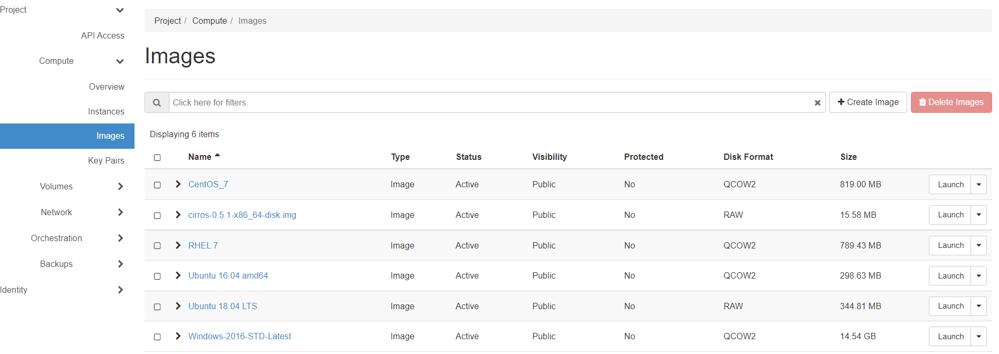

# How to convert virtual machines to run in OpenStack

## Overview

This article outlines the process for importing virtual machine (VM) images from other cloud or virtualisation platforms and run them on OpenStack's KVM hypervisor using the Linux `virt-v2v` tool.

### Intended audience

This article is intended for operators who have the capability to download a VM image from their current hypervisor and upload images to UKCloud's OpenStack service. In addition, this article assumes that operators are familiar with Linux and its command line.

## Supported conversions

You can use `virt-v2v` to convert VMs running the following operating systems to run on KVM:

| Guest OS                                       | RHEL 7 host                              | RHEL 8 host        |
|------------------------------------------------|------------------------------------------|--------------------|
| Red Hat Enterprise Linux 5                     | Supported                                | Not supported      |
| Red Hat Enterprise Linux 6                     | Supported                                | Supported          |
| Red Hat Enterprise Linux 7                     | Supported                                | Supported          |
| Red Hat Enterprise Linux 8                     | Not supported                            | Supported          |
| SUSE Linux Enterprise Server 11, SP4 and later | Supported on RHEL 7.7 and later          | Supported          |
| SUSE Linux Enterprise Server 12                | Supported                                | Supported          |
| SUSE Linux Enterprise Server 15                | Supported                                | Supported          |
| Windows 8                                      | Supported                                | Not supported      |
| Windows 8.1                                    | Supported                                | Not supported      |
| Windows 10                                     | Supported                                | Supported          |
| Windows Server 2008                            | Supported                                | Not supported      |
| Windows Server 2008 R2                         | Supported                                | Not supported      |
| Windows Server 2012                            | Supported                                | Not supported      |
| Windows Server 2012 R2                         | Supported                                | Not supported      |
| Windows Server 2016                            | Supported                                | Supported          |
| Windows Server 2019                            | Supported                                | Supported          |
| Debian                                         | Technology Preview in RHEL 7.4 and later | Technology Preview |
| Ubuntu                                         | Technology Preview in RHEL 7.4 and later | Technology Preview |

> [!NOTE]
> `virt-v2v` may convert VMs running other Linux operating systems, such as Debian and Ubuntu, but these conversions are not supported.
> 
> [!NOTE]
> As of January 2021 some operating systems are not supported for conversion on RHEL 8 but they are still supported on RHEL 7 as the table above shows.

Conversions from the following hypervisors are supported:

- Red Hat Enterprise Linux 5 Xen

- VMware vSphere ESX / ESX(i) - versions 6.0, 6.5, 6.7 and 7.0

> [!NOTE]
> Conversions from any hypervisor not listed above may in some cases work, but are not supported.

> [!NOTE]
> VMware appliances based on Photon OS are not supported and cannot be converted using `virt-v2v`.

## Converting virtual machines

1. Download the VM image from your source hypervisor (please see your local instructions on how to perform this).

2. Convert the source hypervisor image to an OpenStack KVM compatible image (QCOW2) using the following:

    - For general instructions on how to use the `virt-v2v` tool, see the following page on the Red Hat Customer Portal:

      [Converting VMs from other hypervisors to KVM with virt-v2v in RHEL 7 and RHEL 8](https://access.redhat.com/articles/1351473)

    - For specific instructions on how to export a guest VM from VMware as an OVA file and import it into KVM see the following page on the Red Hat Customer Portal:

      [Export a guest VM from VMware as an OVA file and import it into KVM](https://access.redhat.com/articles/1351963)

3. Upload your new QCOW2 image to OpenStack (Glance) using the following steps:

    a. Log in to the UKCloud OpenStack region to which you want to upload your image.

    b. Expand the **Compute** menu on the left side of the Horizon dashboard and select **Images**.

    

    c. Click the **Create Image** button.

    

    d. In the *Create Image* page, browse for the image you want to import, complete the rest of the details on the page, then click **Create Image**.

    

    e. Depending on the size of the image, the import process may take up to an hour to complete. You can view progress of the import from the Images page of the OpenStack dashboard.

4. When the import process is complete, you'll be able to use your newly imported image in the same way as any other image stored in OpenStack's image catalog (Glance).

> [!NOTE]
> The above instructions assume you're using RHEL 7 or RHEL 8 to run the `virt-v2v` tool, however you can install the `virt-v2v` tool on other Linux operating systems.

## Next steps

You can find more information about the `virt-v2v` tool on the official project page:

<https://libguestfs.org/virt-p2v.1.html>

If you're looking for a more managed migration service, you can engage with companies such as [Cloudbase Solutions](https://cloudbase.it/coriolis/).

## Feedback

If you find a problem with this article, click **Improve this Doc** to make the change yourself or raise an [issue](https://github.com/UKCloud/documentation/issues) in GitHub. If you have an idea for how we could improve any of our services, send an email to <feedback@ukcloud.com>.
