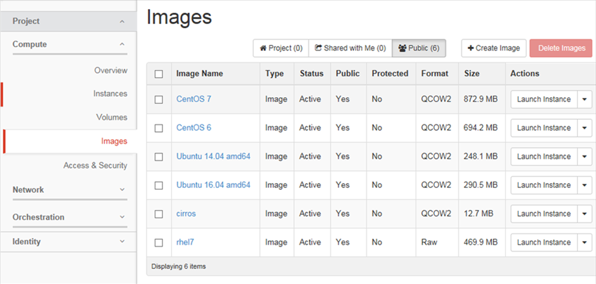
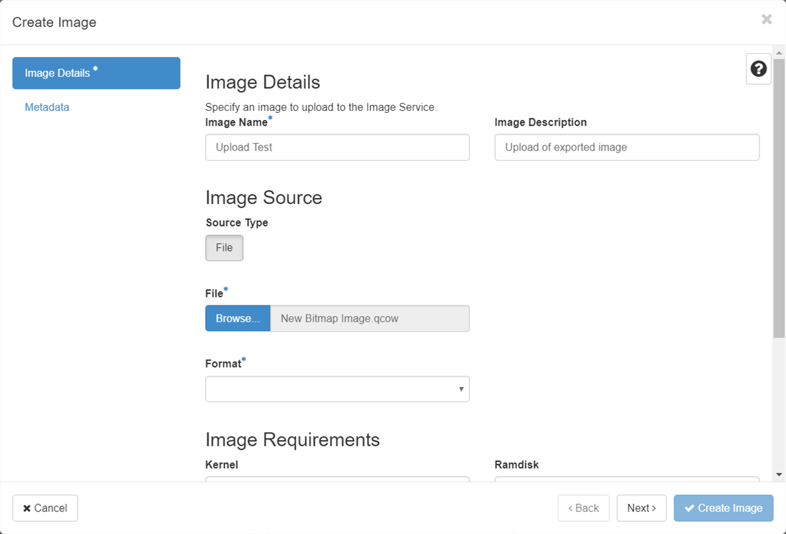

# How to convert virtual machines to run in OpenStack

## Overview

This article outlines the process for importing virtual machine (VM) images from other cloud or virtualisation platforms and run them on OpenStack's KVM hypervisor using the Linux `virt-v2v` tool.

### Intended audience

This article is intended for operators who have the capability to download a VM image from their current hypervisor and upload images to UKCloud's OpenStack service. In addition, this article assumes that operators are familiar with Linux and its command line.

## Supported conversions

You can use `virt-v2v` to convert VMs running the following operating systems to run on KVM:

- Red Hat Enterprise Linux 3.9

- Red Hat Enterprise Linux 4

- Red Hat Enterprise Linux 5

- Red Hat Enterprise Linux 6

- Red Hat Enterprise Linux 7.1 and later

- Windows XP

- Windows Vista

- Windows 7

- Windows 8

- Windows 8.1

- Windows 10

- Windows Server 2003

- Windows Server 2008

- Windows Server 2008 R2

- Windows Server 2012

- Windows Server 2012 R2

- Windows Server 2016

> [!NOTE]
> `virt-v2v` may convert VMs running other Linux operating systems, such as Debian and Ubuntu, but these conversions are not supported.

Conversions from the following hypervisors are supported:

- Red Hat Enterprise Linux 5 Xen

- VMware vSphere ESX / ESX(i) - versions 3.5, 4.0, 4.1, 5.0, 5.1, 5.5, 6.0, 6.5, 6.7

> [!NOTE]
> VMware appliances based on Photon OS are not supported and cannot be converted using `virt-v2v`.

## Converting virtual machines

1. Download the VM image from your source hypervisor (please see your local instructions on how to perform this).

2. Convert the source hypervisor image to an OpenStack KVM compatible image (QCOW2) using the following:

    - For general instructions on how to use the `virt-v2v` tool, see the following page on the Red Hat Customer Portal:

    [Converting Virtual Machines from Other Hypervisors to KVM with virt-v2v in RHEL 7](https://access.redhat.com/articles/1351473)

    - For specific instructions on how to export a guest VM from VMware as an OVA file and import it into KVM see the following page on the Red Hat Customer Portal:

    [Export a guest virtual machine from VMware as an OVA file and import it into KVM](https://access.redhat.com/articles/1351963)

3. Upload your new QCOW2 image to OpenStack (Glance) using the following steps:

    a. Log in to the UKCloud OpenStack region to which you want to upload your image.

    b. Expand the **Compute** menu on the left side of the Horizon dashboard and select **Images**.

    

    c. Click the **Create Image** button.

    

    d. In the *Create Image* page, browse for the image you want to import, complete the rest of the details on the page, then click Create Image.

    

    e. Depending on the size of the image, the import process may take up to an hour to complete. You can view progress of the import from the Images page of the OpenStack dashboard.

4. When the import process is complete, you'll be able to use your newly imported image in the same way as any other image stored in OpenStack's image catalog (Glance).

> [!NOTE]
> The above instructions assume you're using RHEL 7 to run the `virt-v2v` tool, however you can install the `virt-v2v` tool on other Linux operating systems.

## Next steps

You can find more information about the `virt-v2v` tool on the official project page:

<http://libguestfs.org/virt-p2v.1.html>

If you're looking for a more managed migration service, you can engage with companies such as [Cloudbase Solutions](https://cloudbase.it/coriolis/).

## Feedback

If you find an issue with this article, click **Improve this Doc** to suggest a change. If you have an idea for how we could improve any of our services, visit [UKCloud Ideas](https://ideas.ukcloud.com). Alternatively, you can contact us at <products@ukcloud.com>.