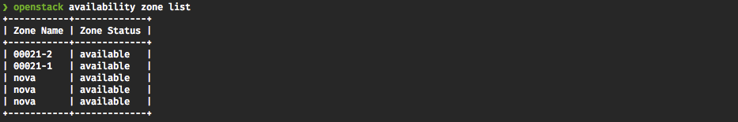
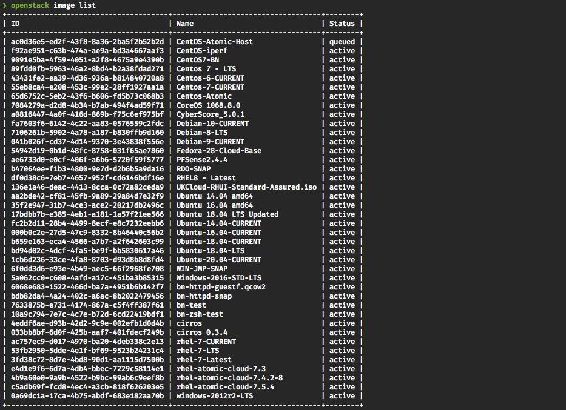
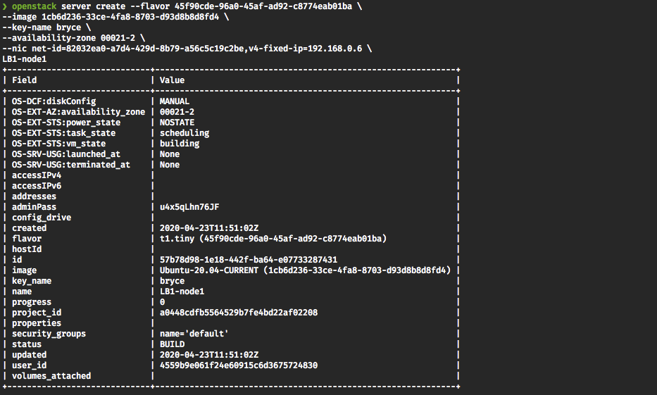
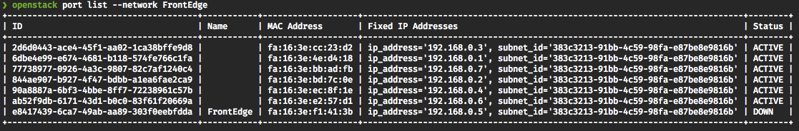

# Creating load-balancing services on UKCloud for OpenStack

> [!NOTE]
> This article only applies to OpenStack Regions running the Newton release and lower (currently COR00005 and FRN00006). All newer Regions offer native Load Balancing as a Service (LBaaS)

## Overview

Although OpenStack's Neutron project does support load-balancing natively, our testing has shown that this is not a highly available solution which could result in the loss of traffic flow to a project in the event of a host failure, this view has been echoed by many other OpenStack vendors. In order to mitigate against this scenario, we have created the following article, which enables you to easily deploy our load-balancing solution within your OpenStack projects.

Benefits of this solution include:

- Highly Available implementation of an OpenStack load-balancing solution

- Advanced load-balancing services provided by HAProxy (for example, SSL support, session stickiness)

- Fully scripted repeatable deployment (HEAT template available [here](https://cas.frn00006.ukcloud.com/Docs/Documents/OpenStack-LBaaS.zip?AWSAccessKeyId=438-1048-5-aefff7-1&Expires=1601391847&Signature=HUI%2Bp79N44gmGz2btqoFZTQsf%2Fc%3D))

## Caveats

This solution utilises HAProxy and keepalived, both of which are complicated software products. This guide will help you set up UKCloud for OpenStack to enable you to deploy a load-balancing solution based on keepalived and haProxy, but additional tuning and configuration may be required depending on your intended setup. Please take a moment to have a read through the documentation for both the keepalived project -
<https://www.keepalived.org/documentation.html> and the HAProxy project - <https://www.haproxy.org>.

## Prerequisites

This guide assumes that you have the following already configured in your environment:

- A router connected to the internet external network.

- A jump server with required security groups to allow you to SSH to that server and to SSH inside your environment.

- At least two servers inside your environment running a web server to test the HAProxy configuration against.

- The Ubuntu 16.04 amd64 image (id: `b8617599-495f-4d00-abf9-57b431caeb4c`) has been used throughout this document.

## Implementation steps

1. Create the network in which your front edge load balancers sit.

    **Command:** `openstack network create  <network-name>`

    **Example:** `openstack network create FrontEdge `

    **Result:**

    

2. Create the subnet in which your load-balancers will be placed (we recommend creating a `/28`, as four addresses will be used internally by OpenStack).

    **Command:** `openstack subnet create --subnet-range <cidr> --network <networkName> <subnetName>`

    **Example:** `openstack subnet create --subnet-range 192.168.0.0/28 --network FrontEdge FrontEdge`

    **Result:**

    

3. Attach your internet router to the newly created network.

    - Locate your router.

        **Command:** `openstack router list`

        **Result:**

        

    - Add the Interface to the router.

        **Command:** `openstack router add subnet <RouterName> <SubnetName>`

        **Example:** `openstack router add subnet R1 FrontEdge`

4. Create a port to be used as the VIP addresses.

    **Command:** `openstack port create --fixed-ip subnet_id=<subnetName>,ip_address=<vipIP> --network <NetworkName> --description <description> <PortName>`

    **Example:** `openstack port create --fixed-ip subnet=FrontEdge,ip-address=192.168.0.5 --network FrontEdge --description LB_VIP_PORT FrontEdge`

    **Result:**

    

    Make a note of the ID and the IP you set as you will need this information later.

5. Associate Floating IP with newly created VIP port.

    - Get a new floating IP.

        **Command:** `openstack floating ip create <floatingIPPoolName>`

        **Example:** `openstack floating ip create internet`

        **Result:**

        

        Make a note of the ID you will need it in the next step.

    - Associate the floating IP to VIP port-create. You can use the name or ID.

        **Command:** `openstack floating ip set --port <portName> <floatingIPID>`

        **Example:** `openstack floating ip set --port FrontEdge 7bbfdbb9-026b-4c04-8999-8051e47c3528`

6. Create and boot the two load-balancer instances.

    - Get a list of availability zones to ensure resilience of the LB pair.

        **Command:** `openstack availability zone list`

        **Result:**

        

        Make a note of available zones, as you'll want to boot one server into one zone and the other into the other.

    - Get available flavours.

        **Command:** `openstack flavor list`

        **Result:**

        

        Make a note of the ID of the flavour you want to use.

    - Get available images.

        **Command:** `openstack image list`

        **Result:**

        

        Make a note of the ID of the image you want to boot.

    - Launch the first server.

        **Command:** `openstack server create --flavor <flavorID> --image <imageID> --key-name <keyName> --availability-zone <availabilityZone> --nic net-id=<networkName>,v4-fixed-ip=<fixedIP> <name>`

        **Example:** `openstack server create --flavor 45f90cde-96a0-45af-ad92-c8774eab01ba --image 1cb6d236-33ce-4fa8-8703-d93d8b8d8fd4 --key-name bryce --availability-zone 00021-2 --nic net-id=82032ea0-a7d4-429d-8b79-a56c5c19c2be,v4-fixed-ip=192.168.0.6 LB1-node1`

        **Result:**

        

    - Launch the second server, remembering to change the availability zone and the IP address of the server and the server name.

        **Command:** `openstack server create --flavor <flavorID> --image <imageID> --key-name <keyName> --availability-zone <availabilityZone> --nic net-id=<networkName>,v4-fixed-ip=<fixedIP> <name>`

        **Example:** `openstack server create --flavor 45f90cde-96a0-45af-ad92-c8774eab01ba --image 1cb6d236-33ce-4fa8-8703-d93d8b8d8fd4 --key-name bryce --availability-zone 00021-1 --nic net-id=82032ea0-a7d4-429d-8b79-a56c5c19c2be,v4-fixed-ip=192.168.0.7 LB1-node2`

        **Result:**

        

7. Update ports to allow traffic to be sent via VIP IP.

    - Get the port IDs that need updating These are the IDs that are associated to IP addresses of the Load Balancer servers you just created (LB1-node1 & LB1-node2).

        **Command:** `openstack port list --network <network-name>`

        **Example:** `openstack port list --network FrontEdge`

        **Result:**

        

        You need to locate the ports that are attached to your load-balancer instances. Once you've located them, note down the IDs as you'll need them in the next steps.

    - Update the first port to allow traffic to pass on VIP IP.

        **Command:** `openstack port set --allowed-address ip-address=<VIP_IP> <PortID>`

        **Example:** `openstack port set --allowed-address ip-address=192.168.0.5 ab52f9db-6171-43d1-b0c0-83f61f20669a`

    - Update the second port to allow traffic to pass on VIP IP.

        **Command:** `openstack port set --allowed-address ip-address=<VIP_IP> <PortID>`

        **Example:** `openstack port set --allowed-address ip-address=192.168.0.5 77738977-0926-4a3c-9807-82c7af1240c4`

8. Patch and install keepalived and HAProxy.

    - SSH to your jump server, and then through to the first load-balancer.

    - Run a system update.

           sudo apt-get update -y
           sudo apt-get upgrade -y

    - Install keepalived and HAProxy.

           sudo apt-get install haproxy keepalived -y

9. Configure keepalived.

    - Copy example configuration to keepalive config directory.

           sudo cp /usr/share/doc/keepalived/samples/keepalived.conf.vrrp /etc/keepalived/keepalivd.conf

    - Delete lines 36 through 79 in `/etc/keepalived/keepalived.conf`.

    - Set the email address you want to receive notifications in the `Notification_email` section.

    - Set the `notification_email_from` email addresses.

    - Set the SMTP server IP.

    - Set the interface name to be the name of the first network interface on the server (not loopback).

    - Set the `Router_ID` to a description of the router's function.

    - Set the `auth_pass` to a new secure password (avoid special characters).

    - Remove all items inside the `virtual_ipaddress` section.

    - Add the VIP IP from earlier to the `virtual_ipaddress` section (This is the internal IP NOT the floating IP).

    - Save and exit the file.

    - Take a copy of the file, and transfer it to the second load balancer machine.

10. Enable non-local IP binding on the first load balancer.

    - Add `net.ipv4.ip_forward = 1` to `/etc/sysctl.conf`

    - Add `net.ipv4.ip_nonlocal_bind = 1` to `/etc/sysctl.conf`

    - `sudo sysctl -p`

11. Configure the second load balancer.

    - Place a copy of the first load balancer's `keepalived.conf` into `/etc/keepalived/keepalived.conf`.

    - Edit `/etc/keepalived/keepalived.conf` and make the following changes

        - Change state to BACKUP

        - Change priority to 90

        - Save and exit the file

12. Enable non-local IP binding on the second server.

    - Add `net.ipv4.ip_forward = 1` to `/etc/sysctl.conf`

    - `sudo sysctl -p`

13. Start keepalived on first load balancer.

        sudo service keepalived start

14. Start keepalived on the second load balancer.

        sudo service keepalived start

15. Check to ensure that the VIP IP has come up on the first load balancer.

        ip add -4 -o a

    You should see the VIP showing up in the resulting list.

16. Fail the first load balancer and ensure that the VIP moves to the second load balancer.

17. Configure HAProxy on the first load balancer by adding a frontend and     backend

    - Edit `/etc/haproxy/haproxy.conf`

    - Add the following section to the bottom of the file:

            frontend localnodes
                    bind <VIPIP>:80
                    mode http
                    default_backend nodes

    - Add the following section below the frontend section:

            backend nodes
                   mode http
                   balance roundrobin
                   option forwardfor
                   server <Name> <ServerIP>:<serverPort> check
            server <Name> <ServerIP>:<serverPort> check

    - Copy the changes from the first load balancer to the second load balancer.

    - On both load balancers issue a reload command to hot restart HAProxy and load in the new changes.

            sudo service haproxy reload

18. Set up security groups required for your application, and apply them to the load-balancer servers. You will also need to apply security groups to your backend servers to allow the required traffic to pass from the load-balancer nodes to the required ports on the back-end servers.

19. Testing - Once HAProxy has reloaded on both servers, you should be able to connect to your floating IP address and the content hosted on your web servers should now be visible. Try disabling keepalived on the first load-balancer after a few seconds traffic should flow through to the second load-balancer and your content should still be available.

## Post installation

Depending on the amount of traffic you expect to see, you may need to make  additional tuning changes to your load balancer systems. Usually these changes take the form of increasing the number of available ephemeral ports, and the enablement of `tcp_tw_reuse`. Please do careful research on these settings before making changes. We recommend making these changes on a non-live system and testing before applying these changes to a production system.

You may also wish to investigate keepalived ability to monitor applications on the local system and force a fail over if an application crashes. For example, keepalived can be made to monitor HAProxy and to fail over if HAProxy stops or fails. Instructions on how to do this can be found in the keepalived  documentation.

## First free load balancer

To meet the [*UKCloud for OpenStack Service Definition*](ostack-sd.md) commitment of one free load balancer per project, we will credit the first two instances in a project which match the following criteria:

  Region | Flavor ID | Image ID | Instance name prefix
  -------|-----------|----------|---------------------
  COR00005 | 43746228-0c64-4e33-b39d-c3f91bedb7cc | b8617599-495f-4d00-abf9-57b431caeb4c | LB1-

> [!NOTE]
> UKCloud has the right to remove this free solution with 30 days notice once the default OpenStack LBaaS service has been made available.

## Feedback

If you find a problem with this article, click **Improve this Doc** to make the change yourself or raise an [issue](https://github.com/UKCloud/documentation/issues) in GitHub. If you have an idea for how we could improve any of our services, send an email to <feedback@ukcloud.com>.
